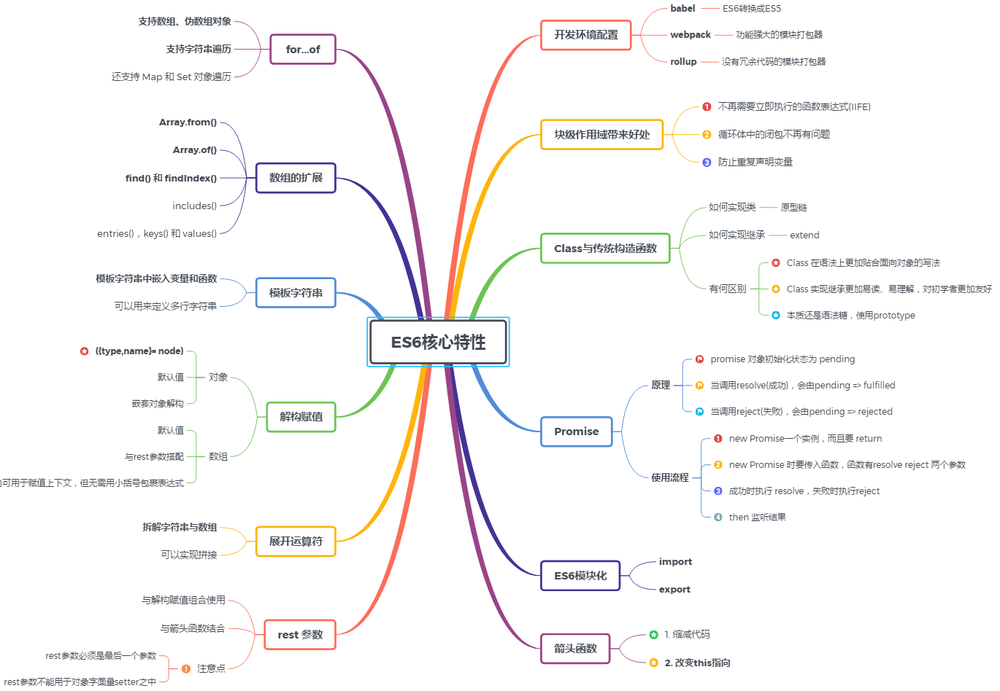
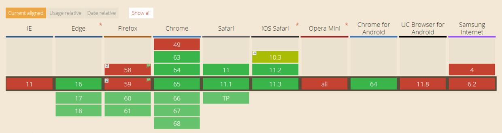
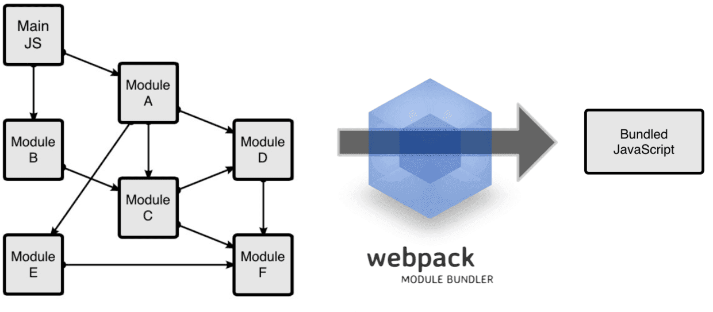
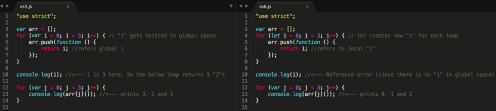
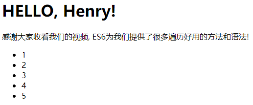
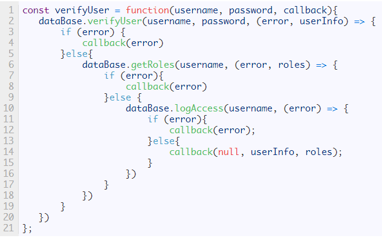

# ES6核心特性

## 前言

ES6 虽提供了许多新特性，但我们实际工作中用到频率较高并不多，根据二八法则，我们应该用百分之八十的精力和时间，好好专研这百分之二十核心特性，将会收到事半功倍的奇效！



## 一、开发环境配置

这部分着重介绍：`babel 编译ES6语法，如何用webpack实现模块化。`

### 1.babel

> #### `为啥需要babel？`

ES6 提供了许多新特性，但并不是所有的浏览器都能够完美支持。下图是各个浏览器对ES6兼容性一览表(以export为例)



由上图可知，有些浏览器对于ES6并不是很友好，针对 ES6 的兼容性问题，很多团队为此开发出了多种语法解析转换工具(比如babel，jsx，traceur 等)，可以把我们写的 ES6 语法转换成 ES5，相当于在 ES6 和浏览器之间做了一个翻译官。其中 [Babel](https://babeljs.io/) 是一个广泛使用的转码器，可以将ES6代码转为ES5代码，从而在现有环境执行。

> #### `如何配置babel？`

```
· 首先要先安装node.js，运行npm init，然后会生成package.json文件
· npm install --save-dev babel-core babel-preset-es2015 babel-preset-latest
· 创建并配置.babelrc文件//存放在项目的根目录下，与node_modules同级
· npm install -g babel-cli
· babel-version
```

Babel的配置文件是.babelrc，存放在项目的根目录下。该文件用来设置转码规则和插件，具体内容如下：

```javascript
//.babelrc文件
{
    "presets": ["es2015", "latest"],
    "plugins": []
}
```

> #### `验证配置是否成功`

```
· 创建 ./src/index.js
· 内容：[1,2,3].map(item=>item+1）；
· 运行babel ./src/index.js
```
 
运行后得到以下部分，说明已经成功配置了babel

```javascript
"use strict";
[1, 2, 3].map(function (item) {
  return item + 1;
});
```

### 2.webpack

> #### `为啥要使用WebPack？`

现今的很多网页其实可以看做是功能丰富的应用，它们拥有着复杂的JavaScript代码和一大堆依赖包，模快化工具就应运而生了，其中webpack 功能强大深受人们喜爱。

`Webpack的工作方式是：把你的项目当做一个整体，通过一个给定的主文件（如：index.js），Webpack将从这个文件开始找到你的项目的所有依赖文件，使用loaders处理它们，最后打包为一个（或多个）浏览器可识别的JavaScript文件。`



> #### `如何配置webpack？`

```
· npm install webpack babel-loader --save-dev
· 创建并配置 webpack.config.js//webpack.config.js文件与package.json同级
· 配置 package.json中的scripts
· 运行 npm start
```

```javascript
//配置 webpack.config.js  针对.js结尾的文件除了node_modules都用babel解析
module.exports = {
    entry: './src/index.js',
    output: {
        path: __dirname,
        filename: './build/bundle.js'
    },
    module: {
        rules: [{
            test: /\.js?$/,
            exclude: /(node_modules)/,
            loader: 'babel-loader'
        }]
    }
}
```

```javascript
//配置 package.json中的scripts
"scripts": {
    "start": "webpack",
    "test": "echo \"Error: no test specified\" && exit 1"
}
```

## 二、块级作用域

ES5 只有全局作用域和函数作用域（例如，我们必须将代码包在函数内来限制作用域），这导致很多问题：

`情况1：内层变量覆盖外层变量`

```javascript
var tmp = new Date();
function f() {
  console.log(tmp); //undefined
  if (false) {   
    var tmp = "hello world";
  }
}
```

`情况2：变量泄露，成为全局变量`

```javascript
var s = 'hello';
for (var i = 0; i < s.length; i++) {
  console.log(s[i]);
}
console.log(i); // 5
```

ES6 提供 let 和 const 来代替 var 声明变量，新的声明方式支持用大括号表示的块级作用域，这会带来一些好处：

`1.不再需要立即执行的函数表达式(IIFE)`

在 ES5 中，我们需要构造一个立即执行的函数表达式去保证我们不污染全局作用域。在 ES6中， 我们可以使用更简单的大括号（{}），然后使用 const 或者 let 代替 var 来达到同样的效果。

`2.循环体中的闭包不再有问题`

在 ES5 中，如果循环体内有产生一个闭包，访问闭包外的变量，会产生问题。在 ES6，你可以使用 “let” 来避免问题。



`3.防止重复声明变量`

ES6 不允许在同一个作用域内用 let 或 const 重复声明同名变量。这对于防止在不同的 js 库中存在重复声明的函数表达式十分有帮助。

## 三、数组的扩展

### 1. `Array.from()` : 将伪数组对象或可遍历对象转换为真数组

`如果一个对象的所有键名都是正整数或零，并且有length属性`，那么这个对象就很像数组，称为伪数组。典型的伪数组有`函数的arguments对象，以及大多数 DOM 元素集，还有字符串。`

```html
...
<button>测试1</button>
<br>
<button>测试2</button>
<br>
<button>测试3</button>
<br>
<script type="text/javascript">
let btns = document.getElementsByTagName("button")
console.log("btns",btns);//得到一个伪数组
btns.forEach(item=>console.log(item))
//  Uncaught TypeError: btns.forEach is not a function
</script>
```

针对伪数组，没有数组一般方法，直接遍历便会出错,ES6新增Array.from()方法来提供一种明确清晰的方式以解决这方面的需求。

```javascript
// 将伪数组转换为数组
Array.from(btns).forEach(item=>console.log(item))
```

.png)

### 2. `Array.of(v1, v2, v3)` : 将一系列值转换成数组

当调用 new Array( )构造器时，根据传入参数的类型与数量的不同，实际上会导致一些不同的结果， 例如

```javascript
let items = new Array(2)
console.log(items.length); // 2
console.log(items[0]); // undefined
console.log(items[1]);
```

```javascript
let items = new Array(1, 2)
console.log(items.length) // 2
console.log(items[0]) // 1
console.log(items[1]) // 2
```

当使用单个数值参数来调用 Array 构造器时，数组的长度属性会被设置为该参数。 如果使用多个参数(无论是否为数值类型)来调用，这些参数也会成为目标数组的项。数组的这种行为既混乱又有风险，因为有时可能不会留意所传参数的类型。

ES6 引入了Array.of( )方法来解决这个问题。该方法的作用非常类似Array构造器，但在使用单个数值参数的时候并不会导致特殊结果。`Array.of( )方法总会创建一个包含所有传入参数的数组，而不管参数的数量与类型：`

```javascript
let items = Array.of(1, 2)
console.log(items.length); // 2
console.log(items[0]); // 1
console.log(items[1]); // 2
items = Array.of(2)
console.log(items.length); // 1
console.log(items[0]); // 2
```

`Array.of基本上可以用来替代Array()或newArray()，并且不存在由于参数不同而导致的重载，而且他们的行为非常统一。`

### 3. 数组实例的 `find()` 和 `findIndex()`

数组实例的find方法，用于找出第一个符合条件的数组成员。它的参数是一个回调函数，所有数组成员依次执行该回调函数，直到找出第一个返回值为true的成员，然后返回该成员。如果没有符合条件的成员，则返回undefined。

```javascript
[1, 4, -5, 10].find((n) => n < 0) // -5
```

数组实例的findIndex方法的用法与find方法非常类似，返回第一个符合条件的数组成员的位置，如果所有成员都不符合条件，则返回-1。

```javascript
[1, 5, 10, 15].findIndex(function(value, index, arr) {
  return value > 9;
})  // 2
```

### 4. 数组实例的`includes()`

Array.prototype.includes方法返回一个布尔值，表示某个数组是否包含给定的值。该方法的第二个参数表示搜索的起始位置，默认为0。如果第二个参数为负数，则表示倒数的位置，如果这时它大于数组长度（比如第二个参数为-4，但数组长度为3），则会重置为从0开始。

```javascript
[1, 2, 3].includes(2)   // true
[1, 2, 3].includes(3, -1); // true
[1, 2, 3, 5, 1].includes(1, 2); // true
```

没有该方法之前，我们通常使用数组的indexOf方法，检查是否包含某个值。indexOf方法有两个缺点，`一是不够语义化，它的含义是找到参数值的第一个出现位置，所以要去比较是否不等于-1，表达起来不够直观。二是，它内部使用严格相等运算符（===）进行判断，这会导致对NaN的误判。`

```javascript
[NaN].indexOf(NaN) // -1
[NaN].includes(NaN) // true
```

### 5. 数组实例的 `entries()`，`keys()` 和 `values()`

ES6 提供entries()，keys()和values(),用于遍历数组。它们都返回一个遍历器对象，可以用for...of循环进行遍历，唯一的区别是keys()是对键名的遍历、values()是对键值的遍历，entries()是对键值对的遍历。

```javascript
for (let index of ['a', 'b'].keys()) {
  console.log(index);
}
// 0
// 1

for (let elem of ['a', 'b'].values()) {
  console.log(elem);
}
// 'a'
// 'b'

for (let [index, elem] of ['a', 'b'].entries()) {
  console.log(index, elem);
}
// 0 "a"
// 1 "b"
```

## 四、箭头函数

ES6 允许使用“箭头”（=>）定义函数。它主要有两个作用：缩减代码和改变this指向，接下来我们详细介绍：

### `1. 缩减代码`

```javascript
const double1 = function(number){
    return number * 2;   //ES5写法
}
const double2 = (number) => {
    return number * 2;    //ES6写法
}
const double4 = number => number * 2; //可以进一步简化
```

`多个参数记得加括号`

```javascript
const double6 = (number,number2) => number + number2;
```

`如果箭头函数的代码块部分多于一条语句，就要使用大括号将它们括起来，并且使用return语句返回。`

```javascript
const double = (number,number2) => {
   sum = number + number2 
   return sum;
}
```

由于大括号被解释为代码块，所以`如果箭头函数直接返回一个对象，必须在对象外面加上括号，否则会报错。`

```javascript
// 报错
let getTempItem = id => { id: id, name: "Temp" };
// 不报
let getTempItem = id => ({ id: id, name: "Temp" });
```

`此外还有个好处就是简化回调函数`

```javascript
// 正常函数写法
[1,2,3].map(function (x) {
  return x * x;
});
// 箭头函数写法
[1,2,3].map(x => x * x);//[1, 4, 9]
```

### `2. 改变this指向`

长期以来，JavaScript 语言的this对象一直是一个令人头痛的问题，在对象方法中使用this，必须非常小心。箭头函数”绑定”this，很大程度上解决了这个困扰。我们不妨先看一个例子：

```javascript
const team = {
  members:["Henry","Elyse"],
  teamName:"es6",
  teamSummary:function(){
    return this.members.map(function(member){
      return `${member}隶属于${this.teamName}小组`;    // this不知道该指向谁了
    })
  }
}
console.log(team.teamSummary());//["Henry隶属于undefined小组", "Elyse隶属于undefined小组"]
```

teamSummary函数里面又嵌了个函数，这导致内部的this的指向发生了错乱。

`那如何修改：`

`方法一: let self = this`

```javascript
const team = {
  members:["Henry","Elyse"],
  teamName:"es6",
  teamSummary:function(){
    let self = this;
    return this.members.map(function(member){
      return `${member}隶属于${self.teamName}小组`;
    })
  }
}
console.log(team.teamSummary());//["Henry隶属于es6小组", "Elyse隶属于es6小组"]
```

`方法二: bind函数`

```javascript
const team = {
  members:["Henry","Elyse"],
  teamName:"es6",
  teamSummary:function(){
    return this.members.map(function(member){
      // this不知道该指向谁了
      return `${member}隶属于${this.teamName}小组`;
    }.bind(this))
  }
}
console.log(team.teamSummary());//["Henry隶属于es6小组", "Elyse隶属于es6小组"]
```

`方法三: 箭头函数`

```javascript
const team = {
  members:["Henry","Elyse"],
  teamName:"es6",
  teamSummary:function(){
    return this.members.map((member) => {
      // this指向的就是team对象
      return `${member}隶属于${this.teamName}小组`;
    })
  }
}
console.log(team.teamSummary());//["Henry隶属于es6小组", "Elyse隶属于es6小组"]
```

### `3.使用注意点`

> （1）函数体内的this对象，就是定义时所在的对象，而不是使用时所在的对象。
>
> （2）不可以当作构造函数，也就是说，不可以使用new命令，否则会抛出一个错误。
>
> （3）不可以使用arguments对象，该对象在函数体内不存在。如果要用，可以用 rest 参数代替。
>
> （4）不可以使用yield命令，因此箭头函数不能用作 Generator 函数。
>

## 五、rest 参数

`ES6 引入 rest 参数（形式为...变量名），用于获取函数的多余参数，这样就不需要使用arguments对象了。`

`rest 参数搭配的变量是一个数组，该变量将多余的参数放入数组中。`

我们举个例子：如何实现一个求和函数？

`传统写法：`

```javascript
function addNumbers(a,b,c,d,e){
  var numbers = [a,b,c,d,e];
  return numbers.reduce((sum,number) => {
    return sum + number;
  },0)
 }
 console.log(addNumbers(1,2,3,4,5));//15
```

`ES6写法：`

```javascript
function addNumbers(...numbers){
  return numbers.reduce((sum,number) => {
    return sum + number;
  },0)
 }
 console.log(addNumbers(1,2,3,4,5));//15
```

`也可以与解构赋值组合使用`

```javascript
var array = [1,2,3,4,5,6];
var [a,b,...c] = array;
console.log(a);//1
console.log(b);//2
console.log(c);//[3, 4, 5, 6]
```

`rest 参数还可以与箭头函数结合`

```javascript
const numbers = (...nums) => nums;
numbers(1, 2, 3, 4, 5)// [1,2,3,4,5]  
```

> 注意：
>
> ①`每个函数最多只能声明一个rest参数，而且 rest参数必须是最后一个参数，否则报错。`
>
> ②`rest参数不能用于对象字面量setter之中`

```javascript
let object = {
    set name(...value){   //报错
        //执行一些逻辑
    }
}
```

## 六、展开运算符

与剩余参数关联最密切的就是扩展运算符。剩余参数允许你把多个独立的参数合并到一个数组中；而扩展运算符则允许将一个数组分割，并将各个项作为分离的参数传给函数。

`当用在字符串或数组前面时称为扩展运算符,个人觉得可以理解为rest参数的逆运算，用于将数组或字符串进行拆解。`有些时候，函数不允许传入数组，此时使用展开运算符就很方便，不信的话，咱们看个例子：Math.max()方法，它接受任意数量的参数，并会返回其中的最大值。

```javascript
let value1 = 25				
let value2 = 50
console.log(Math.max(value1, value2));	//	50
```

但若想处理数组中的值，此时该如何找到最大值？Math.max()方法并不允许你传入一个数组。其实你可以像使用rest参数那样在该数组前添加...,并直接将其传递给 Math.max()

```javascript
let values = [25,50,75,	100]
//等价于console.log(Math.max(25,50,75,100));
console.log(Math.max(...values));	//100
```

`扩展运算符还可以与其他参数混用`

```javascript
let values = [-25,-50,-75,-100]
console.log(Math.max(...values, 0));	//0
```

`扩展运算符拆解字符串与数组`

```javascript
let array = [1,2,3,4,5];
console.log(...array);//1 2 3 4 5
let str = "String";
console.log(...str);//S t r i n g
```

`还可以实现拼接`

```javascript
let defaultColors = ["red","greed"];
let favoriteColors = ["orange","yellow"];
let fallColors = ["fire red","fall orange"];
console.log(["blue","green",...fallColors,...defaultColors,...favoriteColors])
//["blue", "green", "fire red", "fall orange", "red", "greed", "orange", "yellow"]
```

## 七、解构赋值----更方便的数据访问

ES6 新增了解构，这是将一个数据结构分解为更小的部分的过程。

### 1.解构为何有用？

在ES5及更早版本中，从对象或数组中获取信息、并将特定数据存入本地变量，需要书写许多并且相似的代码。例如：

```javascript
var expense = {
  type: "es6",
  amount:"45"
};
var type = expense.type
var amount = expense.amount
console.log(type,amount);
```

此代码提取了expense对象的type与amount值，并将其存在同名的本地变量上。虽然 这段代码看起来简单，但想象一下若有大量变量需要处理，你就必须逐个为其赋值；并且若有一个嵌套的数据结构需要遍历以寻找信息，你可能会为了一点数据而挖掘整个结构。

这就是ES6为何要给对象与数组添加解构。当把数据结构分解为更小的部分时，从中提取你要的数据会变得容易许多。

### 2.对象

上个例子中如果采用对象解构的方法，就很容易获取expense对象的type与amount值。

```javascript
const { type, amount } = expense;
console.log(type,amount);
```

我们再来看个例子：

```javascript
let node = {type:"Identifier",	name:"foo"},	
type = "Literal", name = 5;
({type,name}= node);//	使用解构来分配不同的值 
console.log(type); //	"Identifier" 
console.log(name); //	"foo"
```

`注意:你必须用圆括号包裹解构赋值语句`，这是因为暴露的花括号会被解析为代码块语句，而块语句不允许在赋值操作符（即等号）左侧出现。圆括号标示了里面的花括号并不是块语句、而应该被解释为表达式，从而允许完成赋值操作。

`默认值：`可以选择性地定义一个默认值，以便在指定属性不存在时使用该值。若要这么做，需要在 属性名后面添加一个等号并指定默认值，就像这样：

```javascript
let node = {
  type: "Identifier",
  name: "foo"
};
let {
  type,
  name,
  value = true
} = node;
console.log(type); //	"Identifier" 
console.log(name); //	"foo" 
console.log(value); //	true
```

`嵌套对象解构：`

使用类似于对象字面量的语法，可以深入到嵌套的对象结构中去提取你想要的数据。

```javascript
let node = {
  type: "Identifier",
  name: "foo",
  loc: {
    start: {
      line: 1,
      column: 1
    },
    end: {
      line: 1,
      column: 4
    }
  }
};
let { loc: { start }} = node;
console.log(start.line); //	1 
console.log(start.column); //	1
```

本例中的解构模式使用了花括号，表示应当下行到node对象的loc属性内部去寻找start属性。

`必须传值的解构参数`

```javascript
function setCookie(name, value, {
  secure,
  path,
  domain,
  expires
}) {
  //	设置cookie的代码 
}
setCookie("type", "js");//报错
```

在此函数内，name与value参数是必需的，而secure、path、domain与expires则不是。默认情况下调用函数时未给参数解构传值会抛出错误。像上例中如果setCookie不传第三个参数，就会报错。若解构参数是可选的，可以给解构的参数提供默认值来处理这种错误。

```javascript
function setCookie(name, value, {
  secure,
  path,
  domain,
  expires
} = {}) {}
setCookie("type", "js");//不会报错
```

### 3.数组

```javascript
const names = ["Henry","Bucky","Emily"];
const [name1,name2,name3] = names;
console.log(name1,name2,name3);//Henry Bucky Emily
const [name,...rest] = names;//结合展开运算符
console.log(rest);//["Bucky", "Emily"]
```

`用{}解构返回数组个数`

```javascript
const {length} = names;
console.log(length);//3
```

`数组解构也可以用于赋值上下文，但不需要用小括号包裹表达式。`这点跟对象解构的约定不同。

```javascript
let colors = ["red", "green", "blue"],
  firstColor = "black",
  secondColor = "purple";
[firstColor, secondColor] = colors;
console.log(firstColor); //	"red" 
console.log(secondColor);	// "green"
```

`默认值：`数组解构赋值同样允许在数组任意位置指定默认值。当指定位置的项不存在、或其值为undefined，那么该默认值就会被使用。

```javascript
let colors = ["red"];
let [firstColor, secondColor = "green"] = colors;
console.log(firstColor); //	"red" 
console.log(secondColor);//	"green"
```

`与rest参数搭配`

在ES5中常常使用concat()方法来克隆数组，例如：

```javascript
//在ES5中克隆数组 
var colors = ["red", "green", "blue"];
var clonedColors = colors.concat();
console.log(clonedColors); //"[red,green,blue]"
```

在ES6中，你可以使用剩余项的语法来达到同样效果

```javascript
//在ES6中克隆数组 
let colors = ["red", "green", "blue"];
let [...clonedColors] = colors;
console.log(clonedColors); //[red,green,blue]
```

接下我们看个例子：如何将数组转化为对象

```javascript
const points = [[4, 5], [10, 1], [0, 40]];
//期望得到的数据格式如下，如何实现？
// [
//   {x:4,y:5},
//   {x:10,y:1},
//   {x:0,y:40}
// ]
let newPoints = points.map(pair => {
  const [x,y] = pair;
  return {x,y}
})
//还可以通过以下办法，更为简便
let newPoints = points.map(([x,y]) => {
  return {x,y}
})
console.log(newPoints);
```

`混合解构`

```javascript
const people = [
  {name:"Henry",age:20},
  {name:"Bucky",age:25},
  {name:"Emily",age:30}
];
//es5 写法 
var age = people[0].age;
console.log(age);
//es6 解构
const [age] = people;
console.log(age);//第一次解构数组 {name:"Henry",age:20}
const [{age}] = people;//再一次解构对象
console.log(age);//20
```

### 4.注意点

当使用解构来配合var、let、const来声明变量时，必须提供初始化程序（即等号右边的值）。下面的代码都会因为缺失初始化程序而抛出语法错误：

```javascript
var { type, name }; // 语法错误！ 
let { type, name }; // 语法错误！
const { type, name }; // 语法错误！
```

## 八、模板字符串（template string）

模板字符串是增强版的字符串，用反引号（`）标识。

`它可以当作普通字符串使用，也可以用来定义多行字符串，或者在字符串中嵌入变量。`

`模板字符串中嵌入变量和函数，需要将变量名写在${}之中。`

```javascript
let name = "Henry";
function makeUppercase(word){
  return word.toUpperCase();
}
let template = 
  `
  <h1>${makeUppercase('Hello')}, ${name}!</h1>//可以存放函数和变量
  <p>感谢大家收看我们的视频, ES6为我们提供了很多遍历好用的方法和语法!</p>
  <ul>
    <li>1</li>
    <li>2</li>
    <li>3</li>
    <li>4</li>
    <li>5</li>
  </ul>
  `;
document.getElementById('template').innerHTML = template;
```



再举个例子，工作中常用到ElementUI库，在自定义一个弹出框时，使用模板字符串就很方便:

```javascript
await this.$alert(
`<p>
<strong>确认是否升级${this.lectureName}</strong>
<br>(若已存在讲义套件，升级后请重新生成)
</p>`,
{dangerouslyUseHTMLString: true}
)
```

## 九、Class 和传统构造函数有何区别

从概念上讲，在 ES6 之前的 JS 中并没有和其他面向对象语言那样的“类”的概念。长时间里，人们把使用 new 关键字通过函数（也叫构造器）构造对象当做“类”来使用。由于 JS 不支持原生的类，而只是通过原型来模拟，各种模拟类的方式相对于传统的面向对象方式来说非常混乱，尤其是处理当子类继承父类、子类要调用父类的方法等等需求时。

ES6提供了更接近传统语言的写法，引入了Class（类）这个概念，作为对象的模板。通过class关键字，可以定义类。`但是类只是基于原型的面向对象模式的语法糖。`

`对比在传统构造函数和 ES6 中分别如何实现类：`

```javascript
//传统构造函数
function MathHandle(x,y){
  this.x = x
  this.y = y
}
MathHandle.prototype.add = function(){
  return this.x + this.y
}
var m = new MathHandle(1,2)
console.log(m.add())
```

```javascript
//class语法
class MathHandle {
 constructor(x,y){
  this.x = x
  this.y = y
}
 add(){
   return this.x + this.y
  }
}
const m = new MathHandle(1,2)
console.log(m.add())
```

这两者有什么联系？其实这两者本质是一样的，只不过是语法糖写法上有区别。所谓语法糖是指计算机语言中添加的某种语法，这种语法对语言的功能没有影响，但是更方便程序员使用。比如这里class语法糖让程序更加简洁，有更高的可读性。

```javascript
typeof MathHandle   //"function"
MathHandle === MathHandle.prototype.constructor //true
```

`对比在传统构造函数和 ES6 中分别如何实现继承：`

```javascript
//传统构造函数继承
function Animal() {
  this.eat = function () {
    alert('Animal eat')
  }
}
function Dog() {
  this.bark = function () {
    alert('Dog bark')
  }
}
Dog.prototype = new Animal()// 绑定原型，实现继承
var hashiqi = new Dog()
hashiqi.bark()//Dog bark
hashiqi.eat()//Animal eat
```

```javascript
//ES6继承
class Animal {
  constructor(name) {
    this.name = name
  }
  eat() {
    alert(this.name + ' eat')
  }
}
class Dog extends Animal {
  constructor(name) {
    super(name) // 有extend就必须要有super，它代表父类的构造函数，即Animal中的constructor
    this.name = name
  }
  say() {
    alert(this.name + ' say')
  }
}
const dog = new Dog('哈士奇')
dog.say()//哈士奇 say
dog.eat()//哈士奇 eat
```

Class之间可以通过extends关键字实现继承，这比ES5的通过修改原型链实现继承，要清晰和方便很多。

> `Class 和传统构造函数有何区别`
>
>  - Class 在语法上更加贴合面向对象的写法
>
>  - Class 实现继承更加易读、易理解，对初学者更加友好
>
>  - 本质还是语法糖，使用prototype

## 十、Promise的基本使用和原理

在JavaScript的世界中，所有代码都是单线程执行的。由于这个“缺陷”，导致JavaScript的所有网络操作，浏览器事件，都必须是异步执行。`Promise 是异步编程的一种解决方案，比传统的解决方案(回调函数和事件)更合理和更强大。`



ES6中的promise的出现给我们很好的解决了`回调地狱`的问题，所谓的回调地狱是指当太多的异步步骤需要一步一步执行，或者一个函数里有太多的异步操作，这时候就会产生大量嵌套的回调，使代码嵌套太深而难以阅读和维护。ES6认识到了这点问题，现在promise的使用，完美解决了这个问题。

`Promise原理:`

一旦状态改变，就不会再变，任何时候都可以得到这个结果。Promise对象的状态改变，只有两种可能：从pending变为fulfilled和从pending变为rejected。`promise 对象初始化状态为 pending ；当调用resolve(成功)，会由pending => fulfilled ；当调用reject(失败)，会由pending => rejected。`具体流程见下图：


`Promise的使用流程`

1. new Promise一个实例，而且要 return
2. new Promise 时要传入函数，函数有resolve reject 两个参数
3. 成功时执行 resolve，失败时执行reject
4. then 监听结果

```javascript
function loadImg(src){
  const promise=new Promise(function(resolve,reject){
    let img=document.createElement（'img'）
    img.onload=function(){
      resolve(img)
  }
  img.onerror=function(){
      reject()
  }
  img.src=src
 })
  return promise//返回一个promise实例
}
let src="http://www.imooc.com/static/img/index/logo_new.png"
let result=loadImg(src)
result.then(function(img){
  console.log(img.width)//resolved(成功)时候的回调函数
},function(){
  console.log("failed")//rejected(失败)时候的回调函数
})
result.then(function(img){
  console.log(img.height)
})
```

promise会让代码变得更容易维护，像写同步代码一样写异步代码,同时业务逻辑也更易懂。

## 十一、Iterator 和 for...of 循环

JavaScript 原有的表示“集合”的数据结构，主要是数组（Array）和对象（Object），ES6 又添加了Map和Set。这样就需要一种统一的接口机制，来处理所有不同的数据结构。遍历器（Iterator）就是这样一种机制。它是一种接口，为各种不同的数据结构提供统一的访问机制。`任何数据结构只要部署 Iterator 接口，就可以完成遍历操作（即依次处理该数据结构的所有成员）。`

### 1. Iterator的作用：

- 为各种数据结构，提供一个统一的、简便的访问接口；
- 使得数据结构的成员能够按某种次序排列
- ES6创造了一种新的遍历命令for...of循环，Iterator接口主要供for...of消费。

### 2. 原生具备iterator接口的数据(可用for of遍历)

- Array
- set容器
- map容器
- String
- 函数的 arguments 对象
- NodeList 对象

```javascript
let arr3 = [1, 2, 'kobe', true];
for(let i of arr3){
  console.log(i); // 1 2 kobe true
}
```

```javascript
let str = 'abcd';
for(let item of str){
  console.log(item); // a b c d
} 
```

```javascript
var engines = new Set(["Gecko", "Trident", "Webkit", "Webkit"]);
for (var e of engines) {
  console.log(e);
}
// Gecko
// Trident
// Webkit   
```

### 3. 几种遍历方式比较

- for of 循环不仅支持数组、大多数伪数组对象，也支持字符串遍历，此外还支持 Map 和 Set 对象遍历。
- for in循环可以遍历字符串、对象、数组，不能遍历Set/Map
- forEach 循环不能遍历字符串、对象,可以遍历Set/Map

## 十二、ES6模块化

ES6 在语言标准的层面上，实现了模块功能，而且实现得相当简单，旨在成为浏览器和服务器通用的模块解决方案。`其模块功能主要由两个命令构成：export和import。export命令用于规定模块的对外接口，import命令用于输入其他模块提供的功能。`

```javascript
/** 定义模块 math.js **/
const basicNum = 0;
const add (a, b) {
  return a + b;
};
export { basicNum, add };
/** 引用模块 **/
import { basicNum, add } from './math';
function test(ele) {
  ele.textContent = add(99 + basicNum);
}
```

如上例所示，使用import命令的时候，用户需要知道所要加载的变量名或函数名，否则无法加载。为了给用户提供方便，让他们不用阅读文档就能加载模块，就要用到export default命令，为模块指定默认输出。

```javascript
// export-default.js
export default function () {
  console.log('foo');
}
```

上面代码是一个模块文件export-default.js，它的默认输出是一个函数。`其他模块加载该模块时，import命令可以为该匿名函数指定任意名字。`

```javascript
// import-default.js
import customName from './export-default';
customName(); // 'foo'
```

上面代码的import命令，可以用任意名称指向export-default.js输出的方法，这时就不需要知道原模块输出的函数名。`需要注意的是，这时import命令后面，不使用大括号。`

## 参考文章

> [ES6笔记（一）：ES6所改良的javascript“缺陷”](https://www.cnblogs.com/yzg1/p/5776171.html)
>
> [在 ES6 中 改良的 5 个 JavaScript “缺陷”](https://www.h5jun.com/post/5-javascript-%E2%80%9Cbad%E2%80%9D-parts-that-are-fixed-in-es6.html)
>
> [ECMAScript 6 入门](http://es6.ruanyifeng.com/)
>
> [深入理解ES6](https://book.douban.com/subject/27072230/)
>
> [ES6的rest参数和扩展运算符](https://zhuanlan.zhihu.com/p/32038245)