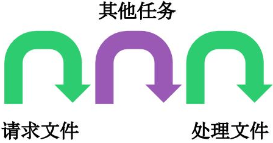
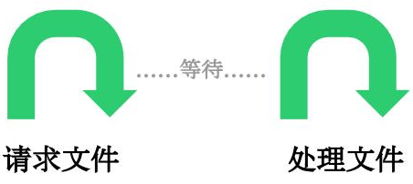
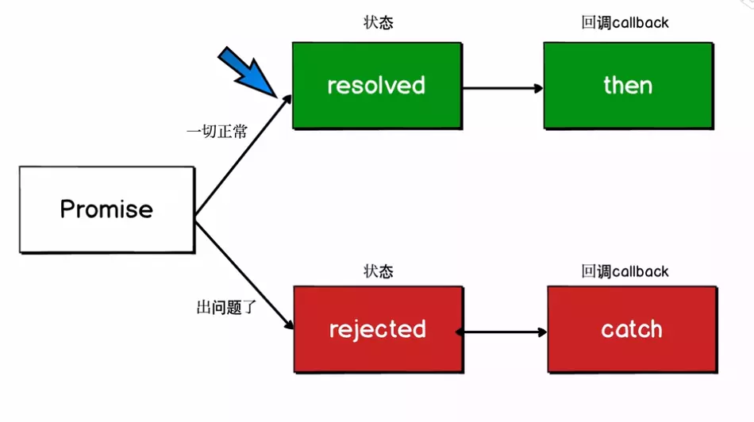

# JS异步编程六种方案

## 前言

我们知道Javascript语言的执行环境是"单线程"。也就是指一次只能完成一件任务。如果有多个任务，就必须排队，前面一个任务完成，再执行后面一个任务。

这种模式虽然实现起来比较简单，执行环境相对单纯，但是只要有一个任务耗时很长，后面的任务都必须排队等着，会拖延整个程序的执行。常见的浏览器无响应（假死），往往就是因为某一段Javascript代码长时间运行（比如死循环），导致整个页面卡在这个地方，其他任务无法执行。

为了解决这个问题，Javascript语言将任务的执行模式分成两种：同步和异步。本文主要介绍异步编程几种办法，并通过比较，得到最佳异步编程的解决方案！

## 一、同步与异步

我们可以通俗理解为异步就是一个任务分成两段，先执行第一段，然后转而执行其他任务，等做好了准备，再回过头执行第二段。排在异步任务后面的代码，不用等待异步任务结束会马上运行，也就是说，`异步任务不具有”堵塞“效应`。比如，有一个任务是读取文件进行处理，异步的执行过程就是下面这样



这种不连续的执行，就叫做异步。相应地，连续的执行，就叫做同步



"异步模式"非常重要。在浏览器端，耗时很长的操作都应该异步执行，避免浏览器失去响应，最好的例子就是Ajax操作。在服务器端，"异步模式"甚至是唯一的模式，因为执行环境是单线程的，如果允许同步执行所有http请求，服务器性能会急剧下降，很快就会失去响应。接下来介绍下异步编程六种方法。

## 二、回调函数（Callback）

回调函数是异步操作最基本的方法。以下代码就是一个回调函数的例子：

```text
ajax(url, () => {
    // 处理逻辑
})
```

但是回调函数有一个致命的弱点，就是容易写出`回调地狱（Callback hell）`。假设多个请求存在依赖性，你可能就会写出如下代码：

```text
ajax(url, () => {
    // 处理逻辑
    ajax(url1, () => {
        // 处理逻辑
        ajax(url2, () => {
            // 处理逻辑
        })
    })
})
```

回调函数的优点是简单、容易理解和实现，缺点是不利于代码的阅读和维护，各个部分之间高度耦合，使得程序结构混乱、流程难以追踪（尤其是多个回调函数嵌套的情况），而且每个任务只能指定一个回调函数。此外它不能使用 try catch 捕获错误，不能直接 return。

## 三、事件监听

这种方式下，`异步任务的执行不取决于代码的顺序，而取决于某个事件是否发生`。

下面是两个函数f1和f2，编程的意图是f2必须等到f1执行完成，才能执行。首先，为f1绑定一个事件（这里采用的jQuery的写法）

```text
f1.on('done', f2)
```

上面这行代码的意思是，当f1发生done事件，就执行f2。然后，对f1进行改写：

```javascript
function f1() {
  setTimeout(function () {
    // ...
    f1.trigger('done');
  }, 1000);
}
```

上面代码中，f1.trigger('done')表示，执行完成后，立即触发done事件，从而开始执行f2。

这种方法的优点是比较容易理解，可以绑定多个事件，每个事件可以指定多个回调函数，而且可以"去耦合"，有利于实现模块化。缺点是整个程序都要变成事件驱动型，运行流程会变得很不清晰。阅读代码的时候，很难看出主流程。

## 四、发布订阅

我们假定，存在一个"信号中心"，某个任务执行完成，就向信号中心"发布"（publish）一个信号，其他任务可以向信号中心"订阅"（subscribe）这个信号，从而知道什么时候自己可以开始执行。这就叫做"发布/订阅模式"（publish-subscribe pattern），又称"观察者模式"（observer pattern）。

首先，f2向信号中心jQuery订阅done信号。

```text
jQuery.subscribe('done', f2);
```

然后，f1进行如下改写：

```javascript
function f1() {
  setTimeout(function () {
    // ...
    jQuery.publish('done');
  }, 1000);
}
```

上面代码中，jQuery.publish('done')的意思是，f1执行完成后，向信号中心jQuery发布done信号，从而引发f2的执行。

f2完成执行后，可以取消订阅（unsubscribe）

```text
jQuery.unsubscribe('done', f2);
```

这种方法的性质与“事件监听”类似，但是明显优于后者。因为可以通过查看“消息中心”，了解存在多少信号、每个信号有多少订阅者，从而监控程序的运行。

## 五、Promise/A+

Promise本意是承诺，在程序中的意思就是承诺我过一段时间后会给你一个结果。 什么时候会用到过一段时间？答案是异步操作，异步是指可能比较长时间才有结果的才做，例如网络请求、读取本地文件等

### 1.Promise的三种状态

- Pending----Promise对象实例创建时候的初始状态

- Fulfilled----可以理解为成功的状态

- Rejected----可以理解为失败的状态



`这个承诺一旦从等待状态变成为其他状态就永远不能更改状态了`，比如说一旦状态变为 resolved 后，就不能再次改变为Fulfilled

```javascript
let p = new Promise((resolve, reject) => {
  reject('reject')
  resolve('success')//无效代码不会执行
})
p.then(
  value => {
    console.log(value)
  },
  reason => {
    console.log(reason)//reject
  }
)
```

当我们在构造 Promise 的时候，构造函数内部的代码是立即执行的

```javascript
new Promise((resolve, reject) => {
  console.log('new Promise')
  resolve('success')
})
console.log('end')
// new Promise => end
```

### 2.promise的链式调用

- 每次调用返回的都是一个新的Promise实例(这就是then可用链式调用的原因)

- 如果then中返回的是一个结果的话会把这个结果传递下一次then中的成功回调

- 如果then中出现异常,会走下一个then的失败回调

- 在 then中使用了return，那么 return 的值会被Promise.resolve() 包装(见例1，2)

- then中可以不传递参数，如果不传递会透到下一个then中(见例3)

- catch 会捕获到没有捕获的异常

接下来我们看几个例子：

```javascript
// 例1
Promise.resolve(1)
.then(res => {
console.log(res)
return 2 //包装成 Promise.resolve(2)
})
.catch(err => 3)
.then(res => console.log(res))
```

```javascript
// 例2
Promise.resolve(1)
  .then(x => x + 1)
  .then(x => {
  throw new Error('My Error')
  })
  .catch(() => 1)
  .then(x => x + 1)
  .then(x => console.log(x)) //2
  .catch(console.error)
```

```javascript
// 例3
let fs = require('fs')
function read(url) {
  return new Promise((resolve, reject) => {
    fs.readFile(url, 'utf8', (err, data) => {
      if (err) reject(err)
      resolve(data)
    })
  })
}
read('./name.txt')
  .then(function(data) {
    throw new Error() //then中出现异常,会走下一个then的失败回调
  }) //由于下一个then没有失败回调，就会继续往下找，如果都没有，就会被catch捕获到
  .then(function(data) {
    console.log('data')
  })
  .then()
  .then(null, function(err) {
    console.log('then', err)// then error
  })
  .catch(function(err) {
    console.log('error')
  })
```

Promise不仅能够捕获错误，而且也很好地解决了回调地狱的问题，可以把之前的回调地狱例子改写为如下代码：

```javascript
ajax(url)
  .then(res => {
      console.log(res)
      return ajax(url1)
  }).then(res => {
      console.log(res)
      return ajax(url2)
  }).then(res => console.log(res))
```

它也是存在一些缺点的，比如无法取消 Promise，错误需要通过回调函数捕获。

## 六、生成器Generators/ yield

Generator 函数是 ES6 提供的一种异步编程解决方案，语法行为与传统函数完全不同，Generator 最大的特点就是可以控制函数的执行。

- 语法上，首先可以把它理解成，Generator 函数是一个状态机，封装了多个内部状态。

- Generator 函数除了状态机，还是一个遍历器对象生成函数。

- 可暂停函数, yield可暂停，next方法可启动，每次返回的是yield后的表达式结果。

- yield表达式本身没有返回值，或者说总是返回undefined。next方法可以带一个参数，该参数就会被当作上一个yield表达式的返回值。


我们先来看个例子：

```javascript
function *foo(x) {
  let y = 2 * (yield (x + 1))
  let z = yield (y / 3)
  return (x + y + z)
}
let it = foo(5)
console.log(it.next())   // => {value: 6, done: false}
console.log(it.next(12)) // => {value: 8, done: false}
console.log(it.next(13)) // => {value: 42, done: true}
```

可能结果跟你想象不一致，接下来我们逐行代码分析：

- 首先 Generator 函数调用和普通函数不同，它会返回一个迭代器

- 当执行第一次 next 时，传参会被忽略，并且函数暂停在 yield (x + 1) 处，所以返回 5 + 1 = 6

- 当执行第二次 next 时，传入的参数12就会被当作上一个yield表达式的返回值，如果你不传参，yield 永远返回 undefined。此时 let y = 2 * 12，所以第二个 yield 等于 2 * 12 / 3 = 8

- 当执行第三次 next 时，传入的参数13就会被当作上一个yield表达式的返回值，所以 z = 13, x = 5, y = 24，相加等于 42

我们再来看个例子：有三个本地文件，分别1.txt,2.txt和3.txt，内容都只有一句话，下一个请求依赖上一个请求的结果，想通过Generator函数依次调用三个文件

```text
//1.txt文件
2.txt
```

```text
//2.txt文件
3.txt
```

```text
//3.txt文件
结束
```

```javascript
let fs = require('fs')
function read(file) {
  return new Promise(function(resolve, reject) {
    fs.readFile(file, 'utf8', function(err, data) {
      if (err) reject(err)
      resolve(data)
    })
  })
}
function* r() {
  let r1 = yield read('./1.txt')
  let r2 = yield read(r1)
  let r3 = yield read(r2)
  console.log(r1)
  console.log(r2)
  console.log(r3)
}
let it = r()
let { value, done } = it.next()
value.then(function(data) { // value是个promise
  console.log(data) //data=>2.txt
  let { value, done } = it.next(data)
  value.then(function(data) {
    console.log(data) //data=>3.txt
    let { value, done } = it.next(data)
    value.then(function(data) {
      console.log(data) //data=>结束
    })
  })
})
// 2.txt=>3.txt=>结束
```

从上例中我们看出手动迭代`Generator`函数很麻烦，实现逻辑有点绕，而实际开发一般会配合`co`库去使用。`co是一个为Node.js和浏览器打造的基于生成器的流程控制工具，借助于Promise，你可以使用更加优雅的方式编写非阻塞代码。`

安装`co`库只需：`npm install co`

上面例子只需两句话就可以轻松实现

```javascript
function* r() {
  let r1 = yield read('./1.txt')
  let r2 = yield read(r1)
  let r3 = yield read(r2)
  console.log(r1)
  console.log(r2)
  console.log(r3)
}
let co = require('co')
co(r()).then(function(data) {
  console.log(data)
})
// 2.txt=>3.txt=>结束=>undefined
```

我们可以通过 Generator 函数解决回调地狱的问题，可以把之前的回调地狱例子改写为如下代码：

```javascript
function *fetch() {
    yield ajax(url, () => {})
    yield ajax(url1, () => {})
    yield ajax(url2, () => {})
}
let it = fetch()
let result1 = it.next()
let result2 = it.next()
let result3 = it.next()
```

## 七、async/await

### 1.Async/Await简介

使用async/await，你可以轻松地达成之前使用生成器和co函数所做到的工作,它有如下特点：

- async/await是基于Promise实现的，它不能用于普通的回调函数。

- async/await与Promise一样，是非阻塞的。

- async/await使得异步代码看起来像同步代码，这正是它的魔力所在。


`一个函数如果加上 async ，那么该函数就会返回一个 Promise`

```javascript
async function async1() {
  return "1"
}
console.log(async1()) // -> Promise {<resolved>: "1"}
```

Generator函数依次调用三个文件那个例子用async/await写法，只需几句话便可实现

```javascript
let fs = require('fs')
function read(file) {
  return new Promise(function(resolve, reject) {
    fs.readFile(file, 'utf8', function(err, data) {
      if (err) reject(err)
      resolve(data)
    })
  })
}
async function readResult(params) {
  try {
    let p1 = await read(params, 'utf8')//await后面跟的是一个Promise实例
    let p2 = await read(p1, 'utf8')
    let p3 = await read(p2, 'utf8')
    console.log('p1', p1)
    console.log('p2', p2)
    console.log('p3', p3)
    return p3
  } catch (error) {
    console.log(error)
  }
}
readResult('1.txt').then( // async函数返回的也是个promise
  data => {
    console.log(data)
  },
  err => console.log(err)
)
// p1 2.txt
// p2 3.txt
// p3 结束
// 结束
```

### 2.Async/Await并发请求

如果请求两个文件，毫无关系，可以通过并发请求

```javascript
let fs = require('fs')
function read(file) {
  return new Promise(function(resolve, reject) {
    fs.readFile(file, 'utf8', function(err, data) {
      if (err) reject(err)
      resolve(data)
    })
  })
}
function readAll() {
  read1()
  read2()//这个函数同步执行
}
async function read1() {
  let r = await read('1.txt','utf8')
  console.log(r)
}
async function read2() {
  let r = await read('2.txt','utf8')
  console.log(r)
}
readAll() // 2.txt 3.txt
```

## 八、总结

1.JS 异步编程进化史：callback -> promise -> generator -> async + await

2.async/await 函数的实现，就是将 Generator 函数和自动执行器，包装在一个函数里。

3.async/await可以说是异步终极解决方案了。

(1) async/await函数相对于Promise，优势体现在：

- 处理 then 的调用链，能够更清晰准确的写出代码

- 并且也能优雅地解决回调地狱问题。

当然async/await函数也存在一些缺点，因为 await 将异步代码改造成了同步代码，如果多个异步代码没有依赖性却使用了 await 会导致性能上的降低，代码没有依赖性的话，完全可以使用 Promise.all 的方式。

(2) async/await函数对 Generator 函数的改进，体现在以下三点：

- 内置执行器。

Generator 函数的执行必须靠执行器，所以才有了 co 函数库，而 async 函数自带执行器。也就是说，`async 函数的执行，与普通函数一模一样，只要一行`。

- 更广的适用性。

co 函数库约定，yield 命令后面只能是 Thunk 函数或 Promise 对象，而 `async 函数的 await 命令后面，可以跟 Promise 对象和原始类型的值（数值、字符串和布尔值，但这时等同于同步操作）`。

- 更好的语义。
async 和 await，比起星号和 yield，语义更清楚了。async 表示函数里有异步操作，await 表示紧跟在后面的表达式需要等待结果。

## 参考文章
- [Promises/A+](https://promisesaplus.com/)

- [前端面试之道](https://juejin.im/book/6844733763675488269/section/6844733763763568647)

- [Javascript异步编程的4种方法](http://www.ruanyifeng.com/blog/2012/12/asynchronous%EF%BC%BFjavascript.html)

- [你不知道的JavaScript（中卷）](https://book.douban.com/subject/26854244/)

- [async 函数的含义和用法](http://www.ruanyifeng.com/blog/2015/05/async.html)

- [Async/Await替代Promise的6个理由](https://blog.fundebug.com/2017/04/04/nodejs-async-await/)

