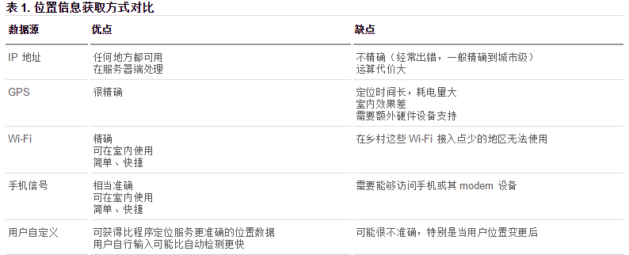

<!-- TOC -->

- [1. HTML5新增](#1-html5新增)
  - [1.1. HTML5中的语义标签](#11-html5中的语义标签)
  - [1.2. `input`表单中新增的`type`](#12-input表单中新增的type)
  - [1.3. `datalist`表单](#13-datalist表单)
  - [1.4. `input`表单的事件](#14-input表单的事件)
  - [1.5. `progress`进度条标签](#15-progress进度条标签)
  - [1.6. 表单综合案例](#16-表单综合案例)
  - [1.7. 多媒体标签](#17-多媒体标签)
- [2. DOM操作](#2-dom操作)
  - [2.1. 获取元素](#21-获取元素)
  - [2.2. 类样式操作](#22-类样式操作)
  - [2.3. 自定义属性](#23-自定义属性)
  - [2.4. 网络接口(连接 断开事件)](#24-网络接口连接-断开事件)
  - [2.5. 全屏接口](#25-全屏接口)
  - [2.6. `FileReader()`文件读取对象](#26-filereader文件读取对象)
  - [2.7. `drag`拖拽接口](#27-drag拖拽接口)
  - [2.8. 获取地理位置](#28-获取地理位置)
  - [2.9. web存储](#29-web存储)
  - [2.10. 应用缓存 manifest ？](#210-应用缓存-manifest-)
  - [2.11. 视频播放器案例](#211-视频播放器案例)
- [3. CSS3](#3-css3)
  - [3.1. 属性选择器](#31-属性选择器)
  - [3.2. 伪类选择器-伪元素选择器](#32-伪类选择器-伪元素选择器)
  - [3.3. 颜色设置](#33-颜色设置)
  - [3.4. 阴影`text-shadow` `box-shadow`](#34-阴影text-shadow-box-shadow)
  - [3.5. 盒子模型](#35-盒子模型)
  - [3.6. 边框圆角](#36-边框圆角)
- [4. `background`](#4-background)
  - [4.1. `background-image`渐变色](#41-background-image渐变色)
    - [4.1.1. 线性渐变：](#411-线性渐变)
    - [4.1.2. 径向渐变](#412-径向渐变)
    - [4.1.3. 重复渐变](#413-重复渐变)
  - [4.2. 背景样式](#42-背景样式)
  - [4.3. 边框图片](#43-边框图片)
- [5. 变换效果](#5-变换效果)
  - [5.1. `transition`过渡](#51-transition过渡)
  - [5.2. `transform`2D变换](#52-transform2d变换)
  - [5.3. `transform`3D变换](#53-transform3d变换)
  - [5.4. 过渡动画](#54-过渡动画)
  - [5.5. web字体和字体图标](#55-web字体和字体图标)
- [6. 布局](#6-布局)
  - [6.1. 多列布局](#61-多列布局)
  - [6.2. `flex`伸缩布局](#62-flex伸缩布局)

<!-- /TOC -->

# 1. HTML5新增

## 1.1. HTML5中的语义标签

HTML5的语义标签IE8以下浏览器有兼容性问题，引入`html5shiv.min.js`文件。

```html
<header>头部</header>
<nav>导航</nav>
<main>
    <article>正文</article>
    <aside>侧边</aside>
</main>
<footer>底部</footer>
```

## 1.2. `input`表单中新增的`type`

`type`属性: `text` `password` `email` `tel` `url` `number` `search` `range` `color` `month` `week` `time` `date` `datetime` `datetime-local`

其它属性：  
`placeholder` 提示文本  
`autofocus` 自动获取焦点  
`autocomplete` 自动完成, on:打开,off:关闭 (必须有name属性)  
`required` 必填  
`pattern` 手机号`tel`的正则表达式验证 `pattern="^(\+86)?1\d{10}$"`  
`mutiple` 文件多选, 多个邮箱地址  

几个特别的：  
`for` 用`id`关联`label`与`input`表单  
`form` 用`id`关联`input`表单与`form`表单。  
`list` 用`id`关联`input`表单与`datalist`列表  

```html
    用户名：<input type="text" name="userName" placeholder="请输入用户名"> <br>
    密码：<input type="password" name="userPwd"> <br>
    <!--email提供了默认的电子邮箱的完整验证：要求必须包含@符号，同时必须包含服务器名称，如果不能满足验证，则会阻止当前的数据提交-->
    邮箱：<input type="email"> <br>
    <!--tel它并不是来实现验证。它的本质目的是为了能够在移动端打开数字键盘。意味着数字键盘限制了用户只能输入数字。  如何查看效果：qq发送文件>>手机端使用qq来接收>>使用手机浏览器查看-->
    电话：<input type="tel"> <br>
    <!--验证只能输入合法的网址：必须包含http://-->
    网址：<input type="url"> <br>
    <!--number：只能输入数字(包含小数点)，不能输入其它的字符
    max:最大值
    min:最小值
    value:默认值-->
    数量：<input type="number" value="60" max="100" min="0"> <br>
    <!--search：可以提供更人性化的输入体验-->
    请输入商品名称：<input type="search"> <br>
    <!--range:范围-->
    范围：<input type="range" max="100" min="0" value="50"> <br>
    颜色：<input type="color"> <br>
    <!--日期时间相关-->
    <!--time:时间：时分秒-->
    时间：<input type="time"> <br>
    <!--date：日期：年月日-->
    日期：<input type="date"> <br>
    <!--datetime:大多数浏览器不能支持datetime.用于屏幕阅读器-->
    日期时间：<input type="datetime"><br>
    <!--datetime-local:日期和时间-->
    日期时间：<input type="datetime-local"> <br>
    月份：<input type="month"> <br>
    星期(一年的第几周)：<input type="week">
```

## 1.3. `datalist`表单

`select`表单只能选择不能输入， `datalist`表单可以输入。

```html
<!-- select表单 -->
专业：<select name="" id="">
    <option value="1">前端与移动开发</option>
    <option value="2">java</option>
    <option value="3">javascript</option>
    <option value="4">c++</option>
</select>

<!-- datalist表单 -->

<!--通过datalist创建选择列表-->
<datalist id="subjects">
    <!--创建选项值：value:具体的值 label:提示信息，辅助值-->
    <!--option可以是单标签也可以是双标签-->
    <option value="英语" label="不会"/>
    <option value="前端与移动开发" label="前景非常好"></option>
    <option value="java" label="使用人数多"></option>
    <option value="javascript" label="做特效"></option>
    <option value="c" label="不知道"></option>
</datalist>
<!--建立输入框与datalist的关联  list="datalist的id号"-->
专业：<input type="text" list="subjects"> <br>


网址：<input type="url" list="urls">
<datalist id="urls">
    <!--如果input输入框的type类型是url,那么value值必须添加http://-->
    <option value="http://www.baidu.com" label="百度"></option>
    <option value="http://www.sohu.com"></option>
    <option value="http://www.163.com"></option>
</datalist>
```

## 1.4. `input`表单的事件

`oninput` 事件:监听当前指定元素内容的改变(只要内容改变就会触发)  
`onvalid` 事件:当验证不通过时触发

## 1.5. `progress`进度条标签

`progress`进度条标签： `max`属性 最大值,`value`属性 当前进度值

`meter`度量器标签： `high`规定较高的值,`low`规定较低的值;`max`最大值,`min`最小值,`value`当前度量值。(value值在三个区间中,度量器显示不同的颜色)

```html
<!--max:最大值
value:当前进度值-->
<progress max="100" value="100"></progress>

<!--度量器：衡量当前进度值-->
<!--high:规定的较高的值
low:规定的较低的值
max:最大值
min:最小值
value:当前度量值-->
<meter max="100" min="0" high="80" low="40" value="30"></meter>
<meter max="100" min="0" high="80" low="40" value="60"></meter>
<meter max="100" min="0" high="80" low="40" value="100" name="level"></meter>
```

## 1.6. 表单综合案例

```html
<form action="">
    <fieldset>
        <legend>学生档案</legend>
        <!-- label 通过for属性关联 input -->
        <label for="userName">姓名:</label>
        <input type="text" name="userName" id="userName" placeholder="请输入用户名">
        <label for="userPhone">手机号码:</label>
        <input type="tel" name="userPhone" id="userPhone" pattern="^1\d{10}$">
        <label for="email">邮箱地址:</label>
        <input type="email" required name="email" id="email">
        <label for="collage">所属学院:</label>
        <input type="text" name="collage" id="collage" list="cList" placeholder="请选择">
        <datalist id="cList">
            <option value="前端与移动开发学院"></option>
            <option value="java学院"></option>
            <option value="c++学院"></option>
        </datalist>

        <label for="score">入学成绩:</label>
        <input type="number" max="100" min="0" value="0" id="score">

        <label for="level">基础水平:</label>
        <meter id="level" max="100" min="0" low="59" high="90"></meter>

        <label for="inTime">入学日期:</label>
        <input type="date" id="inTime" name="inTime">
        <label for="leaveTime">毕业日期:</label>
        <input type="date" id="leaveTime" name="leaveTime">
        <input type="submit">
    </fieldset>
</form>
<script>
    document.getElementById("score").oninput=function(){
        document.getElementById("level").value=this.value;
    }
</script>
```

## 1.7. 多媒体标签

`audio` 音频标签  
`video` 视频标签  
(音频视频因版权问题，在不同浏览器中支持的格式不一样。一般将src写在内部的source标签中)  

`audio` 和 `video`用法相同：  
`src`属性:文件的路径；  
`controls`属性:播放器的控制面板；  
`autoplay`属性:自动播放；  
`loop`属性:循环播放；  
( `video`标签可以设置宽高 )  

```html
<video controls >
    <source src="./music.flv" type="video/flv">
    <source src="./music.mp4" type="video/mp4">
    您的浏览器版本过低，请更新到最新版本再打开。
</video>
```

# 2. DOM操作

## 2.1. 获取元素

1. `document.querySelector("选择器")`  
    获取单个元素，如果该条件选择的不止一个，则返回满足条件的第一个元素。`(".son")`、`("#btn")`
2. `document.querySelectorAll("选择器")`  
    获取满足条件的所有元素，返回对象数组。

## 2.2. 类样式操作

1. `classList` 当前元素的所有样式列表 数组。  
    `add(class)` 添加某个类样式  
    `item(index)` 获取某个类样式  
    `remove(class)` 移除某个类样式  
    `toggle(class)` 切换某个类样式(有则移除，无则添加)  
    `contains(class)` 判断元素是否包含某个样式，返回true/false  

例: `document.querySelectorAll("li")[2].classList.add("red");`

## 2.3. 自定义属性

`自定义属性的规范：`

1. 以 `data-` 开头
2. `data-` 后面至少有一个字符，多个单词使用 `-` 连接。
3. (建议)名称都使用小写字符，不要有任何特殊符号，不要使用纯数字。
4. 获取自定义属性时，取 `data-`后面的字符以camel命名法连接(后台是以`-`拆分、拼接)。如： `data-school-name="WebSchool"` 获取时用 `obj.dataset["schoolName"]`。

```html
<p data-school-name="itcast">传智播客</p>
<p data-name="itcast">传智播客</p>
<script>
    window.onload=function(){
        var p=document.querySelector("p");
        var value=p.dataset["schoolName"]; //data-school-name
        console.log(value);
    }
</script>
```

## 2.4. 网络接口(连接 断开事件)

两个事件：

1. `ononline`:网络连通的时候触发这个事件
2. `onoffline`:网络断开时触发

```js
// window.ononline=function(){}
window.addEventListener("online",function(){
    alert("网络连通了");
});
// window.onoffline=function(){}
window.addEventListener("offline",function(){
    alert("网络断开了");
})
```

## 2.5. 全屏接口

1. `requestFullScreen()`:开启全屏显示。  
  不同浏览器需要添加不同的前缀,如 webkitRequestFullScreen()  
  chrome:webkit   firefox:moz   ie:ms   opera:o  
2. `cancelFullScreen()`:退出全屏显示:也添加前缀，在不同的浏览器下.退出全屏只能使用`document`来实现  
3. `fullScreenElement`:判断是否为全屏状态，也只能使用`document`进行判断  
    加前缀后，注意fullscreen的字母`s`。  
    `webkitFullscreenElement`  `mozFullScreenElement` `msFullscreenElement`

## 2.6. `FileReader()`文件读取对象

上传文件即时预览。文件读取对象 `FileReader()`

表单的 `onchange` 事件，监测上传内容改变(`input 的 file`)

```js
/* <input type="file" id="myFile"><br>   */
document.querySelector("#myFile").onchange=function(){
// --- 1. 创建文件读取对象
    var reader = new FileReader()
    /** FileReader()对象的三个方法
     * readAsText() 读取文本文件(可以使用Txt打开的文件)，返回文本字符串，默认编码是 UTF-8
     * readAsBinaryString() 读取任意类型的文件。返回二进制字符串。
     * readAsDataURL() 读取文件获取一段以data开头的字符串(即DataURL，DataURL是一种将文件嵌入到文档的方案。DataURL将资源转换为base64编码的字符串，并且将这些内容直接存储在url中)。
     * */

// --- 2. 存储文件。文件存储在"file"表单元素的 files 属性中，它是一个 blob 对象数组(binary large object)。
    var file = document.querySelector("#myFile").files

// --- 3. 读取文件。用 readerAsDataURL() 读取图片。读取结果保存在 result属性中。
    reader.readAsDataURL(file[0])
    /** 读取文件时的进度状态，会触发 事件：
     * onabort 读取中断时触发
     * onerror 读取错误时触发
     * onloadstart 开始读取时触发
     * onloadend 读取完成时触发，无论成功还是失败
     * onload  读取成功完成时触发
     * onprogress 读取文件过程中持续触发
     * */

    reader.onload=function(){
        document.querySelector("img").src=reader.result
    }
    reader.onprogress=function(e){
        varr percent = e.loaded / e.total * 100 + "%"
        console.log(percent)
    }

}
```

## 2.7. `drag`拖拽接口

拖拽事件：(一般由`document`通过事件捕获注册事件)  
1- 被拖拽的元素事件  
`ondragstart` `ondragend` `ondrag` `ondragleave`  
2- `目的地`元素事件  
`ondragenter` `ondragover` `ondrop` `ondragleave`  

被拖拽的对象：  
事件函数的参数传入当前元素对象(e)。`e.target`指向被拖拽的元素。  
可通过 `dataTransfer` 来实现数据的存储与获取。  
`setData(format,data)` 存储数据。  
  `format`: 数据的类型 `text/html` `text/uri-list`  
  `data`: 数据(一般是字符串值)  
只能在 `ondrop` 事件内,用 `dataTransfer.getDdata(format)`获取。  

```js
document.ondragstart = function(e){ // 拖拽开始
    // 通过事件捕获来获取当前被拖拽的元素
    e.dataTransfer.setData("text/html",e.target.id)
}
document.ondragend = function(e){ // 拖拽结束
}
document.ondrag = function(e){  // 拖拽中一直触发
}
document.ondragleave = function(e){ // 完全离开了原来的元素位置
}

// "目的地"元素的事件
document.ondragenter = function(e){
}
document.ondragover = function(e){
    e.preventDefault()  // 阻止浏览器默认事件
}
// 浏览器默认会阻止 ondrop 事件，如果要使用此事件，要先阻止浏览器的默认事件 preventDefault()
document.ondrop = function(e){
    // 获取 e.dataTransfer.setData(..)存储的数据
    var id = e.dataTransfer.getData("text/html")
    e.target.appendChild(document.getElementById(id))
}
document.ondragleave = function(){
}
```

## 2.8. 获取地理位置

位置信息获取方式： `IP地址` `GPS` `WiFi` `手机信号` `用户自定义`



HTML5 Geolocation(地理位置定位) 规范提供了一套保护用户隐私的机制。必须先得到用户明确许可，才能获取用户的位置信息

`获取当前地理信息`

`navigator.geolocation.getCurrentPosition(success[, error[, [options]])`

三个参数:

1. 成功时的回调函数,`Position`对象作为此回调函数的唯一参数；  
    `position.coords.latitude` 纬度  
    `position.coords.longitude` 经度  
    `position.coords.altitude` 海拔高度  
    `position.coords.accuracy` 精度  
2. 失败时的回调函数,`PositionError`对象作为此回调函数的唯一参数；  
    `positionError.code` 三个值 `PERMISSION_DENIED`   `POSITION_UNAVAILABLE` `TIMEOUT`  
    `positionError.message` 错误信息  
3. 地理信息对象, `PositionOptions`对象(json格式的对象)  
    `anableHighAccuracy`:true/false 设置是否使用高精度  
    `timeout`: 设置超时时间，单位ms  
    `maximumAge`: 浏览器重新获取地理位置信息的时间间隔 ms。  

> 了解百度地图API  
> 百度地图的使用方式

## 2.9. web存储

| 存储方式     | 容量     | 生命周期    |
| ----        | ----     | ----       |
| `window.sessionStorage` | 约5M | 当前页面关闭,数据会自动清除 |
| `window.localStorage` | 约20M | 永久生效,需要手动清除 |

两者使用方式相同：  
`setItem(key,value)` 以键值对的方式存储数据  
`getItem(key)` 通过指定的key获取对应的value值  
`removeItem(key)` 删除指定key的值  
`clear()` 清空所有存储的内容  

## 2.10. 应用缓存 manifest 

HTML5 通过创建 cache manifest 文件，可以轻松地创建 web 应用的离线版本

优势：

1. 可配置需要缓存的资源
2. 网络无连接应用仍可用
3. 本地读取缓存资源，提升访问速度，增强用户体验
4. 减少请求，缓解服务器负担

Cache Manifest 基础：

1. 如需启用应用程序缓存，请在文档的`<html>`标签中包含 `manifest` 属性，指定文件位置。
2. 每个指定了 manifest 的页面在用户对其访问时都会被缓存。如果未指定 manifest 属性，则页面不会被缓存(除非在 manifest 文件中直接指定了该页面)。
3. manifest 文件的建议的文件扩展名是： ".appcache"。
4. 注意， manifest 文件需要配置正确的 MIME-type, 即 "text/cache-manifest"。必须在 web 服务器上进行配置。(apache服务器默认开启了)

Manifest 文件：

1. manifest文件是简单的文本文件，它告知浏览器被缓存的内容（以及不缓存的内容）  
2. manifest 文件可分为三个部分：  
    CACHE MANIFEST  - 开始  
    CACHE 在此标题下列出的文件将在首次下载后进行缓存  
    NETWORK    些标题下列出的文件规定当页面无法访问时的回退页面(如404页面)  

## 2.11. 视频播放器案例

video 标签的属性、方法  
`video.play()`  `video.pause()`  `video.paused`  

类样式操作 add item remove contains toggle  
`obj.classList.add(选择器)` `obj.classList.remove(选择器)`
`obj.classList.toggle(选择器)`  

全屏方法  
`video.requestFullscreen()` `video.webkitRequestFullscreen()`   `video.mozRequestFullScreen()` `video.msRequestFullscreen()`  

# 3. CSS3

## 3.1. 属性选择器

1. `E[attr]` 含有attr属性。`div[class]`

2. `E[attr=val]` 含有属性值为val的。`div[class=mydemo]`

3. `E[attr*=val]` 含有属性值中有val字符的。`div[class*=mydemo]`

4. `E[attr^=val]` 含有属性值以val字符开始的。`div[class^=mydemo]`

5. `E[attr$=val]` 含有属性值以val字符结尾的。`div[class$=mydemo]`

## 3.2. 伪类选择器-伪元素选择器

`<a></a>`标签的： `a:hover` `a:link` `a:active` `a:visited`

结构伪类：元素的位置  
`E:first-child`  
`E:last-child`  
`E:nth-child(n)` 代码中的`n`，可以是多种形式: 2n, 2n+1 , -n+5 , even , odd 等  
`E:nth-last-child(n)`  
`E:nth-of-type(n)` 指定类型  
`E:empty` 选择没有任何子节点的E元素 (空格也是子元素)  
`E:target` 结合锚点进行使用，处于当前锚点的元素会被选中  

伪元素选择器：  
`E::before`  `E::after` 两者均为行内元素，必须添加 `content:""`  
`E::first-letter` 文本的第一个字母或字  
`E::first-line` 文本第一行  
`E::selection` 可改变选中文本的样式  

## 3.3. 颜色设置

`RGBA  语法:`  
R：红色值。正整数 | 百分数  
G：绿色值。正整数 | 百分数  
B：蓝色值。正整数| 百分数  
A：透明度。取值0~1之间  

`HSLA  语法:`  
H：Hue(色调,色相)。0(或360)表示红色，120表示绿色，240表示蓝色，也可取其他数值来指定颜色。取值为：0 – 360,过渡为：(红橙黄绿青蓝紫红)  
S：Saturation(饱和度)。取值为：0.0% - 100.0%  
L：Lightness(亮度)。取值为：0.0% - 100.0%，50%是平衡值  
A：Alpha透明度。取值0~1之间。  

注： opacity 设置透明度，会继承给子元素。Alpha设置透明度不会继承。

## 3.4. 阴影`text-shadow` `box-shadow`

1. `text-shadow` 给对象应用一组或多组阴影效果

    `text-shadow:[颜色(Color)  x轴(X Offset) y轴(Y Offset) 模糊半径(Blur)],...`  
    或者  
    `text-shadow:[x轴(X Offset) y轴(Y Offset)  模糊半径(Blur)  颜色(Color)],...`  

2. `box-shadow` 给边框添加一个或多个阴影

    `box-shadow: h-shadow v-shadow [blur spread color inset],...`  
    h-shadow  必需。水平阴影的位置。允许负值。  
    v-shadow  必需。垂直阴影的位置。允许负值。  
    blur  可选。模糊距离。  
    spread  可选。阴影的尺寸。值越大，阴影的扩散面积越大  
    color  可选。阴影的颜色。  
    inset  可选。将外部阴影 (outset) 改为内部阴影。  

## 3.5. 盒子模型

`box-sizing: content-box | border-box`

宽高计算方式不同：

默认为 `content-box` (外加型) 实际盒子宽度 = width + border + padding.

`border-box` (内减型) 实际盒子宽度 = width.

## 3.6. 边框圆角

`border-radius` 圆角，可以四个角一起设置，也可分别设置。

`border-radius: 5px;` 或 `border-radius: 50%;`

# 4. `background`

## 4.1. `background-image`渐变色

### 4.1.1. 线性渐变：

`linear-gradient` `( [<point> || <angle>,]? <stop>, <stop> [, <stop>]* )`  
第一个参数表示线性渐变的方向，  
    to left：设置渐变为从右到左。相当于: 270deg;  
    to right：设置渐变从左到右。相当于: 90deg;  
    to top：设置渐变从下到上。相当于: 0deg;  
    to bottom：设置渐变从上到下。相当于: 180deg。这是默认值，等同于留空不写。也可以直接指定度数，如45deg  
第二个参数是起点颜色,可以指定颜色的位置  
第三个参数是终点颜色，你还可以在后面添加更多的参数，表示多种颜色的渐变

例：  
`background: linear-gradient(to right,red,blue);`  
`background: linear-gradient(to right,red 0%,red 50%,blue 50%,green 100%);`


### 4.1.2. 径向渐变

`radial-gradient` 径向渐变指从一个中心点开始沿着四周产生渐变效果,是`background-image`的一个值。  
语法：  
`background:` `radial-gradient`(`[ [ <shape> || <size> ] [ at <position> ]? , | at <position>, ]?` `<color-stop>[ , <color-stop> ]+`)

取值：  
i. `shape`：渐变的形状，`ellipse`表示椭圆形，`circle`表示圆形。默认为ellipse，如果元素形状为正方形的元素，则ellipse和circle显示一样。  
ii. `size`：渐变的大小，即渐变到哪里停止，它有四个值。 `closest-side`：最近边； `farthest-side`：最远边； `closest-corner`：最近角； `farthest-corner`：最远角。默认是最远的角farthest-corner  
iii. `position` 确定圆心的位置。如果提供2个参数，第一个表示横坐标，第二个表示纵坐标；如果只提供一个，第二值默认为50%，即center。  
iv. `color-stop`：指定颜色及位置。颜色`RGBA`  `HSLA`，位置用百分比 %。

案例示例代码：

```CSS
.div1{
    width: 200px;
    height: 200px;
    margin: 10px auto;

    /* 从中心点开始，从一种颜色到另外一种颜色*/
    background: radial-gradient(circle at center,red,blue);

    /* 从指定坐标开始，从一种颜色到另外一种颜色*/
    background: radial-gradient(circle at 50px 50px,#eeffff,#334455);

    /* 从指定坐标开始，从一种颜色到另外一种颜色，同时指定颜色的位置*/
    background: radial-gradient(circle at 50px 50px,#eeffff 0%,#666 70%,rgba(33,33,33,0.8) 80%);

    /*指定渐变的形状*/
    /* 从中心点开始，从一种颜色到另外一种颜色*/
    background: radial-gradient(ellipse at center,red,green,blue);

    /*指定渐变的size*/
    /* 从中心点开始，从一种颜色到另外一种颜色,同时指定了大小为渐变到最近的边*/
    background: radial-gradient(circle closest-side at center,red,green,blue);

    /*使用系统提供的位置设置*/
    /* 从右上角点开始，从一种颜色到另外一种颜色*/
    background: radial-gradient(circle at top right,red,green,blue);
}
```

### 4.1.3. 重复渐变

```css
div {
    width: 300px;
    height: 300px;
    background: radial-gradient(
        #fff 0%,#fff 10%,
        #000 10%,#000 20%,
        #fff 20%,#fff 30%,
        #000 30%,#000 40%,
        #fff 40%,#fff 50%,
        #000 50%,#000 60%,
        #fff 60%,#fff 70%,
        #000 70%,#000 80%,
        #fff 80%,#fff 90%,
        #000 90%,#000 100%
    );
    /* 径向 重复渐变 */
    background: repeating-radial-gradient(
        circle closest-side at center center,
        #fff 0%,#fff 10%,
        #000 10%,#000 20%
    );

    /* 线性 重复渐变 */
    background: repeating-linear-gradient(
        to bottom,
        #fff 0%,#fff 10%,
        #000 10%,#000 20%
    );
}
```

## 4.2. 背景样式

1. `background-image`: 如果图片大于容器，默认从窗口左上角开始放置； 如果图片小于容器，那么图片默认会平铺。

2. `background-repeat`：  
    `round`平铺，如果边缘的图位置不够，则缩放再平铺。  
    `space`平铺，图片之间加间距使用之铺满。  

3. `background-attachment`：  
    `fixed` 背景固定在浏览器  
    `scroll` 背景随父容器滚动(在当前容器中，背景不会滚动)  
    `local` 背景随容器滚动(在当前容器中，背景也会滚动)  

4. `background-size:` `length height` `||` `length auto` (第二个值不写默认为auto)   
    宽高值 单位 px 或 % 。 百分比是父容器的比例。  
    `background-size: contain;` 等比例调整图片大小，使图片全部包含在容器内。  
    `background-size: cover;` 等比例调整图片大小，使图片全部力覆盖父容器。  

    ```css
    /* background-size 与 background-position 使用图片铺满并居中 */

    background-size: cover;
    background-position: center;
    ```

5. `background-origin` 设置背景坐标的原点，默认原点在容器的左上角。  
    `border-box`: 从border的位置开始填充背景；  
    `padding-box`: 从padding的位置开始填充背景；  
    `content-box`: 从内容的位置开始填充背景。  

6. `background-clip` 设置内容的裁切。  
    `border-box`: 从border的位置裁切并显示；  
    `padding-box`: 从padding的位置裁切并显示；  
    `content-box`: 从内容的位置裁切并显示。  

## 4.3. 边框图片

`border-image:`    
`border-image-source`  指定边框的图片的路径。  
`border-image-slice`  图片边框向内偏移—裁切。  
`border-image-width`  图片边框的宽度。  
`border-image-outset`  边框图像区域超出边框的量。  
`border-image-repeat`  图像边框是否应平铺(repeated)、铺满(rounded)或拉伸(stretched)。  

> [参考MDN文档](https://developer.mozilla.org/zh-CN/#)

1. `border-image-source`: 指定边框图片的路径，默认只填充到容器的四角。

2. `border-image-slic`: 设置四个角上的裁切距离。默认中间不填充，可以加`fill`填充内部。

    

    ```css
    div{
        width: 200px;
        height: 200px;
        margin:100px auto;
        box-sizing: border-box;
        border: 27px solid red;

        border-image-source: url("");
        border-image-slice: 27 fill; // 裁切距离与border相同，避免中间的内容缩放。
    }
    ```

3. `border-image-outside`: 扩展边框(不建议使用)  
4. `border-image-repeat`: `stretch默认` `repeat` `round`

简写：  
`border-image:` `source` `slice` `/` `width` `/` `outseet` `repeat ;`  
例：  
`border-image: url("../images/1.png") 27 / 27px / 0px round;`

```css
div{
    width: 500px;
    height: auto;
    border: 10px solid red;
    margin:100px auto;
    border-image-source: url("../images/btn_bg.png");
    /* 保护边缘区域 */
    border-image-slice: 10 fill;
    border-image-width: 10px;
    border-image-repeat: stretch;
}
```

# 5. 变换效果

## 5.1. `transition`过渡

`transition:`  `transition-property` `transition-duration` `transition-timing-function` `transition-delay ;`  
`transition-property`: 要过渡的属性，`all`表示所有的属性。  
`transition-duration`: 过程使用的时间 秒s。  
`transition-timing-function`: 运动函数 ease ease-in linear ...  
`transition-delay`: 过渡延迟 秒s。  

例：  
`trasition: left 2s linear 0s, background-color 5s linear 0s;`

```css
/* 选择鼠标选中的div */
.item:hover > .itemBox{
    height: 110px;
}
```

## 5.2. `transform`2D变换

> 通过`transform`过渡，来进行变换。  
> 可以改变原点。 `transform-origin`

1. 移动 `translate()` 。 单位：px, %。百分比是相对自身的比例。  
    `translate()` 一个参数表示x轴方向移动；二个参数表示x轴和y轴方向。  
    `translateX()` 、 `translateY()`单独设置

2. 缩放 `scale()` 。 无单位，1表示不缩放。  
    `scale()` 一个参数表示x轴和y轴同时缩放；二个参数表示分别缩放。  
    `scaleX()` 、 `scaleY()`单独设置。

3. 旋转 `rotate()` 。单位：deg，默认以中心为原点顺时针旋转。

4. 倾斜 `skew()` 。单位：deg，默认以中心为原点作倾斜。  
    `skew()` 一个参数表示x轴方向倾斜；二个参数表示x轴和y轴方向倾斜。  
    `skewX()` 、 `skewY()` 单独设置。

同时添加多个`transform`属性  
旋转时会将坐标系旋转，所以旋转+移动时，先添加移动再添加旋转。  
`transform: translate(100px,200px) rotate(50deg);`

## 5.3. `transform`3D变换

1. 3D移动 `translate3d(x,y,z)`。三维移动。
    单独设置：`translateX()` 、 `translateY()` 、 `translateZ()`。

2. 3D缩放 `scale3d(x,y,z)`。
    单独设置：`scaleX()`、`scaleY()`、`scaleZ()`、

3. 3D旋转 `rotate3d(x,y,z,angle)`。前三个参数是方向的向量值，确定出一个旋转轴。`angle`是旋转角度。
    单独设置：`rotateX()` `rotateY()` `rotateZ()`。

4. 透视/景深效果

左手法则：大拇指指向当前坐标轴的方向，手指环绕的方向就是正方向。

`perspective()` 透视的距离(视距)。作用于元素的后代。当`perspective:none或0;`时，相当于没有设置。(观察者与z=0平面的距离)

`perspective-origin` 镜头在平面(z=0)上的位置。默认是放在元素的中心。

`transform-style` 使被转换的子元素保留其3D转换(`在父元素中设置`)。  
值： `flat` 子元素将不保留其3D位置(以平面方式显示),  
  `preserve-3d` 子元素保留3D位置(以立方体方式显示)。

## 5.4. 过渡动画

`animation`

1. 创建动画。 `@keyframes`关键字。

    ```css
    @keyframes moveTest{
        /* 百分比是指动画耗时的百分比 */
        0% { transform: translate(0,0); }
        50%{ transform: translate(0,500px); }
        100%{ transform: translate(500px,600px); }
    }
    ```

2. 添加动画,及耗时。指定动画名称。  
    `animation-name: moveTest;`  
    `animation-duration: 2s;`

3. 其它属性：  
    `animation-iteration-count` : 动画 `播放次数` ，默认为1次，可以指定具体值，无限次用`infinite`。

    `animation-direction` : 下一次动画的 `方向`。`alternate`反方向，可以实现来回。
    `animation-delay`: 动画延迟开始 秒s。

    `animation-fill-mode`: 动画 `结束状态` 。默认结束会回到开始状态。`forwards`保留动画结束时的状态，在添加延迟的情况下，并不会立即进入到动画的初始状态； `backwards`不会保留动画结束时的状态，在添加延迟的情况下，动画会立刻进入初始状态再等待； `both`会保留动画的结束状态，在添加延迟的情况下也会立刻进入初始状态。

    `animation-time-function` : `动画函数`。

    `animation-play-state`: `paused` 暂停， `running` 播放。

## 5.5. web字体和字体图标

字体格式： TureType(`.ttf`) , OpenType(`.otf`) , Web Open Font Format(`.woff`) , Embedded Open Type(`.eot`) , SVG(`.svg`)。

字体图标：  
icomoon字库 <http://icomoon.io>  
阿里icon font字库 <http://www.iconfont.cn>

> 字体图标的使用：(先制作下载字体图标文件)

1. 在样式里面声明字体(注意url的实际路径)

    ```css
    @font-face {
    font-family: 'icomoon'; // 设置该字体的名称
    src:  url('fonts/icomoon.eot?7kkyc2');
    src:  url('fonts/icomoon.eot?7kkyc2#iefix') format('embedded-opentype'),
    url('fonts/icomoon.ttf?7kkyc2') format('truetype'),
    url('fonts/icomoon.woff?7kkyc2') format('woff'),
    url('fonts/icomoon.svg?7kkyc2#icomoon') format('svg');
    }
    ```

2. 使用字体一般以添加类样式来实现：

    ```css
    .icofont {
        font-family: "icomoon" !important;
        font-size: 16px;
        font-weight: normal;
        font-style: normal;
    }
    .smile::before {
        content: "\e641";
    }
    // 使用：  <i class="icofont smile">这是一个笑脸图标</i>
    ```

# 6. 布局

## 6.1. 多列布局

`column-count`: 属性设置列的具体个数。浏览器会自动计算每组宽度。  
`column-width`: 属性控制列的宽度，如果设置的值比自动计算的值小，则不生效(取大优先)。  
`column-gap`: 两列之间的缝隙间隔。  
`column-rule`: 规定列之间的宽度、样式和颜色(与`border:`设置类似)。  
`column-span`: 规定元素应横跨多少列(1:占据本列 all:跨所有列)  
`max-height`: 最大高度。  

## 6.2. `flex`伸缩布局

1. 父容器中设置伸缩参数  

    |flex 父容器中： |  
    | ---- |  
    |`display`: `flex | flex-reverse` |  
    |`justify-content`: `flex-start | flex-end | center | space-between | space-around` 设置主轴上的对齐方式。 |  
    |`flex-flow`: `[flex-direction]`  `[flex-wrap]`; 设置或检索弹性盒模型对象的子元素排列方式。 |  
    | --  `flex-direction`: `row | row-reverse | column | column-reverse` 设置主轴方向。 |  
    | -- `flex-warp`: `nowrap | wrap | wrap-reverse` 设置是否允许多行。 |  
    | `align-items`: `flex-start | flex-end | center | stretch | baseline` 设置子元素在侧轴方向上的对齐方式。 |  

2. 子容器中设置参数  

    | flex 子容器中： |  
    | ---- |  
    |`flex`: `[flex-grow]` `[flex-shrink]` `[flex-basis]`一般只设置第一个值,如`flex:1;` |  
    | -- `flex-grow`: 扩展子元素的宽度，分摊多余空白的宽度。(默认为0) |  
    | -- `flex-shrink`: 如果父元素宽度不够，子元素缩放分摊宽度。(默认为1) |  
    |`align-self`: 设置单个元素在侧轴方向上的对齐方式。 |  

