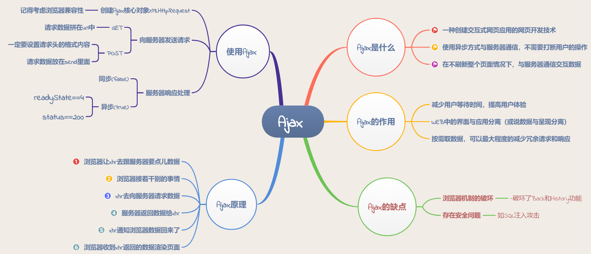
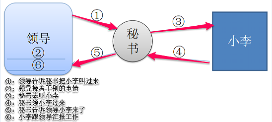
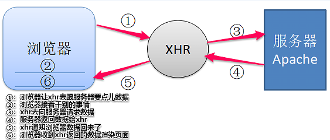
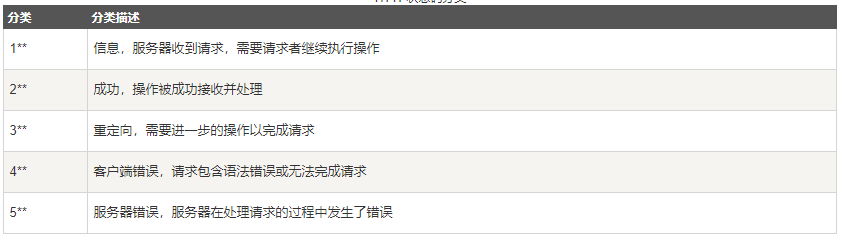
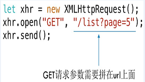

# Ajax原理一篇就够了

## 前言

AJAX即“Asynchronous Javascript And XML”，是指一种创建交互式网页应用的网页开发技术。AJAX 是一种用于创建快速动态网页的技术。它可以令开发者只向服务器获取数据（而不是图片，HTML文档等资源），互联网资源的传输变得前所未有的轻量级和纯粹，这激发了广大开发者的创造力，使各式各样功能强大的网络站点，和互联网应用如雨后春笋一般冒出，不断带给人惊喜。



## 一、什么是Ajax

Ajax是一种异步请求数据的web开发技术，对于改善用户的体验和页面性能很有帮助。简单地说，在不需要重新刷新页面的情况下，Ajax 通过异步请求加载后台数据，并在网页上呈现出来。常见运用场景有表单验证是否登入成功、百度搜索下拉框提示和快递单号查询等等。`Ajax的目的是提高用户体验，较少网络数据的传输量。`同时，由于AJAX请求获取的是数据而不是HTML文档，因此它也节省了网络带宽，让互联网用户的网络冲浪体验变得更加顺畅。

## 二、Ajax原理是什么

在解释Ajax原理之前，我们不妨先举个“领导想找小李汇报一下工作”例子，领导想找小李问点事，就委托秘书去叫小李，自己就接着做其他事情，直到秘书告诉他小李已经到了，最后小李跟领导汇报工作。



Ajax请求数据流程与“领导想找小李汇报一下工作”类似。其中最核心的依赖是浏览器提供的XMLHttpRequest对象，它扮演的角色相当于秘书，使得浏览器可以发出HTTP请求与接收HTTP响应。浏览器接着做其他事情，等收到XHR返回来的数据再渲染页面。



理解了Ajax的工作原理后，接下来我们探讨下如何使用Ajax。

## 三、Ajax的使用

### 1.创建Ajax核心对象XMLHttpRequest(记得考虑兼容性)

```text
1. var xhr=null;  
2. if (window.XMLHttpRequest)  
3.   {// 兼容 IE7+, Firefox, Chrome, Opera, Safari  
4.   xhr=new XMLHttpRequest();  
5.   } else {// 兼容 IE6, IE5 
6.     xhr=new ActiveXObject("Microsoft.XMLHTTP");  
7.   } 
```

### 2.向服务器发送请求

```text
1. xhr.open(method,url,async);  
2. send(string);//post请求时才使用字符串参数，否则不用带参数。
```

- method：请求的类型；GET 或 POST

- url：文件在服务器上的位置

- async：true（异步）或 false（同步）

`注意：post请求一定要设置请求头的格式内容`

```javascript
xhr.open("POST","test.html",true);  
xhr.setRequestHeader("Content-type","application/x-www-form-urlencoded");  
xhr.send("fname=Henry&lname=Ford");  //post请求参数放在send里面，即请求体
```

### 3.服务器响应处理（区分同步跟异步两种情况）

responseText 获得字符串形式的响应数据。

responseXML 获得XML 形式的响应数据。

#### `①同步处理`

```text
1. xhr.open("GET","info.txt",false);  
2. xhr.send();  
3. document.getElementById("myDiv").innerHTML=xhr.responseText; //获取数据直接显示在页面上
```

#### `②异步处理`

相对来说比较复杂，要在请求状态改变事件中处理。

```text
1. xhr.onreadystatechange=function()  { 
2.    if (xhr.readyState==4 &&xhr.status==200)  { 
3.       document.getElementById("myDiv").innerHTML=xhr.responseText;  
4.      }
5.    } 
```

`什么是readyState？`

readyState是XMLHttpRequest对象的一个属性，用来标识当前XMLHttpRequest对象处于什么状态。

readyState总共有5个状态值，分别为0~4，每个值代表了不同的含义

- 0：未初始化 -- 尚未调用.open()方法；
- 1：启动 -- 已经调用.open()方法，但尚未调用.send()方法；
- 2：发送 -- 已经调用.send()方法，但尚未接收到响应；
- 3：接收 -- 已经接收到部分响应数据；
- 4：完成 -- 已经接收到全部响应数据，而且已经可以在客户端使用了；

`什么是status？`

HTTP状态码(status)由三个十进制数字组成，第一个十进制数字定义了状态码的类型，后两个数字没有分类的作用。HTTP状态码共分为5种类型：



`常见的状态码`

仅记录在 RFC2616 上的 HTTP 状态码就达 40 种，若再加上 WebDAV（RFC4918、5842）和附加 HTTP 状态码 （RFC6585）等扩展，数量就达 60 余种。接下来，我们就介绍一下这些具有代表性的一些状态码。

- 200 表示从客户端发来的请求在服务器端被正常处理了。
- 204 表示请求处理成功，但没有资源返回。
- 301 表示永久性重定向。该状态码表示请求的资源已被分配了新的URI，以后应使用资源现在所指的URI。
- 302 表示临时性重定向。
- 304 表示客户端发送附带条件的请求时（指采用GET方法的请求报文中包含if-matched,if-modified-since,if-none-match,if-range,if-unmodified-since任一个首部）服务器端允许请求访问资源，但因发生请求未满足条件的情况后，直接返回304Modified（服务器端资源未改变，可直接使用客户端未过期的缓存）
- 400 表示请求报文中存在语法错误。当错误发生时，需修改请求的内容后再次发送请求。
- 401 表示未授权（Unauthorized)，当前请求需要用户验证
- 403 表示对请求资源的访问被服务器拒绝了
- 404 表示服务器上无法找到请求的资源。除此之外，也可以在服务器端拒绝请求且不想说明理由时使用。
- 500 表示服务器端在执行请求时发生了错误。也有可能是Web应用存在的bug或某些临时的故障。
- 503 表示服务器暂时处于超负载或正在进行停机维护，现在无法处理请求。

#### `③GET和POST请求数据区别`

- 使用Get请求时,参数在URL中显示,而使用Post方式,则放在send里面
- 使用Get请求发送数据量小,Post请求发送数据量大
- 使用Get请求安全性低，会被缓存，而Post请求反之

关于第一点区别，详情见下面两张图：



## 四、结束语

其实通过 XMLHttpRequest或者封装后的框架进行网络请求,这种方式已经有点老旧了，配置和调用方式非常混乱，近几年刚刚出来的Fetch提供了一个更好的替代方法，它不仅提供了一种简单，合乎逻辑的方式来跨网络异步获取资源，而且可以很容易地被其他技术使用。

## 参考文章

- [javascript教程](https://www.liaoxuefeng.com/wiki/1022910821149312/1023022332902400)

- [Ajax 简介](https://www.ibm.com/developerworks/cn/web/wa-aj-ajaxhistory/index.html)

- [再也不学AJAX了！（一）AJAX概述](https://juejin.im/post/5a1e11b86fb9a0451d413977)

- [HTTP菜鸟教程](https://www.runoob.com/http/http-tutorial.html)

- [AJAX的POST和GET请求的区别](https://juejin.im/post/5a31d0685188253da72e7458)
