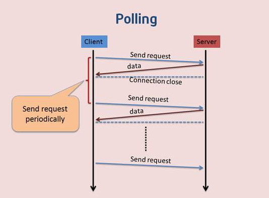
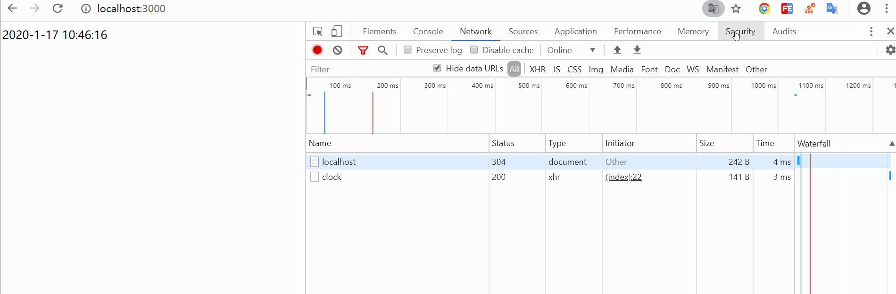
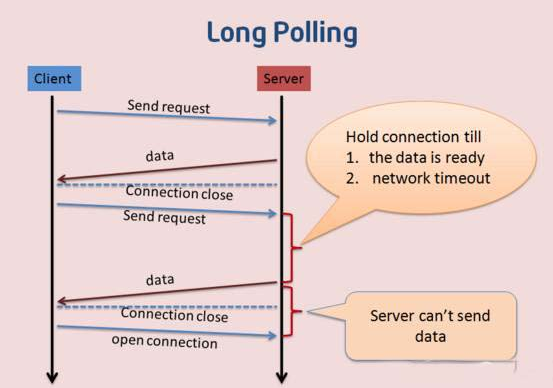
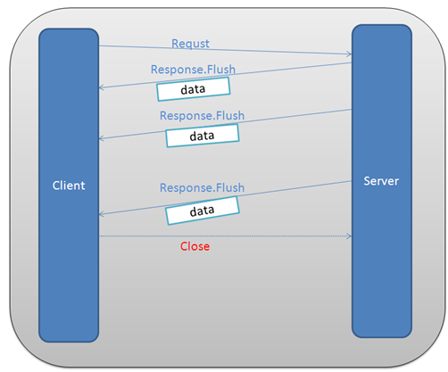
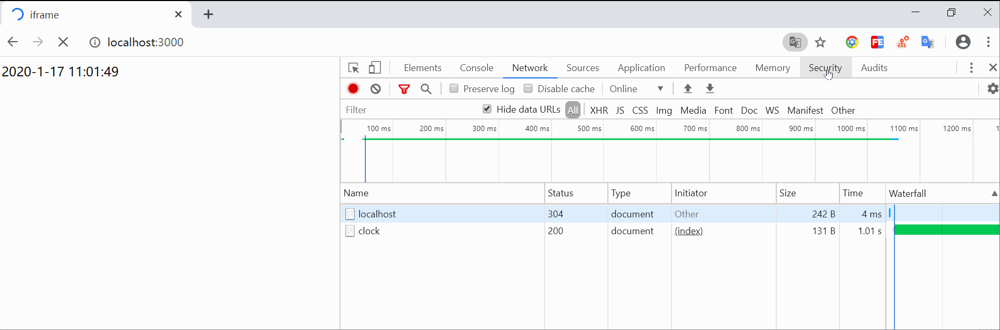
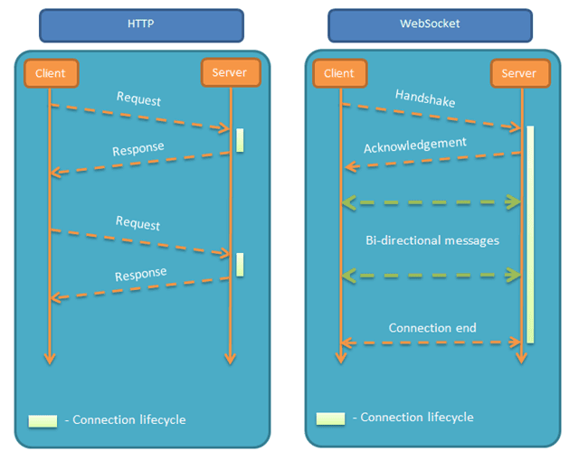
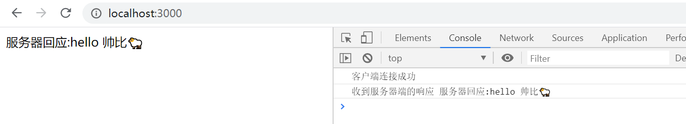

# Web 实时推送技术的总结

## 前言

随着 Web 的发展，用户对于 Web 的实时推送要求也越来越高 ，比如，工业运行监控、Web 在线通讯、即时报价系统、在线游戏等，都需要将后台发生的变化主动地、实时地传送到浏览器端，而不需要用户手动地刷新页面。本文对过去和现在流行的 Web 实时推送技术进行了比较与总结。

## 一、双向通信

HTTP 协议有一个缺陷：通信只能由客户端发起。举例来说，我们想了解今天的天气，只能是客户端向服务器发出请求，服务器返回查询结果。HTTP 协议做不到服务器主动向客户端推送信息。这种单向请求的特点，注定了如果服务器有连续的状态变化，客户端要获知就非常麻烦。`在WebSocket协议之前，有三种实现双向通信的方式：轮询（polling）、长轮询（long-polling）和iframe流（streaming）`。

### 1.轮询（polling）

轮询是客户端和服务器之间会一直进行连接，每隔一段时间就询问一次。其缺点也很明显：连接数会很多，一个接受，一个发送。而且`每次发送请求都会有Http的Header，会很耗流量，也会消耗CPU的利用率。`

- 优点：实现简单，无需做过多的更改

- 缺点：轮询的间隔过长，会导致用户不能及时接收到更新的数据；轮询的间隔过短，会导致查询请求过多，增加服务器端的负担

> [轮询(polling) demo](./polling-demo)

启动本地服务，打开`http://localhost:3000`,得到如下结果：

### 2.长轮询（long-polling）

长轮询是对轮询的改进版，客户端发送HTTP给服务器之后，看有没有新消息，如果没有新消息，就一直等待。当有新消息的时候，才会返回给客户端。在某种程度上减小了网络带宽和CPU利用率等问题。由于http数据包的头部数据量往往很大（通常有400多个字节），但是真正被服务器需要的数据却很少（有时只有10个字节左右），这样的数据包在网络上周期性的传输，难免`对网络带宽是一种浪费`。

- 优点：比 轮询(Polling) 做了优化，有较好的时效性

- 缺点：保持连接会消耗资源; 服务器没有返回有效数据，程序超时。

> [长轮询(long-polling) demo](./long-polling-demo)

### 3.iframe流（streaming）

iframe流方式是在页面中插入一个隐藏的iframe，利用其src属性在服务器和客户端之间创建一条长连接，服务器向iframe传输数据（通常是HTML，内有负责插入信息的javascript），来实时更新页面。

- 优点：消息能够实时到达；浏览器兼容好

- 缺点：服务器维护一个长连接会增加开销；IE、chrome、Firefox会显示加载没有完成，图标会不停旋转。

> [iframe流(streaming) demo](./iframe-demo)

上述代码中，客户端只请求一次，然而服务端却是源源不断向客户端发送数据，这样服务器维护一个长连接会增加开销。

以上我们介绍了三种实时推送技术，然而各自的缺点很明显，使用起来并不理想，接下来我们着重介绍另一种技术--websocket,它是比较理想的双向通信技术。

## 二、WebSocket

### 1.什么是websocket

WebSocket是一种全新的协议，随着HTML5草案的不断完善，越来越多的现代浏览器开始全面支持WebSocket技术了，它将TCP的Socket（套接字）应用在了webpage上，从而使通信双方建立起一个保持在活动状态连接通道。

一旦Web服务器与客户端之间建立起WebSocket协议的通信连接，之后所有的通信都依靠这个专用协议进行。通信过程中可互相发送JSON、XML、HTML或图片等任意格式的数据。`由于是建立在HTTP基础上的协议，因此连接的发起方仍是客户端，而一旦确立WebSocket通信连接，不论服务器还是客户端，任意一方都可直接向对方发送报文`。

初次接触 WebSocket 的人，都会问同样的问题：我们已经有了 HTTP 协议，为什么还需要另一个协议？

### 2.HTTP的局限性

- HTTP是半双工协议，也就是说，在同一时刻数据只能单向流动，客户端向服务器发送请求(单向的)，然后服务器响应请求(单向的)。

- 服务器不能主动推送数据给浏览器。这就会导致一些高级功能难以实现，诸如聊天室场景就没法实现。

### 3.WebSocket的特点

- 支持双向通信，实时性更强

- 可以发送文本，也可以发送二进制数据

- 减少通信量：只要建立起WebSocket连接，就希望一直保持连接状态。和HTTP相比，不但每次连接时的总开销减少，而且由于WebSocket的首部信息很小，通信量也相应减少了

相对于传统的HTTP每次请求-应答都需要客户端与服务端建立连接的模式，WebSocket是类似Socket的TCP长连接的通讯模式，一旦WebSocket连接建立后，后续数据都以帧序列的形式传输。在客户端断开WebSocket连接或Server端断掉连接前，不需要客户端和服务端重新发起连接请求。`在海量并发和客户端与服务器交互负载流量大的情况下，极大的节省了网络带宽资源的消耗，有明显的性能优势，且客户端发送和接受消息是在同一个持久连接上发起，实时性优势明显。`

接下来我看下websocket如何实现客户端与服务端双向通信：

> [WebSocket demo](./WebSocket-demo)

## 三、Web 实时推送技术的比较

| 方式  	|   类型   	|   技术实现	| 优点	    | 缺点	     | 适用场景 |
| ----      | ----      | --------     | ----     | -----    | -------|
| 轮询Polling|	client→server|	客户端循环请求 |	1、实现简单 2、 支持跨域 |	1、浪费带宽和服务器资源 2、 一次请求信息大半是无用（完整http头信息） 3、有延迟 4、大部分无效请求 |	适于小型应用|
|长轮询Long-Polling	| client→server |	服务器hold住连接，一直到有数据或者超时才返回，减少重复请求次数 |	1、实现简单 2、不会频繁发请求 3、节省流量 4、延迟低  |	1、服务器hold住连接，会消耗资源 2、一次请求信息大半是无用 |	WebQQ、Hi网页版、Facebook IM|
|长连接iframe |	client→server |	在页面里嵌入一个隐蔵iframe，将这个 iframe 的 src 属性设为对一个长连接的请求，服务器端就能源源不断地往客户端输入数据。	|1、数据实时送达 2、不发无用请求，一次链接，多次“推送” |	1、服务器增加开销 2、无法准确知道连接状态 3、IE、chrome等一直会处于loading状态 |	Gmail聊天 |
|WebSocket |	server⇌client |	new WebSocket() |	1、支持双向通信，实时性更强 2、可发送二进制文件3、减少通信量 |	1、浏览器支持程度不一致 2、不支持断开重连 |	网络游戏、银行交互和支付

综上所述：Websocket协议不仅解决了HTTP协议中服务端的被动性，即通信只能由客户端发起，也解决了数据同步有延迟的问题，同时还带来了明显的性能优势，所以websocket是Web 实时推送技术的比较理想的方案，但如果要兼容低版本浏览器，可以考虑用轮询来实现。

## 参考文章

- [WebSocket 教程](http://www.ruanyifeng.com/blog/2017/05/websocket.html)

- [Web 实时推送技术的总结](https://waylau.com/web-real-time-push-technology/)

- [WebSocket（1）： 服务端“实时推送”的演变](https://github.com/kaola-fed/blog/issues/277)

- [长连接/websocket/SSE等主流服务器推送技术比较](https://zhuanlan.zhihu.com/p/31297574)
