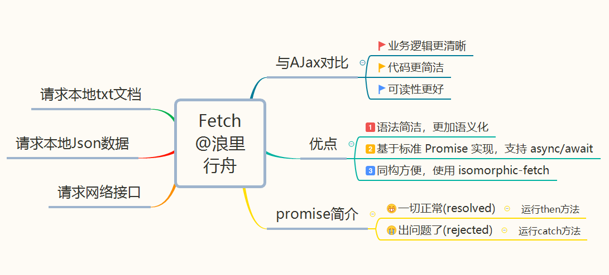
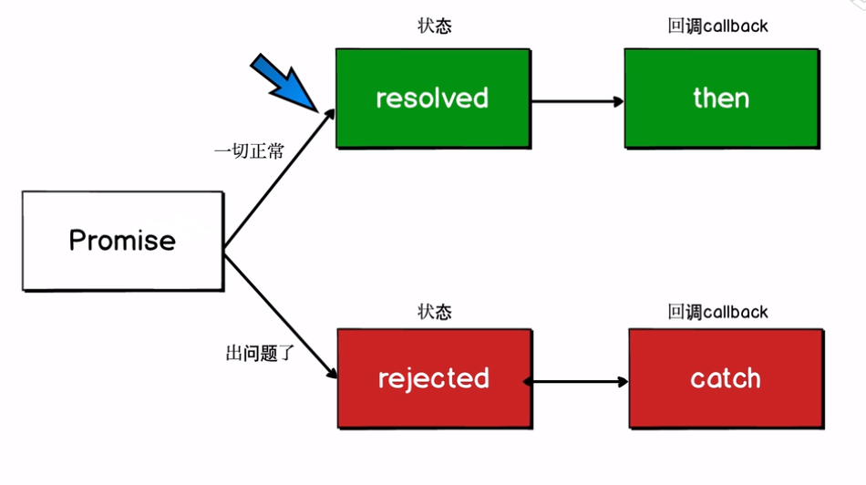

# fetch 如何请求数据

## 一 序言

在 传统Ajax 时代，进行 API 等网络请求都是通过XMLHttpRequest或者封装后的框架进行网络请求,然而配置和调用方式非常混乱，对于刚入门的新手并不友好。今天我们介绍的Fetch提供了一个更好的替代方法，它不仅提供了一种简单，合乎逻辑的方式来跨网络异步获取资源，而且可以很容易地被其他技术使用，例如 Service Workers。



## 二 与Ajax对比

使用Ajax请求一个 JSON 数据一般是这样：

```javascript
var xhr = new XMLHttpRequest();
xhr.open('GET', url/file,true);
xhr.onreadystatechange = function() {
   if(xhr.readyState==4){
        if(xhr.status==200){
            var data=xhr.responseText;
             console.log(data);
   }
};
xhr.onerror = function() {
  console.log("Oh, error");
};
xhr.send();
```

同样我们使用fetch请求JSON数据：

```javascript
fetch(url).then(response => response.json())//解析为可读数据
  .then(data => console.log(data))//执行结果是 resolve就调用then方法
  .catch(err => console.log("Oh, error", err))//执行结果是 reject就调用catch方法
```

从两者对比来看，fetch代码精简许多，业务逻辑更清晰明了，使得代码易于维护，可读性更高。
总而言之，Fetch 优点主要有：

`1. 语法简洁，更加语义化，业务逻辑更清晰`

`2. 基于标准 Promise 实现，支持 async/await`

`3. 同构方便，使用`[isomorphic-fetch](https://github.com/matthew-andrews/isomorphic-fetch)

## 三 Promise简介

由于 Fetch API 是基于 Promise 设计，接下来我们简单介绍下Promise工作流程，方便大家更好理解Fetch。



fetch方法返回一个Promise对象, 根据 Promise Api 的特性, fetch可以方便地使用then方法将各个处理逻辑串起来, 使用 Promise.resolve() 或 Promise.reject() 方法将分别返会肯定结果的Promise或否定结果的Promise, 从而调用下一个then 或者 catch。一旦then中的语句出现错误, 也将跳到catch中。

## 四 请求常见数据格式

接下来将介绍如何使用fetch请求本地文本数据，请求本地JSON数据以及请求网络接口。其实操作相比与Ajax，简单很多！

```html
//HTML部分
<div class="container">
    <h1>Fetch Api sandbox</h1>
    <button id="button1">请求本地文本数据</button>
    <button id="button2">请求本地json数据</button>
    <button id="button3">请求网络接口</button>
    <br><br>
    <div id="output"></div>
</div>
<script src="app.js"></script>
```

### 1.fetch请求本地文本数据

本地有一个test.txt文档，通过以下代码就可以获取其中的数据，并且显示在页面上。

```javascript
document.getElementById('button1').addEventListener('click',getText);
function getText(){
  fetch("test.txt")
      .then((res) => res.text())//注意：此处是res.text()
      .then(data => {
        console.log(data);
        document.getElementById('output').innerHTML = data;
      })
      .catch(err => console.log(err));
}
```

### 2.fetch请求本地JSON数据

本地有个posts.json数据，与请求本地文本不同的是，得到数据后还要用forEach遍历,最后呈现在页面上。

```javascript
document.getElementById('button2').addEventListener('click',getJson);
function getJson(){
  fetch("posts.json")
      .then((res) => res.json())
      .then(data => {
        console.log(data);
        let output = '';
        data.forEach((post) => {
          output += `<li>${post.title}</li>`;
        })
        document.getElementById('output').innerHTML = output;
      })
      .catch(err => console.log(err));
}
```

### 3.fetch请求网络接口

获取https://api.github.com/users中的数据，做法与获取本地JSON的方法类似,得到数据后，同样要经过处理

```javascript
document.getElementById('button3').addEventListener('click',getExternal);
function getExternal(){
  // https://api.github.com/users
  fetch("https://api.github.com/users")
      .then((res) => res.json())
      .then(data => {
        console.log(data);
        let output = '';
        data.forEach((user) => {
          output += `<li>${user.login}</li>`;
        })
        document.getElementById('output').innerHTML = output;
      })
      .catch(err => console.log(err));
}
```
