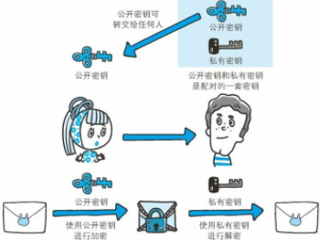
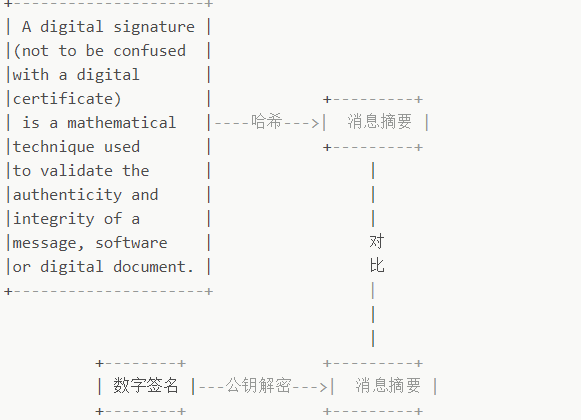
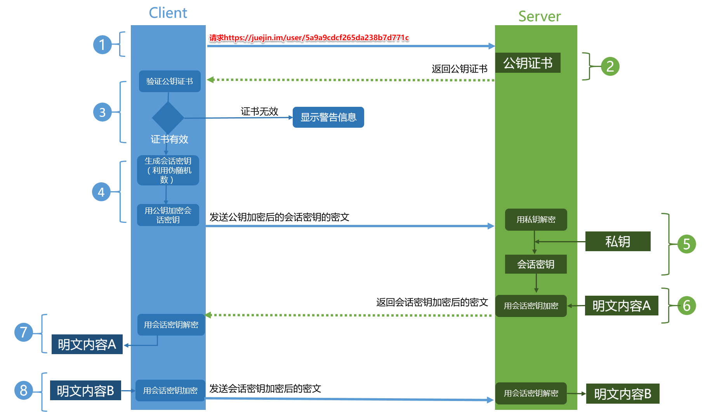
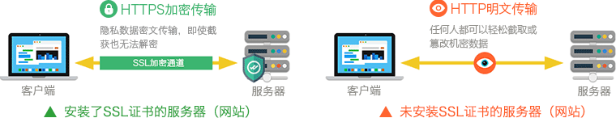

# 深入理解HTTPS工作原理

## 前言

近几年，互联网发生着翻天覆地的变化，尤其是我们一直习以为常的HTTP协议，在逐渐的被HTTPS协议所取代，在浏览器、搜索引擎、CA机构、大型互联网企业的共同促进下，互联网迎来了“HTTPS加密时代”，HTTPS将在未来的几年内全面取代HTTP成为传输协议的主流。

读完本文，希望你能明白：

>HTTP通信存在什么问题
>
>HTTPS如何改进HTTP存在那些问题
>
>HTTPS工作原理是什么

## 一、什么是HTTPS

HTTPS是在HTTP上建立SSL加密层，并对传输数据进行加密，是HTTP协议的安全版。现在它被广泛用于万维网上安全敏感的通讯，例如交易支付方面。

HTTPS主要作用是：

（1）对数据进行加密，并建立一个信息安全通道，来保证传输过程中的数据安全;

（2）对网站服务器进行真实身份认证。

我们经常会在Web的登录页面和购物结算界面等使用HTTPS通信。使用HTTPS通信时，不再用http://，而是改用https://。另外，当浏览器访问HTTPS通信有效的Web网站时，浏览器的地址栏内会出现一个带锁的标记。对HTTPS的显示方式会因浏览器的不同而有所改变。

## 二、为什么需要HTTPS

在HTTP协议中有可能存在信息窃取或身份伪装等安全问题。使用HTTPS通信机制可以有效地防止这些问题，接下来，我们先来了解下HTTP协议存在的哪些问题：

>- 通信使用明文（不加密），内容可能被窃听

由于HTTP本身不具备加密的功能，所以也无法做到对通信整体（使用HTTP协议通信的请求和响应的内容）进行加密。即，`HTTP报文使用明文（指未经过加密的报文）方式发送`。

HTTP明文协议的缺陷是导致数据泄露、数据篡改、流量劫持、钓鱼攻击等安全问题的重要原因。HTTP协议无法加密数据，所有通信数据都在网络中明文“裸奔”。通过网络的嗅探设备及一些技术手段，就可还原HTTP报文内容。

>- 无法证明报文的完整性，所以可能遭篡改

所谓完整性是指信息的准确度。若无法证明其完整性，通常也就意味着无法判断信息是否准确。由于HTTP协议无法证明通信的报文完整性，因此，在请求或响应送出之后直到对方接收之前的这段时间内，即使请求或响应的内容遭到篡改，也没有办法获悉。

换句话说，`没有任何办法确认，发出的请求/响应和接收到的请求/响应是前后相同的`。

>- 不验证通信方的身份，因此有可能遭遇伪装

`HTTP协议中的请求和响应不会对通信方进行确认`。在HTTP协议通信时，由于不存在确认通信方的处理步骤，任何人都可以发起请求。另外，服务器只要接收到请求，不管对方是谁都会返回一个响应（但也仅限于发送端的IP地址和端口号没有被Web服务器设定限制访问的前提下）

HTTP协议无法验证通信方身份，任何人都可以伪造虚假服务器欺骗用户，实现“钓鱼欺诈”，用户无法察觉。

反观HTTPS协议，它比HTTP协议相比多了以下优势（下文会详细介绍）:

>- 数据隐私性：内容经过对称加密，每个连接生成一个唯一的加密密钥
>
>- 数据完整性：内容传输经过完整性校验
>
>- 身份认证：第三方无法伪造服务端（客户端）身份
>

## 三、HTTPS如何解决HTTP上述问题?

HTTPS并非是应用层的一种新协议。只是HTTP通信接口部分用SSL和TLS协议代替而已。

通常，HTTP直接和TCP通信。当使用SSL时，则演变成先和SSL通信，再由SSL和TCP通信了。简言之，`所谓HTTPS，其实就是身披SSL协议这层外壳的HTTP`。

在采用SSL后，HTTP就拥有了HTTPS的加密、证书和完整性保护这些功能。也就是说`HTTP加上加密处理和认证以及完整性保护后即是HTTPS`。

HTTPS 协议的主要功能基本都依赖于 TLS/SSL 协议，TLS/SSL 的功能实现主要依赖于三类基本算法：散列函数 、对称加密和非对称加密，`其利用非对称加密实现身份认证和密钥协商，对称加密算法采用协商的密钥对数据加密，基于散列函数验证信息的完整性`。

### 1.解决内容可能被窃听的问题——加密

#### 方法1.对称加密

这种方式加密和解密同用一个密钥。加密和解密都会用到密钥。`没有密钥就无法对密码解密，反过来说，任何人只要持有密钥就能解密了`。

以对称加密方式加密时必须将密钥也发给对方。可究竟怎样才能安全地转交？在互联网上转发密钥时，如果通信被监听那么密钥就可会落人攻击者之手，同时也就失去了加密的意义。另外还得设法安全地保管接收到的密钥。

#### 方法2.非对称加密

公开密钥加密使用一对非对称的密钥。一把叫做私有密钥，另一把叫做公开密钥。顾名思义，`私有密钥不能让其他任何人知道，而公开密钥则可以随意发布，任何人都可以获得`。

使用公开密钥加密方式，发送密文的一方使用`对方的公开密钥`进行加密处理，对方收到被加密的信息后，再使用自己的私有密钥进行解密。利用这种方式，不需要发送用来解密的私有密钥，也不必担心密钥被攻击者窃听而盗走。

非对称加密的特点是信息传输一对多，服务器只需要维持一个私钥就能够和多个客户端进行加密通信。

这种方式有以下缺点：

>- 公钥是公开的，所以针对私钥加密的信息，黑客截获后可以使用公钥进行解密，获取其中的内容；
>
>- 公钥并不包含服务器的信息，使用非对称加密算法无法确保服务器身份的合法性，存在中间人攻击的风险，服务器发送给客户端的公钥可能在传送过程中被中间人截获并篡改；
>
>- 使用非对称加密在数据加密解密过程需要消耗一定时间，降低了数据传输效率；

#### 方法3.对称加密+非对称加密(HTTPS采用这种方式)

使用对称密钥的好处是解密的效率比较快，使用非对称密钥的好处是可以使得传输的内容不能被破解，因为就算你拦截到了数据，但是没有对应的私钥，也是不能破解内容的。就比如说你抢到了一个保险柜，但是没有保险柜的钥匙也不能打开保险柜。那我们就将对称加密与非对称加密结合起来,充分利用两者各自的优势，`在交换密钥环节使用非对称加密方式，之后的建立通信交换报文阶段则使用对称加密方式`。

具体做法是：`发送密文的一方使用对方的公钥进行加密处理“对称的密钥”，然后对方用自己的私钥解密拿到“对称的密钥”，这样可以确保交换的密钥是安全的前提下，使用对称加密方式进行通信`。所以，HTTPS采用对称加密和非对称加密两者并用的混合加密机制。

### 2.解决报文可能遭篡改问题——数字签名

网络传输过程中需要经过很多中间节点，虽然数据无法被解密，但可能被篡改，那如何校验数据的完整性呢？----校验数字签名。

`数字签名有两种功效：`

>- 能确定消息确实是由发送方签名并发出来的，因为别人假冒不了发送方的签名。
>
>- 数字签名能确定消息的完整性,证明数据是否未被篡改过。

`数字签名如何生成:`

将一段文本先用Hash函数生成消息摘要，然后用发送者的私钥加密生成数字签名，与原文文一起传送给接收者。接下来就是接收者校验数字签名的流程了。

`校验数字签名流程：`

接收者只有用发送者的公钥才能解密被加密的摘要信息，然后用HASH函数对收到的原文产生一个摘要信息，与上一步得到的摘要信息对比。如果相同，则说明收到的信息是完整的，在传输过程中没有被修改，否则说明信息被修改过，因此数字签名能够验证信息的完整性。

假设消息传递在Kobe，James两人之间发生。James将消息连同数字签名一起发送给Kobe，Kobe接收到消息后，通过校验数字签名，就可以验证接收到的消息就是James发送的。当然，这个过程的前提是Kobe知道James的公钥。问题的关键的是，和消息本身一样，公钥不能在不安全的网络中直接发送给Kobe,或者说拿到的公钥如何证明是James的。

此时就需要引入了`证书颁发机构`（Certificate Authority，简称CA），CA数量并不多，Kobe客户端内置了所有受信任CA的证书。CA对James的公钥（和其他信息）数字签名后生成证书。

### 3.解决通信方身份可能被伪装的问题——数字证书

数字证书认证机构处于客户端与服务器双方都可信赖的第三方机构的立场上。

我们来介绍一下数字证书认证机构的业务流程：

>- 服务器的运营人员向第三方机构CA提交公钥、组织信息、个人信息(域名)等信息并申请认证;
>
>- CA通过线上、线下等多种手段验证申请者提供信息的真实性，如组织是否存在、企业是否合法，是否拥有域名的所有权等;
>
>- 如信息审核通过，CA会向申请者签发认证文件-证书。证书包含以下信息：申请者公钥、申请者的组织信息和个人信息、签发机构 CA的信息、有效时间、证书序列号等信息的明文，同时包含一个签名。 其中签名的产生算法：首先，使用散列函数计算公开的明文信息的信息摘要，然后，采用 CA的私钥对信息摘要进行加密，密文即签名;
>
>- 客户端 Client 向服务器 Server 发出请求时，Server 返回证书文件;
>
>- 客户端 Client 读取证书中的相关的明文信息，采用相同的散列函数计算得到信息摘要，然后，利用对应 CA的公钥解密签名数据，对比证书的信息摘要，如果一致，则可以确认证书的合法性，即服务器的公开密钥是值得信赖的。
>
>- 客户端还会验证证书相关的域名信息、有效时间等信息; 客户端会内置信任CA的证书信息(包含公钥)，如果CA不被信任，则找不到对应 CA的证书，证书也会被判定非法。

## 四、 HTTPS工作流程

1.Client发起一个HTTPS（比如https://juejin.im/user/5a9a9cdcf265da238b7d771c）的请求，根据RFC2818的规定，Client知道需要连接Server的443（默认）端口。

2.Server把事先配置好的公钥证书（public key certificate）返回给客户端。

3.Client验证公钥证书：比如是否在有效期内，证书的用途是不是匹配Client请求的站点，是不是在CRL吊销列表里面，它的上一级证书是否有效，这是一个递归的过程，直到验证到根证书（操作系统内置的Root证书或者Client内置的Root证书）。如果验证通过则继续，不通过则显示警告信息。

4.Client使用伪随机数生成器生成加密所使用的对称密钥，然后用证书的公钥加密这个对称密钥，发给Server。

5.Server使用自己的私钥（private key）解密这个消息，得到对称密钥。至此，Client和Server双方都持有了相同的对称密钥。

6.Server使用对称密钥加密“明文内容A”，发送给Client。

7.Client使用对称密钥解密响应的密文，得到“明文内容A”。

8.Client再次发起HTTPS的请求，使用对称密钥加密请求的“明文内容B”，然后Server使用对称密钥解密密文，得到“明文内容B”。

## 五、HTTP 与 HTTPS 的区别

- HTTP 是明文传输协议，HTTPS 协议是由 SSL+HTTP 协议构建的可进行加密传输、身份认证的网络协议，比 HTTP 协议安全。

关于安全性，用最简单的比喻形容两者的关系就是卡车运货，HTTP下的运货车是敞篷的，货物都是暴露的。而https则是封闭集装箱车，安全性自然提升不少。

- HTTPS比HTTP更加安全，对搜索引擎更友好，利于SEO,谷歌、百度优先索引HTTPS网页;

- HTTPS需要用到SSL证书，而HTTP不用;

- HTTPS标准端口443，HTTP标准端口80;

- HTTPS基于传输层，HTTP基于应用层;

- HTTPS在浏览器显示绿色安全锁，HTTP没有显示;

## 六、为何不所有的网站都使用HTTPS

既然HTTPS那么安全可靠，那为何不所有的Web网站都使用HTTPS？

首先，很多人还是会觉得HTTPS实施有门槛，这个门槛在于需要权威CA颁发的SSL证书。从证书的选择、购买到部署，传统的模式下都会比较耗时耗力。

其次，HTTPS普遍认为性能消耗要大于HTTP，`因为与纯文本通信相比，加密通信会消耗更多的CPU及内存资源`。如果每次通信都加密，会消耗相当多的资源，平摊到一台计算机上时，能够处理的请求数量必定也会随之减少。但事实并非如此，用户可以通过性能优化、把证书部署在SLB或CDN，来解决此问题。举个实际的例子，“双十一”期间，全站HTTPS的淘宝、天猫依然保证了网站和移动端的访问、浏览、交易等操作的顺畅、平滑。通过测试发现，经过优化后的许多页面性能与HTTP持平甚至还有小幅提升，因此HTTPS经过优化之后其实并不慢。

除此之外，`想要节约购买证书的开销`也是原因之一。要进行HTTPS通信，证书是必不可少的。而使用的证书必须向认证机构（CA）购买。

最后是安全意识。相比国内，国外互联网行业的安全意识和技术应用相对成熟，HTTPS部署趋势是由社会、企业、政府共同去推动的。

## 参考文章与书籍

- [图解HTTP](https://book.douban.com/subject/25863515/)

- [珠峰架构课(推荐)](http://www.zhufengpeixun.cn/main/course/index.html)

- [数字签名是什么？(推荐)](http://www.ruanyifeng.com/blog/2011/08/what_is_a_digital_signature.html)

- [HTTPS工作原理](https://cattail.me/tech/2015/11/30/how-https-works.html)

- [HTTPS 原理详解](https://cattail.me/tech/2015/11/30/how-https-works.html)

- [详解HTTPS是如何确保安全性的？](http://www.wxtlife.com/2016/03/27/%E8%AF%A6%E8%A7%A3https%E6%98%AF%E5%A6%82%E4%BD%95%E7%A1%AE%E4%BF%9D%E5%AE%89%E5%85%A8%E7%9A%84%EF%BC%9F/)

- [HTTPS工作流程](https://www.cnblogs.com/linianhui/p/security-https-workflow.html)

- [为什么HTTPS比HTTP更安全](https://www.wosign.com/Info/https_vs_http.htm)
