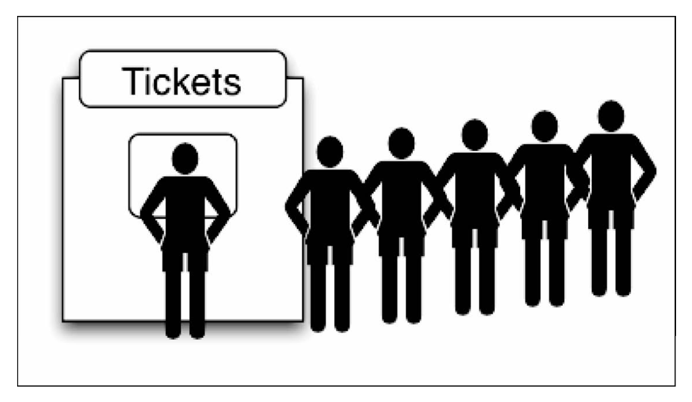

# 栈和队列

## 一、栈

栈是一种遵从先进后出 (LIFO) 原则的有序集合；新添加的或待删除的元素都保存在栈的末尾，称作栈顶，另一端为栈底。在栈里，新元素都靠近栈顶，旧元素都接近栈底。

通俗来讲，一摞叠起来的书或盘子都可以看做一个栈，我们想要拿出最底下的书或盘子，一定要现将上面的移走才可以。


栈也被用在编程语言的编译器和内存中保存变变量、方法调用。

在 Javascript 中我们可以使用数组的原生方法实现一个栈/队列的功能，鉴于学习目的，我们使用类来实现一个栈。

```javascript
class Stack {
    constructor() {
        this.items = []
    }

    // 入栈 push
    push(element) {
        this.items.push(element)
    }

    // 出栈 pop
    pop() {
        return this.items.pop()
    }

    // 末位
    get peek() {
        return this.items[this.items.length - 1]
    }

    // 是否为空栈
    get isEmpty() {
        return !this.items.length
    }
    
    // 尺寸
    get size() {
        return this.items.length
    }

    // 清空栈
    clear() {
        this.items = []
    }
    
    //  打印栈数据
    print() {
        console.log(this.items.toString())
    }
}
```

`使用栈类：`

```javascript
// 实例化一个栈
const stack = new Stack()
console.log(stack.isEmpty) // true

// 添加元素
stack.push(5)
stack.push(8)

// 读取属性再添加
console.log(stack.peek) // 8
stack.push(11)
console.log(stack.size) // 3
console.log(stack.isEmpty) // fasle
```

下面是一个小算法题，可以视为栈的综合利用，如何将10进制数字转成任意进制数字：

```javascript
const baseConverter = (decNumber, base) => {
    let remStack = new Stack()
    let rem
    let baseString = ''
    let digits = '0123456789ABCDEF'

    while (decNumber > 0) {
        rem = Math.floor(decNumber % base)
        remStack.push(rem)
        decNumber = Math.floor(decNumber / base)
    }
    while (!remStack.isEmpty()) {
        baseString += digits[remStack.pop()]
    }
    return baseString
}

baseConverter(100345,2) // "11000011111111001"
baseConverter(100345,8) // "303771"
baseConverter(100345,16) // "187F9"   
```

## 二、队列

与栈相反，队列是一种遵循先进先出 (FIFO / First In First Out) 原则的一组有序的项；队列在尾部添加新元素，并从头部移除元素。最新添加的元素必须排在队列的末尾。

在现实中，最常见的例子就是排队，吃饭排队、银行业务排队、公车的前门上后门下机制...，前面的人优先完成自己的事务，完成之后，下一个人才能继续。



在计算机科学中，一个常见的例子就是打印队列。比如说我们需要打印五份文档。我们会打开每个文档，然后点击打印按钮。每个文档都会被发送至打印队列。第一个发送到打印队列的文档会首先被打印，以此类推，直到打印完所有文档。

同样的，我们在 Javascript 中实现一个队列类。

```javascript
class Queue {
    constructor(items) {
        this.items = items || []
    }

    // 入队列
    enqueue(element) {
        this.items.push(element)
    }

    // 出队列
    dequeue() {
        return this.items.shift()
    }

    // 队列首位
    front() {
        return this.items[0]
    }

    // 清空队列
    clear() {
        this.items = []
    }

    // 尺寸
    get size() {
        return this.items.length
    }

    // 是否为空队列
    get isEmpty() {
        return !this.items.length
    }

    // 打印队列数据
    print() {
        console.log(this.items.toString())
    }
}
```

`使用队列类：`

```javascript
const queue = new Queue()
console.log(queue.isEmpty) // true

queue.enqueue('John')
queue.enqueue('Jack')
queue.enqueue('Camila')
console.log(queue.size) // 3
console.log(queue.isEmpty) // false
queue.dequeue()
queue.dequeue()
queue.print() // 'Camila'
```

### 优先队列

队列大量应用在计算机科学以及我们的生活中，我们在之前话题中实现的默认队列也有一些修改版本。

其中一个修改版就是优先队列。元素的添加和移除是基于优先级的。一个现实的例子就是机场登机的顺序。头等舱和商务舱乘客的优先级要高于经济舱乘客。在有些国家，老年人和孕妇(或 带小孩的妇女)登机时也享有高于其他乘客的优先级。

另一个现实中的例子是医院的(急诊科)候诊室。医生会优先处理病情比较严重的患者。通常，护士会鉴别分类，根据患者病情的严重程度放号。

实现一个优先队列，有两种选项：设置优先级，然后在正确的位置添加元素；或者用入列操作添加元素，然后按照优先级移除它们。在下面示例中，我们将会在正确的位置添加元素，因此可以对它们使用默认的出列操作：

```javascript
class PriorQueue {
    constructor() {
        this.items = []
    }
    
    // 入队列
    enqueue(element, priority) {
        const queueElement = {element, priority}
        if (this.isEmpty) {
            this.items.push(queueElement)
        } else {
            const preIndex = this.items.findIndex(item => {
                queueElement.priority < item.priority
            })
            if (preIndex > -1) {
                this.items.splice(preIndex, 0, queueElement)
            } else {
                this.items.push(queueElement)
            }
        }
    }

    // 出队列
    dequeue() {
        return this.items.shift()
    }

    // 队列首位
    front() {
        return this.items[0]
    }

    // 清空队列
    clear() {
        this.items = []
    }

    // 尺寸
    get size() {
        return this.items.length
    }

    // 是否为空队列
    get isEmpty() {
        return !this.items.length
    }

    // 打印队列数据
    print() {
        console.log(this.items.toString())
    }
}
```

`优先队列的使用：`

```javascript
const priorityQueue = new PriorityQueue()
priorityQueue.enqueue('John', 2)
priorityQueue.enqueue('Jack', 1)
priorityQueue.enqueue('Camila', 1)
priorityQueue.enqueue('Surmon', 3)
priorityQueue.enqueue('skyRover', 2)
priorityQueue.enqueue('司马萌', 1)
priorityQueue.print()

console.log(priorityQueue.isEmpty, priorityQueue.size) // false 6
```

### 循环队列

为充分利用向量空间，克服"假溢出"现象的方法是：将向量空间想象为一个首尾相接的圆环，并称这种向量为循环向量。存储在其中的队列称为循环队列（Circular Queue）。这种循环队列可以以单链表、队列的方式来在实际编程应用中来实现。

下面我们基于首次实现的队列类，简单实现一个循环引用的示例：

```javascript
class LoopQueue extends Queue {
    constructor(items) {
        super(items)
    }

    getIndex(index) {
        const length = this.items.length
        return index > length ? (index % length) : index
    }

    find(index) {
        return !this.isEmpty ? this.items[this.getIndex(index)] : null
    }   
}
```

`访问一个循环队列：`

```javascript
const loopQueue = new LoopQueue(['Surmon'])
loopQueue.enqueue('SkyRover')
loopQueue.enqueue('Even')
loopQueue.enqueue('Alice')
console.log(loopQueue.size, loopQueue.isEmpty) // 4 false

console.log(loopQueue.find(26)) // 'Evan'
console.log(loopQueue.find(87651)) // 'Alice'
```

击鼓传花游戏，在这个游戏中，孩子们围成一个圆圈，把花尽快的传递给旁边的人。某一时刻传花停止，这个时候花落在谁手里，谁就退出圆圈结束游戏。重复这个过程，直到只剩下一个孩子。例子如下：

```javascript
const hotPotato = (nameList, num) => {
    let queue = new Queue()
    for (let i = 0; i < nameList.length; i++) {
        queue.enqueue(nameList[i])
    }
    let eliminated = ''
    while (queue.size() > 1) {
        for (let i = 0; i < num; i++) {
            queue.enqueue(queue.dequeue())
        }
        eliminated = queue.dequeue()
        console.log(eliminated + '在游戏中淘汰了。')
    }
    return queue.dequeue()
}

let nameList = ["a","b","c","d","e"]
let winner = hotPotato(nameList, 7)
console.log("胜利者" + winner)
//c在游戏中淘汰了。
//b在游戏中淘汰了。
//e在游戏中淘汰了。
//d在游戏中淘汰了。
//胜利者a
```
