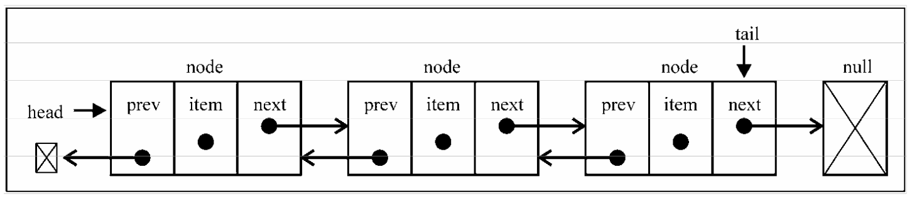
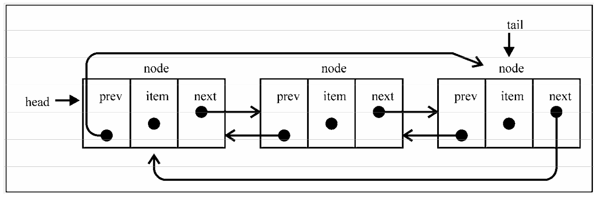

# 链表

要存储多个元素，数组（或列表）可能是最常用的数据结构。每种语言都实现了数组。这种数据结构非常方便，提供了一个便利的`[]`语法来访问它的元素。然而，这种数据结构有一个缺点：在大多数语言中，数组的大小是固定的，从数组的起点或中间插入或移除项的成本很高，因为需要移动元素；尽管 JavaScript 中的`Array`类方法可以帮我们做这些事，但背后的处理机制同样如此。

链表存储有序的元素集合，但不同于数组，链表中的元素在内存中并不是连续放置的。每个 元素由一个存储元素本身的节点和一个指向下一个元素的引用(也称指针或链接)组成。下图展示了链表的结构:


相对于传统的数组，链表的一个好处在于，添加或移除元素的时候不需要移动其他元素。然而，链表需要使用指针，因此实现链表时需要额外注意。

数组的另一个细节是可以直接访问任何位置的任何元素，而要想访问链表中间的一个元素，需要从起点(表头)开始迭代列表直到找到所需的元素。

现实中有许多链表的例子：一列火车是由一系列车厢/车皮组成的，每节车厢/车皮都相互连接，你很容易分离一节车皮，改变它的位置，添加或移除它。下图演示了一列火车，每节车皮都是列表的元素，车皮间的连接就是指针：


## 单向链表

下面我们使用 Javascript 创建一个链表类：

```javascript
// 链表节点
class Node {
    constructor(element) {
        this.element = element
        this.next = null
    }
}

// 链表
class LinkedList {
    constructor() {
        this.head = null
        this.length = 0
    }

    // 追加元素
    append(element) {
        const node = new Node(element)
        let current = null
        if (this.head === null) {
            this.head = node
        } else {
            current = this.head
            while (current.next) {
                current = current.next
            }
            current.next = node
        }
        this.length++
    }

    // 任意位置插入元素
    insert(position, element) {
        if (position >= 0 && position <= this.length) {
            const  node = new Node(element)
            let current = this.head
            let previous = null
            let index = 0
            if (position === 0) {
                this.head = node
            } else {
                while (index++ < position) {
                    previous = current
                    current = current.next
                }
                node.next = current
                previous.next = node
            }
            this.length++
            return true
        }
        return false
    }

    // 移除指定位置元素
    removeAt(position) {
        // 检查越界值
        if (position > -1 && position < length) {
            let current = this.head
            let previous = null
            let index = 0
            if (position) {
                this.head = current.next
            } else {
                while (index++ < position) {
                    previous = current
                    current = current.next
                }
                previous.next = current.next
            }
            this.length--
            return current.element
        }
        return null
    }

    // 寻找元素下标
    findIndex(element) {
        let current = this.head
        let index = -1
        while (current) {
            if (element === current.element) {
                return index + 1
            }
            index++
            current = current.next
        }
        return -1
    }

    // 删除指定文档
    remove(element) {
        const index = this.indexOf(element)
        return this.removeAt(index)
    }

    // 是否为空链表
    isEmpty() {
        return !this.length
    }

    // 尺寸
    size() {
        return this.length
    }

    // 转为字符串
    toString() {
        let current = this.head
        let string = ''
        while (current) {
            string += `${current.element}`
            current = current.next
        }
        return string
    }
}
```

`链表类的使用：`

```javascript
const linkedList = new LinkedList()

console.log(linkedList)
linkedList.append(2)
linkedList.append(6)
linkedList.append(24)
linkedList.append(152)

linkedList.insert(3, 18)
console.log(linkedList)
console.log(linkedList.findIndex(24))
```

## 双向链表

链表有多种不同的类型，这一节介绍双向链表。双向链表和普通链表的区别在于，在链表中， 一个节点只有链向下一个节点的链接，而在双向链表中，链接是双向的:一个链向下一个元素， 另一个链向前一个元素，如下图所示:



双向链表提供了两种迭代列表的方法:从头到尾，或者反过来。我们也可以访问一个特定节 点的下一个或前一个元素。在单向链表中，如果迭代列表时错过了要找的元素，就需要回到列表 起点，重新开始迭代。这是双向链表的一个优点。

我们继续来实现一个双向链表类：

```javascript
// 链表节点
class Node {
    constructor(element) {
        this.element = element
        this.prev = null
        this.next = null
    }
}

// 双向链表
class DoublyLinkedList {
    constructor() {
        this.head = null
        this.tail = null
        this.length = 0
    }

    // 任意位置插入元素
    insert(position, element) {
        if (position >= 0 && position <= this.length) {
            const node = new Node(element)
            let current = this.head
            let previous = null
            let index = 0
            // 首位
            if (position === 0) {
                if (!head) {
                    this.head = node
                    this.tail = node
                } else {
                    node.next = current
                    this.head = node
                    current.prev = node
                }
            // 末位
            } else if (position === this.length) {
                current = this.tail
                current.next = node
                node.prev = current
                this.tail = node
            // 中位
            } else {
                while (index++ < position) {
                    previous = current
                    current = current.next
                }
                node.next = current
                previous.next = node
                current.prev = node
                node.prev = previous
            }
            this.length++
            return true
        }
        return false
    }

    // 移除指定位置元素
    removeAt(position) {
        if (position > -1 && position < this.length) {
            let current = this.head
            let previous = null
            let index = 0
            // 首页
            if (position === 0) {
                this.head = this.head.next
                this.head.prev = null
                if (this.length === 1) {
                    this.tail = null
                }
            // 末位
            } else if (position === this.length - 1) {
                this.tail = this.tail.prev
                this.tail.next = null
            // 中位
            } else {
                while (index++ < position) {
                    previous = current
                    current = current.next
                }
                previous.next = current.next
                current.next.prev = previous
            }
            this.length--
            return current.element
        } else {
            return null
        }
    }

    // 其他方法...
}
```

## 循环链表

循环链表可以像链表一样只有单向引用，也可以像双向链表一样有双向引用。循环链表和链表之间唯一的区别在于，最后一个元素指向下一个元素的指针(tail.next)不是引用null， 而是指向第一个元素(head)，如下图所示。


我们继续来实现一个循环链表类：

```javascript
// 链表节点
class Node {
    constructor(element) {
        this.element = element
        this.next = null
    }
}

// 循环链表
class CircularLinkedList {
    constructor() {
        this.length = 0
        this.head = null
    }

    // 任意位置插入元素
    insert(position, element) {
        if (position >= 0 && position <= this.length) {
            const node = new Node(element)
            let current = this.head
            let previous = null
            let index = 0
            if (position === 0) {    // 在第一项
                node.next = current
                while (current.next !== this.head) {
                    current = current.next
                }
                this.head = node
                current.next = this.head
            } else {
                while (index++ < position) {
                    previous = current
                    current = current.next
                }
                node.next = current
                previous.next = node
                if (node.next === null) { // 在最后一个元素更新
                    node.next = this.head
                }
            }
            this.length++
            return true
        } else {
            return false
        }
    }

    // 移除指定位置元素
    removeAt(position) {
        if (position > -1 && position < length) {
            let current = this.head
            let previous = null
            let index = 0
            if (position === 0) {
                while (current.next !== this.head) {
                    current = current.next
                }
                this.head = this.head.next
                current.next = this.head
            } else {
                while (index++ < position) {
                    previous = current
                    current = current.next
                }
                previous.next = current.next
            }
            this.length--
            return current.element
        } else {
            return null
        }
    }

    // 其他方法...
}
```

双向循环链表有指向head元素的tail.next，和指向tail元素的head.prev。



链表相比数组最重要的优点，那就是无需移动链表中的元素，就能轻松地添加和移除元素。因此，当你需要添加和移除很多元素 时，最好的选择就是链表，而非数组。
