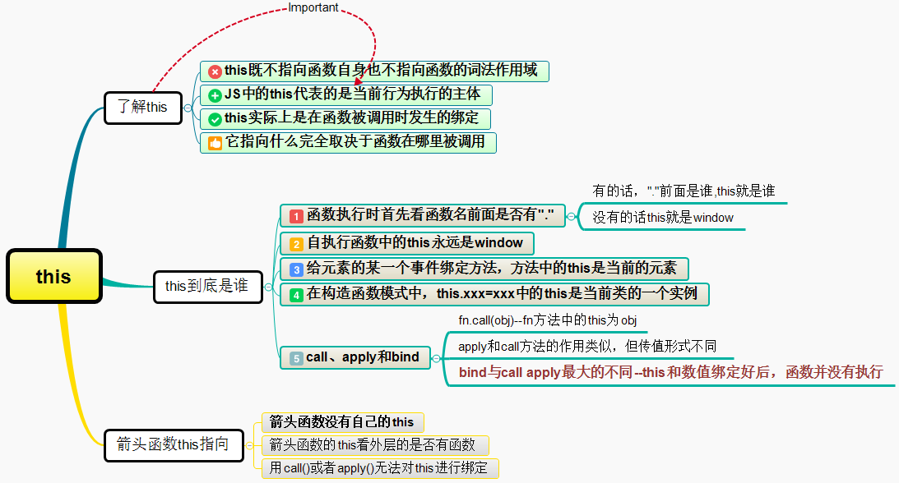
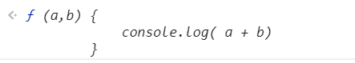
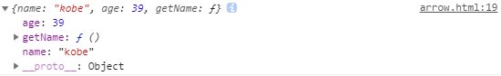
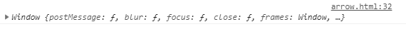

# JavaScript中this问题

## 一、前言

this关键字是JavaScript中最复杂的机制之一。它是一个很特别的关键字，被自动定义在所有函数的作用域中。对于那些没有投入时间学习this机制的JavaScript开发者来说，this的绑定一直是一件非常令人困惑的事。



## 二、了解this

`学习this的第一步是明白this既不指向函数自身也不指向函数的词法作用域`，你也许被这样的解释误导过，但其实它们都是错误的。随着函数使用场合的不同，this的值会发生变化。但总有一条原则就是`JS中的this代表的是当前行为执行的主体`，在JS中主要研究的都是函数中的this，但并不是说只有在函数里才有this，`this实际上是在函数被调用时发生的绑定，它指向什么完全取决于函数在哪里被调用`。如何的区分this呢？

## 三、this到底是谁

这要分情况讨论，常见有五种情况：

### `1、函数执行时首先看函数名前面是否有"."，有的话，"."前面是谁,this就是谁；没有的话this就是window`

```javascript
function fn(){
    console.log(this)
}
let obj = {fn: fn}
fn()//this->window
obj.fn()//this->obj
function sum(){
    fn()//this->window
}
sum()
let oo = {
    sum: function(){
    console.log(this)//this->oo
        fn() //this->window
    }
}
oo.sum()
```

### `2、自执行函数中的this永远是window`

```javascript
(function(){
    console.log(this) // this->window
})()

~function(){
    console.log(this) // this->window
}()
```

### `3、给元素的某一个事件绑定方法，当事件触发的时候，执行对应的方法，方法中的this是当前的元素，除了IE6~8下使用attachEvent（IE一个著名的bug）`

- DOM零级事件绑定

```javascript
oDiv.onclick = function(){
    //this->oDiv
}
```

- DOM二级事件绑定

```javascript
oDiv.addEventListener("click", function() {
    //this->oDiv
}, false)
```

- 在IE6~8下使用attachEvent，默认的this就是指的window对象

```javascript
oDiv.attachEvent("click",function(){
    //this->window
})
```

我们大多数时候，遇到事件绑定，如下面例子这种，对于IE6~8下使用attachEvent不必太较真

```javascript
function fn() {
    console.log(this)
}
document.getElementById("div1").onclick = fn//fn中的this就是#divl
document.getElementById("div1").onclick = function() {
console.log(this)//this->#div1
fn()//this->window
}
```

### `4、在构造函数模式中，类中(函数体中)出现的this.xxx=xxx中的this是当前类的一个实例`

```javascript
function CreateJsPerson(name,age){
    //浏览器默认创建的对象就是我们的实例p1->this
    this.name = name//->p1.name=name
    this.age = age
    this.writeJs=function（）{
        console.log("my name is"+this.name +",i can write Js")
    }
    //浏览器再把创建的实例默认的进行返回
}
let p1 = new CreateJsPerson("尹华芝",48);
```

必须要注意一点：`类中某一个属性值(方法)，方法中的this需要看方法执行的时候，前面是否有".",才能知道this是谁`。大家不妨看下接下来的这个例子，就可明白是啥意思。

```javascript
function Fn(){
    this.x = 100//this->f1
    this.getX = function(){
        console.log(this.x)//this->需要看getX执行的时候才知道
    }
}
let f1 = new Fn
f1.getX()//->方法中的this是f1，所以f1.x=100
let ss = f1.getX
ss()//->方法中的this是window ->undefined
```

### `5.call、apply和bind`

我们先来看一个问题，想在下面的例子中this绑定obj,怎么实现？

```javascript
let obj = {name: "tmflsby"}
function fn(){
    console.log(this)//this=>window
}
fn()
obj.fn()//->Uncaught TypeError:obj.fn is not a function
```

如果直接绑定obj.fn(),程序就会报错。这里我们应该用fn.call(obj)就可以实现this绑定obj,接下来我们详细介绍下call方法：

- `call方法的作用:`

①`首先我们让原型上的call方法执行，在执行call方法的时候，我们让fn方法中的this变为第一个参数值obj；然后再把fn这个函数执行。`

②`call还可以传值，在严格模式下和非严格模式下，得到值不一样。`

```javascript
//在非严格模式下
let obj = {name: "tmflsby"} 
function fn(num1, num2){
    console.log(num1 + num2) 
    console.log(this) 
}
fn.call(100, 200) //this->100 num1=200 num2=undefined
fn.call(obj, 100, 200) //this->obj num1=100 num2=200
fn.call() //this->window
fn.call(null) //this->window
fn.call(undefined) //this->window
```

```javascript
//严格模式下 
fn.call() //在严格模式下this->undefined
fn.call(null) // 在严格模式 下this->null
fn.call(undefined) //在严格模式下this->undefined
```

- `apply和call方法的作用是一模一样的，都是用来改变方法的this关键字并且把方法执行，而且在严格模式下和非严格模式下对于第一个参数是null/undefined这种情况的规律也是一样的。`

两者唯一的区别：call在给fn传递参数的时候，是一个个的传递值的，而apply不是一个个传，而是把要给fn传递的参数值统一的放在一个数组中进行操作。但是也相当子一个个的给fn的形参赋值。`总结一句话:call第二个参数开始接受一个参数列表,apply第二个参数开始接受一个参数数组`

```javascript
fn.call(obj, 100, 200)
fn.apply(obj, [100, 200])
```

- `bind：这个方法在IE6～8下不兼容，和call/apply类似都是用来改变this关键字的`，但是和这两者有明显区别：

```javascript
fn.call(obj, 1, 2) //->改变this和执行fn函数是一起都完成了
fn.bind(obj, 1, 2) //->只是改变了fn中的this为obj，并且给fn传递了两个参数值1、2，
                     但是此时并没有把fn这个函数执行
let tempFn = fn.bind(obj, 1, 2) 
tempFn()  //这样才把fn这个函数执行
```

`bind体现了预处理思想：事先把fn的this改变为我们想要的结果，并且把对应的参数值也准备好，以后要用到了，直接的执行即可。`

`call和apply直接执行函数，而bind需要再一次调用。`

```javascript
let a = {
    name: "Cherry",
    fn: function(a, b) {
        console.log( a + b)
    }
}
let b = a.fn
b.bind(a, 1, 2)
```



上述代码没有执行，bind返回改变了上下文的一个函数，我们必须要手动去调用：

```javascript
b.bind(a,1,2)() //3
```

`必须要声明一点：遇到第五种情况（call apply和bind),前面四种全部让步。`

## 四、箭头函数this指向

箭头函数正如名称所示那样使用一个“箭头”(=>)来定义函数的新语法，但它优于传统的函数,主要体现两点：`更简短的函数并且不绑定this`。

```javascript
let obj = {
    birth: 1990,
    getAge: function () {
        let b = this.birth // 1990
        let fn = function () {
            return new Date().getFullYear() - this.birth // this指向window或undefined
        }
        return fn()
    }
}
```

现在，箭头函数完全修复了this的指向，`箭头函数没有自己的this，箭头函数的this不是调用的时候决定的，而是在定义的时候处在的对象就是它的this`。

换句话说，`箭头函数的this看外层的是否有函数，如果有，外层函数的this就是内部箭头函数的this，如果没有，则this是window`。

```html
<button id="btn1">测试箭头函数this_1</button>
<button id="btn2">测试箭头函数this_2</button>
<script type="text/javascript">   
    let btn1 = document.getElementById('btn1')
    let obj = {
        name: 'kobe',
        age: 39,
        getName: function () {
            btn1.onclick = () => {
                console.log(this)//obj
            }
        }
    }
    obj.getName()
</script>
```



那假如上一层并不存在函数，this指向又是谁？

```html
<button id="btn1">测试箭头函数this_1</button>
<button id="btn2">测试箭头函数this_2</button>
<script type="text/javascript">   
    let btn2 = document.getElementById('btn2')
    let obj = {
        name: 'kobe',
        age: 39,
        getName: () => {
            btn2.onclick = () => {
                console.log(this)//window
            }
        }
    };
    obj.getName()
</script>
```



上例中，虽然存在两个箭头函数，其实this取决于最外层的箭头函数,由于obj是个对象而非函数，所以this指向为Window对象

由于this在箭头函数中已经按照词法作用域绑定了，所以，`用call()或者apply()调用箭头函数时，无法对this进行绑定，即传入的第一个参数被忽略`：

```javascript
let obj = {
    birth: 1990,
    getAge: function (year) {
        let b = this.birth // 1990
        let fn = (y) => y - this.birth // this.birth仍是1990
        return fn.call({birth:2000}, year)
    }
}
obj.getAge(2018) // 28
```

## 参考文章

- [廖雪峰的官方网站](https://www.liaoxuefeng.com/wiki/1022910821149312/1031549578462080)

- [JS中的箭头函数与this](https://juejin.im/post/5aa1eb056fb9a028b77a66fd)

- [this、apply、call、bind](https://juejin.im/post/59bfe84351882531b730bac2)
