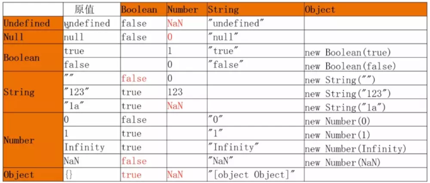

# JavaScript数据类型转换

## 前言

JavaScript是一门动态语言，所谓的动态语言可以暂时理解为在语言中的一切内容都是不确定的。比如一个变量，这一时刻是个整型，下一时刻可能会变成字符串了。虽然变量的数据类型是不确定的，但是各种运算符对数据类型是有要求的。如果运算符发现，运算子的类型与预期不符，就会自动转换类型。

本文主要介绍数据类型强制转换和自动转换，自动转换是基于强制转换之上。`强制转换主要指使用Number、String和Boolean三个函数，手动将各种类型的值，分布转换成数字、字符串或者布尔值。`

## 一、强制转换

### 1、其他的数据类型转换为String

#### `方式一：toString()方法`

> 调用被转换数据类型的toString()方法,该方法不会影响到原变量，它会将转换的结果返回，`但是注意：null和undefined这两个值没有toString，如果调用他们的方法，会报错。`

```javascript
let a = 123
a.toString()//"123"
let b = null;
b.toString()//"报错"
let c = undefined
c.toString()//"报错"
```

> 采用 Number 类型的 toString() 方法的基模式，可以用不同的基输出数字，例如二进制的基是 2，八进制的基是 8，十六进制的基是 16

```javascript
let iNum = 10;
alert(iNum.toString(2));        //输出 "1010"
alert(iNum.toString(8));        //输出 "12"
alert(iNum.toString(16));       //输出 "a"
```

#### `方式二：String()函数`

> 使用String()函数做强制类型转换时，对于Number和Boolean实际上就是调用的toString()方法,
>
>但是对于null和undefined，就不会调用toString()方法,它会将null直接转换为"null",将undefined 直接转换为"undefined"

```javascript
let a = null
String(a)  //"null"
let b = undefined
String(b)  //"undefined"
```

> String方法的参数如果是对象，返回一个类型字符串；如果是数组，返回该数组的字符串形式。

```javascript
String({a: 1})    // "[object Object]"
String([1, 2, 3]) // "1,2,3"
```

### 2、其他的数据类型转换为Number

#### `方式一：使用Number()函数`

下面分成两种情况讨论，一种是参数是原始类型的值，另一种是参数是对象

##### `(1)原始类型值`

①字符串转数字

Ⅰ 如果是纯数字的字符串，则直接将其转换为数字

Ⅱ 如果字符串中有非数字的内容，则转换为NaN

Ⅲ 如果字符串是一个空串或者是一个全是空格的字符串，则转换为0

```javascript
Number('324') // 324
Number('324abc') // NaN
Number('') // 0
```

②布尔值转数字:true转成1,false转成0

```javascript
Number(true) // 1
Number(false) // 0
```

③undefined转数字:转成NaN

```javascript
Number(undefined) // NaN
```

④null转数字：转成0

```javascript
Number(null) // 0
```

⑤Number() 接受数值作为参数，此时它既能识别负的十六进制，也能识别0开头的八进制，返回值永远是十进制值

```javascript
Number(3.15);    //3.15
Number(023);     //19
Number(0x12);    //18
Number(-0x12);   //-18
```

##### `(2)对象`

简单的规则是，Number方法的参数是对象时，将返回NaN，除非是包含单个数值的数组。

```javascript
Number({a: 1}) // NaN
Number([1, 2, 3]) // NaN
Number([5]) // 5
```

#### `方式二：parseInt() & parseFloat()`

这种方式专门用来对付字符串，parseInt()一个字符串转换为一个整数,可以将一个字符串中的有效的整数内容取出来，然后转换为Number。parseFloat()把一个字符串转换为一个浮点数。parseFloat()作用和parseInt()类似，不同的是它可以获得有效的小数。

```javascript
console.log(parseInt('.21'));        //NaN
console.log(parseInt("10.3"));        //10
console.log(parseFloat('.21'));      //0.21
console.log(parseFloat('.d1'));       //NaN
console.log(parseFloat("10.11.33"));  //10.11
console.log(parseFloat("4.3years"));  //4.3
console.log(parseFloat("He40.3"));    //NaN
```

parseInt()在没有第二个参数时默认以十进制转换数值，有第二个参数时，以第二个参数为基数转换数值，如果基数有误返回NaN

```javascript
console.log(parseInt("13"));          //13
console.log(parseInt("11",2));        //3
console.log(parseInt("17",8));        //15
console.log(parseInt("1f",16));       //31
```

#### `两者的区别：Number函数将字符串转为数值，要比parseInt函数严格很多。基本上，只要有一个字符无法转成数值，整个字符串就会被转为NaN。`

```javascript
parseInt('42 cats') // 42
Number('42 cats') // NaN
```

上面代码中，parseInt逐个解析字符，而Number函数整体转换字符串的类型。
另外，对空字符串的处理也不一样

```javascript
Number("   ");     //0    
parseInt("   ");   //NaN
```

### 3、其他的数据类型转换为Boolean

它的转换规则相对简单：`只有空字符串("")、null、undefined、+0、-0 和 NaN 转为布尔型是 false，其他的都是 true，空数组、空对象转换为布尔类型也是 true,甚至连false对应的布尔对象new Boolean(false)也是true`

```javascript
Boolean(undefined) // false
Boolean(null) // false
Boolean(0) // false
Boolean(NaN) // false
Boolean('') // false
```

```javascript
Boolean({}) // true
Boolean([]) // true
Boolean(new Boolean(false)) // true
```

## 二、自动转换

遇到以下三种情况时，JavaScript 会自动转换数据类型，即转换是自动完成的，用户不可见。

### 1.自动转换为布尔值

JavaScript 遇到预期为布尔值的地方(比如if语句的条件部分),就会将非布尔值的参数自动转换为布尔值。系统内部会自动调用Boolean函数。

```javascript
if ('abc') {
  console.log('hello')
}  // "hello"
```

### 2.自动转换为数值

`算数运算符(+ - * /)跟非Number类型的值进行运算时，会将这些值转换为Number，然后在运算，除了字符串的加法运算`

```javascript
true + 1 // 2
2 + null // 2
undefined + 1 // NaN
2 + NaN // NaN 任何值和NaN做运算都得NaN
'5' - '2' // 3
'5' * '2' // 10
true - 1  // 0
'1' - 1   // 0
'5' * []    // 0
false / '5' // 0
'abc' - 1   // NaN
```

`一元运算符也会把运算子转成数值。`

```javascript
+'abc' // NaN
-'abc' // NaN
+true // 1
-false // 0
```

### 3.自动转换为字符串

字符串的自动转换，主要发生在字符串的加法运算时。当一个值为字符串，另一个值为非字符串，则后者转为字符串。

```javascript
'5' + 1 // '51'
'5' + true // "5true"
'5' + false // "5false"
'5' + {} // "5[object Object]"
'5' + [] // "5"
'5' + function (){} // "5function (){}"
'5' + undefined // "5undefined"
'5' + null // "5null"
```

## 三、总结

### 1. 强制转换的各种情况



### 2. 自动转换的的各种情况

- 只有空字符串("")、null、undefined、+0、-0 和 NaN 转为布尔型是 false，其他的都是 true
- 除了加法运算符（+）有可能把运算子转为字符串，其他运算符都会把运算子自动转成数值。一元运算符也会把运算子转成数值。
- 字符串的自动转换，主要发生在字符串的加法运算时。

## 参考文章

- [透彻研究Javascript类型转换](https://blog.csdn.net/Faremax/article/details/76714294)

- [javasript标准参考教程](https://javascript.ruanyifeng.com/grammar/conversion.html)