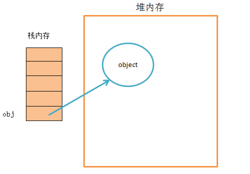
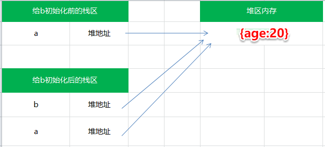
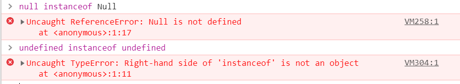

# JavaScript的数据类型及其检测


## 一、JavaScript有几种类型的值？

Javascript有两种数据类型，分别是基本数据类型和引用数据类型。其中基本数据类型包括Undefined、Null、Boolean、Number、String、Symbol (ES6新增，表示独一无二的值)，而引用数据类型统称为Object对象，主要包括对象、数组和函数。接下来我们分别看下两者的特点。

## 二、基本数据类型

### 1.值是不可变的

```javascript
let name = 'JavaScript';
name.toUpperCase(); // 输出 'JAVASCRIPT'
console.log(name); // 输出  'JavaScript'
```

由此可得，基本数据类型的值是不可改变的

### 2.存放在栈区

原始数据类型直接存储在栈(stack)中的简单数据段，占据空间小、大小固定，属于被频繁使用数据，所以放入栈中存储。

### 3.值的比较

```javascript
let a = 1;
let b = true;
console.log(a == b);    // true
console.log(a === b);   // false
```

`==` : 只进行值的比较,会进行数据类型的转换。

`===` : 不仅进行值得比较，还要进行数据类型的比较。

## 三、引用数据类型

### 1.值是可变的

```javascript
let a={age:20};
a.age=21;
console.log(a.age)  //21
```

上面代码说明引用类型可以拥有属性和方法，并且是可以动态改变的。

### 2.同时保存在栈内存和堆内存

引用数据类型存储在堆(heap)中的对象,占据空间大、大小不固定,如果存储在栈中，将会影响程序运行的性能；引用数据类型在栈中存储了指针，该指针指向堆中该实体的起始地址。`当解释器寻找引用值时，会首先检索其在栈中的地址，取得地址后从堆中获得实体。`



### 3.比较是引用的比较

当从一个变量向另一个变量赋引用类型的值时，同样也会将存储在变量中的对象的值复制一份放到为新变量分配的空间中。

```javascript
let a={age:20};
let b=a;
b.age=21;
console.log(a.age==b.age)//true
```

上面我们讲到基本类型和引用类型存储于内存的位置不同，引用类型存储在堆中的对象，与此同时，在栈中存储了指针，而这个指针指向正是堆中实体的起始位置。变量a初始化时，a指针指向对象{age:20}的地址，a赋值给b后,b又指向该对象{age:20}的地址，这两个变量指向了同一个对象。因此，改变其中任何一个变量，都会相互影响。



此时，如果取消某一个变量对于原对象的引用，不会影响到另一个变量。

```javascript
let a={age:20};
let b=a;
a = 1;
b // {age:20}
```

上面代码中，a和b指向同一个对象，然后a的值变为1，这时不会对b产生影响，b还是指向原来的那个对象。

## 四、检验数据类型

### 1.typeof

`typeof返回一个表示数据类型的字符串`，返回结果包括：number、boolean、string、symbol、object、undefined、function等7种数据类型，但不能判断null、array等

```javascript
typeof Symbol(); // symbol 有效
typeof ''; // string 有效
typeof 1; // number 有效
typeof true; //boolean 有效
typeof undefined; //undefined 有效
typeof new Function(); // function 有效
typeof null; //object 无效
typeof [] ; //object 无效
typeof new Date(); //object 无效
typeof new RegExp(); //object 无效
```

数组,对象和null返回的都是object，这时就需要使用instanceof来判断

### 2.instanceof

instanceof 是用来判断A是否为B的实例，表达式为：A instanceof B，如果A是B的实例，则返回true,否则返回false。`instanceof 运算符用来测试一个对象在其原型链中是否存在一个构造函数的 prototype 属性。`

```javascript
[] instanceof Array; //true
{} instanceof Object;//true
new Date() instanceof Date;//true
new RegExp() instanceof RegExp//true
```

关于数组的类型判断，还可以用ES6新增Array.isArray()

```javascript
Array.isArray([]);   // true
```

`instanceof 三大弊端：`

> 1.对于基本数据类型来说，字面量方式创建出来的结果和实例方式创建的是有一定的区别的

```javascript
console.log(1 instanceof Number)//false
console.log(new Number(1) instanceof Number)//true
```

从严格意义上来讲，只有实例创建出来的结果才是标准的对象数据类型值，也是标准的Number这个类的一个实例；对于字面量方式创建出来的结果是基本的数据类型值，不是严谨的实例，但是由于JS的松散特点，导致了可以使用Number.prototype上提供的方法。

> 2.只要在当前实例的原型链上，我们用其检测出来的结果都是true。`在类的原型继承中，我们最后检测出来的结果未必准确。`

```javascript
let arr = [1, 2, 3];
console.log(arr instanceof Array) // true
console.log(arr instanceof Object);  // true
function fn(){}
console.log(fn instanceof Function)// true
console.log(fn instanceof Object)// true
```

> 3.不能检测null 和 undefined

`对于特殊的数据类型null和undefined，他们的所属类是Null和Undefined，但是浏览器把这两个类保护起来了，不允许我们在外面访问使用。`



### 3.constructor

constructor作用和instanceof非常相似。`但constructor检测 Object与instanceof不一样，还可以处理基本数据类型的检测。`

```javascript
let aa=[1,2];
console.log(aa.constructor===Array);//true
console.log(aa.constructor===RegExp);//false
console.log((1).constructor===Number);//true
let reg=/^$/;
console.log(reg.constructor===RegExp);//true
console.log(reg.constructor===Object);//false 
```

`constructor 两大弊端：`

> 1.null 和 undefined 是无效的对象，因此是不会有 constructor 存在的，这两种类型的数据需要通过其他方式来判断。
>
> 2.函数的 constructor 是不稳定的，这个主要体现在把类的原型进行重写，在重写的过程中很有可能出现把之前的constructor给覆盖了，这样检测出来的结果就是不准确的

```javascript
function Fn(){}
Fn.prototype = new Array()
var f = new Fn
console.log(f.constructor)  // ƒ Array() { [native code] }
```

### 4.Object.prototype.toString.call()

`Object.prototype.toString.call() 最准确最常用的方式。`首先获取Object原型上的toString方法，让方法执行，让toString方法中的this指向第一个参数的值。

`关于toString重要补充说明：`

- 本意是转换为字符串，但是某些toString方法不仅仅是转换为字符串
- 对于Number、String，Boolean，Array，RegExp、Date、Function原型上的toString方法都是把当前的数据类型转换为字符串的类型（它们的作用仅仅是用来转换为字符串的）
- Object上的toString并不是用来转换为字符串的。

Object上的toString它的作用是返回当前方法执行的主体（方法中的this）所属类的详细信息即"[object Object]",其中第一个object代表当前实例是对象数据类型的(这个是固定死的)，第二个Object代表的是this所属的类是Object。

```javascript
Object.prototype.toString.call('') ;   // [object String]
Object.prototype.toString.call(1) ;    // [object Number]
Object.prototype.toString.call(true) ; // [object Boolean]
Object.prototype.toString.call(undefined) ; // [object Undefined]
Object.prototype.toString.call(null) ; // [object Null]
Object.prototype.toString.call(new Function()) ; // [object Function]
Object.prototype.toString.call(new Date()) ; // [object Date]
Object.prototype.toString.call([]) ; // [object Array]
Object.prototype.toString.call(new RegExp()) ; // [object RegExp]
Object.prototype.toString.call(new Error()) ; // [object Error]
Object.prototype.toString.call(document) ; // [object HTMLDocument]
Object.prototype.toString.call(window) ; //[object global] window是全局对象global的引用
```

## 参考资料

- [[ JS 进阶 ] 基本类型 引用类型 简单赋值 对象引用（推荐）](https://segmentfault.com/a/1190000002789651)

- [JS判断数据类型的三种方法](https://blog.csdn.net/donggx/article/details/71453103)

- [JS中的数据类型及判断](https://github.com/Kimi-Gao/Program-Blog/issues/17)

- [Javascript 判断变量类型的陷阱 与 正确的处理方式](https://juejin.im/entry/5964a1c15188250d8b65ef5f)

- [判断JS数据类型的四种方法](https://www.cnblogs.com/onepixel/p/5126046.html)