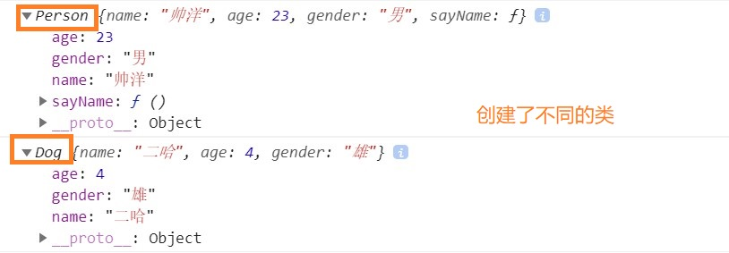
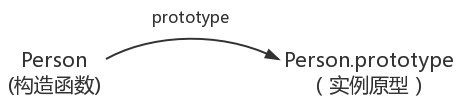
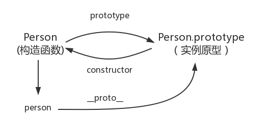

# 原型与原型链详解

## 前言

与大部分面向对象语言不同，ES6之前并没有引入类（class）的概念，JavaScript并非通过类而是直接通过构造函数来创建实例。在介绍原型和原型链之前，我们有必要先复习一下构造函数的知识。

## 一、构造函数

`构造函数模式的目的就是为了创建一个自定义类，并且创建这个类的实例。构造函数模式中拥有了类和实例的概念，并且实例和实例之间是相互独立的，即实例识别。`

构造函数就是一个普通的函数，创建方式和普通函数没有区别，`不同的是构造函数习惯上首字母大写`。另外就是调用方式的不同，普通函数是直接调用，`而构造函数需要使用new关键字来调用`。

```javascript
function Person(name, age, gender) {
		this.name = name
		this.age = age
		this.gender = gender
		this.sayName = function () {
			alert(this.name);
		}
}
let per = new Person("帅洋", 23, "男");
function Dog(name, age, gender) {
		this.name = name
		this.age = age
		this.gender = gender
}
let dog = new Dog("二哈", 4, "雄")
console.log(per);//当我们直接在页面中打印一个对象时，事件上是输出的对象的toString()方法的返回值
console.log(dog);
```



每创建一个Person构造函数，在Person构造函数中，为每一个对象都添加了一个sayName方法，也就是说构造函数每执行一次就会创建一个新的sayName方法。这样就导致了构造函数执行一次就会创建一个新的方法，执行10000次就会创建10000个新的方法，而10000个方法都是一摸一样的，为什么不把这个方法单独放到一个地方，并让所有的实例都可以访问到呢?这就需要原型(prototype)

## 二、原型

`在JavaScript中，每当定义一个函数数据类型(普通函数、类)时候，都会天生自带一个prototype属性，这个属性指向函数的原型对象，并且这个属性是一个对象数据类型的值。`

让我们用一张图表示构造函数和实例原型之间的关系：



原型对象就相当于一个公共的区域，所有同一个类的实例都可以访问到这个原型对象，我们可以将对象中共有的内容，统一设置到原型对象中。

## 三、原型链

### 1.__proto__和constructor

`每一个对象数据类型(普通的对象、实例、prototype......)也天生自带一个属性__proto__，属性值是当前实例所属类的原型(prototype)。原型对象中有一个属性constructor, 它指向函数对象。`

```javascript
function Person() {}
let person = new Person()
console.log(person.__proto__ === Person.prototype)//true
console.log(Person.prototype.constructor===Person)//true
//顺便学习一个ES5的方法,可以获得对象的原型
console.log(Object.getPrototypeOf(person) === Person.prototype) // true
```



### 2.何为原型链

`在JavaScript中万物都是对象，对象和对象之间也有关系，并不是孤立存在的。对象之间的继承关系，在JavaScript中是通过prototype对象指向父类对象，直到指向Object对象为止，这样就形成了一个原型指向的链条，专业术语称之为原型链。`

举例说明:person → Person → Object ，普通人继承人类，人类继承对象类

`当我们访问对象的一个属性或方法时，它会先在对象自身中寻找，如果有则直接使用，如果没有则会去原型对象中寻找，如果找到则直接使用。如果没有则去原型的原型中寻找,直到找到Object对象的原型，Object对象的原型没有原型，如果在Object原型中依然没有找到，则返回undefined。`

我们可以使用对象的`hasOwnProperty()`来检查对象自身中是否含有该属性；使用`in`检查对象中是否含有某个属性时，如果对象中没有但是原型中有，也会返回true

```javascript
function Person() {}
Person.prototype.a = 123;
Person.prototype.sayHello = function () {
  alert("hello");
};
let person = new Person()
console.log(person.a)//123
console.log(person.hasOwnProperty('a'));//false
console.log('a'in person)//true
```

person实例中没有a这个属性，从 person 对象中找不到 a 属性就会从 person 的原型也就是 person.__proto__ ，也就是 Person.prototype中查找，很幸运地得到a的值为123。那假如 person.__proto__中也没有该属性，又该如何查找？

当读取实例的属性时，如果找不到，就会查找与对象关联的原型中的属性，如果还查不到，就去找原型的原型，一直找到最顶层Object为止。

`Object是JS中所有对象数据类型的基类(最顶层的类)在Object.prototype上没有__proto__这个属性。`

```javascript
console.log(Object.prototype.__proto__ === null) // true
```


## 参考文章

[最详尽的 JS 原型与原型链终极详解，没有「可能是」。（一）](https://www.jianshu.com/p/dee9f8b14771)

[JavaScript深入之从原型到原型链](https://github.com/mqyqingfeng/Blog/issues/2)
