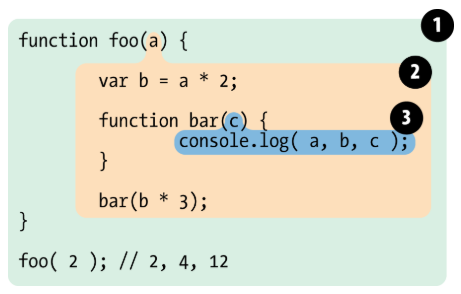

# 深入理解JavaScript作用域和作用域链

## 前言

JavaScript中有一个被称为作用域(Scope)的特性。虽然对于许多新手开发者来说，作用域的概念并不是很容易理解，本文我会尽我所能用最简单的方式来解释作用域和作用域链，希望大家有所收获！

## 作用域(Scope)

### 1.什么是作用域

作用域是在运行时代码中的某些特定部分中变量，函数和对象的可访问性。换句话说，作用域决定了代码区块中变量和其他资源的可见性。可能这两句话并不好理解，我们先来看个例子：

```javascript
function outFun2() {
    var inVariable = "内层变量2";
}
outFun2();//要先执行这个函数，否则根本不知道里面是啥
console.log(inVariable); // Uncaught ReferenceError: inVariable is not defined
```

从上面的例子可以体会到作用域的概念，变量inVariable在全局作用域没有声明，所以在全局作用域下取值会报错。我们可以这样理解：`作用域就是一个独立的地盘，让变量不会外泄、暴露出去。也就是说作用域最大的用处就是隔离变量，不同作用域下同名变量不会有冲突。`

`ES6 之前 JavaScript 没有块级作用域,只有全局作用域和函数作用域。`ES6的到来，为我们提供了‘块级作用域’,可通过新增命令let和const来体现。

### 2.全局作用域和函数作用域

在代码中任何地方都能访问到的对象拥有全局作用域，一般来说以下几种情形拥有全局作用域：

> 最外层函数和在最外层函数外面定义的变量拥有全局作用域

```javascript
var outVariable = "我是最外层变量"; //最外层变量
function outFun() { //最外层函数
    var inVariable = "内层变量";
    function innerFun() { //内层函数
        console.log(inVariable);
    }
    innerFun();
}
console.log(outVariable); //我是最外层变量
outFun(); //内层变量
console.log(inVariable); //inVariable is not defined
innerFun(); //innerFun is not defined
```

> 所有末定义直接赋值的变量自动声明为拥有全局作用域

```javascript
function outFun2() {
    variable = "未定义直接赋值的变量";
    var inVariable2 = "内层变量2";
}
outFun2();//要先执行这个函数，否则根本不知道里面是啥
console.log(variable); //未定义直接赋值的变量
console.log(inVariable2); //inVariable2 is not defined
```

> 所有window对象的属性拥有全局作用域

一般情况下，window对象的内置属性都拥有全局作用域，例如：window.name、window.location、window.top 等等。

全局作用域有个弊端：如果我们写了很多行 JS 代码，变量定义都没有用函数包括，那么它们就全部都在全局作用域中。这样就会 污染全局命名空间, 容易引起命名冲突。

```javascript
// 张三写的代码中
var data = {a: 100}

// 李四写的代码中
var data = {x: true}
```

这就是为何 jQuery、Zepto 等库的源码，所有的代码都会放在`(function(){....})()`中。因为放在里面的所有变量，都不会被外泄和暴露，不会污染到外面，不会对其他的库或者 JS 脚本造成影响。这是函数作用域的一个体现。

函数作用域,是指声明在函数内部的变量，和全局作用域相反，局部作用域一般只在固定的代码片段内可访问到，最常见的例如函数内部。

```javascript
function doSomething(){
    var blogName="浪里行舟";
    function innerSay(){
        alert(blogName);
    }
    innerSay();
}
alert(blogName); //脚本错误
innerSay(); //脚本错误
```

`作用域是分层的，内层作用域可以访问外层作用域的变量，反之则不行。`我们看个例子，用泡泡来比喻作用域可能好理解一点：



最后输出的结果为 2, 4, 12

- 泡泡1是全局作用域，有标识符foo；
- 泡泡2是作用域foo，有标识符a,bar,b；
- 泡泡3是作用域bar，仅有标识符c。

值得注意的是：`块语句（大括号“｛｝”中间的语句），如 if 和 switch 条件语句或 for 和 while 循环语句，不像函数，它们不会创建一个新的作用域。`在块语句中定义的变量将保留在它们已经存在的作用域中。

```javascript
if (true) {
    // 'if' 条件语句块不会创建一个新的作用域
    var name = 'Hammad'; // name 依然在全局作用域中
}
console.log(name); // logs 'Hammad'
```

JS 的初学者经常需要花点时间才能习惯变量提升，而如果不理解这种特有行为，就可能导致bug。正因为如此， ES6 引入了块级作用域，让变量的生命周期更加可控。

### 3.块级作用域

块级作用域可通过新增命令let和const声明，所声明的变量在指定块的作用域外无法被访问。块级作用域在如下情况被创建：

1. 在一个函数内部
2. 在一个代码块（由一对花括号包裹）内部

let 声明的语法与 var 的语法一致。你基本上可以用 let 来代替 var 进行变量声明，但会将变量的作用域限制在当前代码块中。块级作用域有以下几个特点：

> 声明变量不会提升到代码块顶部

let/const 声明并不会被提升到当前代码块的顶部，因此你需要手动将 let/const 声明放置到顶部，以便让变量在整个代码块内部可用。

```javascript
function getValue(condition) {
    if (condition) {
        let value = "blue";
        return value;
    } else {
        // value 在此处不可用
        return null;
    }
// value 在此处不可用
}
```

> 禁止重复声明

如果一个标识符已经在代码块内部被定义，那么在此代码块内使用同一个标识符进行 let 声明就会导致抛出错误。例如：

```javascript
var count = 30;
let count = 40; // Uncaught SyntaxError: Identifier 'count' has already been declared
```

在本例中， count 变量被声明了两次：一次使用 var ，另一次使用 let 。因为 let 不能在同一作用域内重复声明一个已有标识符，此处的 let 声明就会抛出错误。但如果在嵌套的作用域内使用 let 声明一个同名的新变量，则不会抛出错误。

```javascript
var count = 30;
// 不会抛出错误
if (condition) {
    let count = 40;
    // 其他代码
}
```

> 循环中的绑定块作用域的妙用

开发者可能最希望实现for循环的块级作用域了，因为可以把声明的计数器变量限制在循环内，例如：

```javascript
for (let i = 0; i < 10; i++) {
  // ...
}
console.log(i);
// ReferenceError: i is not defined
```

上面代码中，计数器i只在for循环体内有效，在循环体外引用就会报错。

```javascript
var a = [];
for (var i = 0; i < 10; i++) {
    a[i] = function () {
        console.log(i);
    };
}
a[6](); // 10
```

上面代码中，变量i是var命令声明的，在全局范围内都有效，所以全局只有一个变量i。每一次循环，变量i的值都会发生改变，而循环内被赋给数组a的函数内部的console.log(i)，里面的i指向的就是全局的i。也就是说，所有数组a的成员里面的i，指向的都是同一个i，导致运行时输出的是最后一轮的i的值，也就是 10。

如果使用let，声明的变量仅在块级作用域内有效，最后输出的是 6。

```javascript
var a = [];
for (let i = 0; i < 10; i++) {
    a[i] = function () {
        console.log(i);
    };
}
a[6](); // 6
```

上面代码中，变量i是let声明的，当前的i只在本轮循环有效，所以每一次循环的i其实都是一个新的变量，所以最后输出的是6。你可能会问，如果每一轮循环的变量i都是重新声明的，那它怎么知道上一轮循环的值，从而计算出本轮循环的值？这是因为 JavaScript 引擎内部会记住上一轮循环的值，初始化本轮的变量i时，就在上一轮循环的基础上进行计算。

另外，for循环还有一个特别之处，就是设置循环变量的那部分是一个父作用域，而循环体内部是一个单独的子作用域。

```javascript
for (let i = 0; i < 3; i++) {
  let i = 'abc';
  console.log(i);
}
// abc
// abc
// abc
```

上面代码正确运行，输出了 3 次abc。这表明函数内部的变量i与循环变量i不在同一个作用域，有各自单独的作用域。

## 作用域链

### 1.什么是自由变量

首先认识一下什么叫做 `自由变量` 。如下代码中，console.log(a)要得到a变量，但是在当前的作用域中没有定义a（可对比一下b）。当前作用域没有定义的变量，这成为 自由变量 。自由变量的值如何得到 —— 向父级作用域寻找（注意：这种说法并不严谨，下文会重点解释）。

```javascript
var a = 100
function fn() {
    var b = 200
    console.log(a) // 这里的a在这里就是一个自由变量
    console.log(b)
}
fn()
```

### 2.什么是作用域链

如果父级也没呢？再一层一层向上寻找，直到找到全局作用域还是没找到，就宣布放弃。这种一层一层的关系，就是作用域链 。

```javascript
var a = 100
function F1() {
    var b = 200
    function F2() {
        var c = 300
        console.log(a) // 自由变量，顺作用域链向父作用域找
        console.log(b) // 自由变量，顺作用域链向父作用域找
        console.log(c) // 本作用域的变量
    }
    F2()
}
F1()
```

### 3.关于自由变量的取值

关于自由变量的值，上文提到要到父作用域中取，其实有时候这种解释会产生歧义。

```javascript
var x = 10
function fn() {
  console.log(x)
}
function show(f) {
  var x = 20
  (function() {
    f() //10，而不是20
  })()
}
show(fn)
```

在fn函数中，取自由变量x的值时，要到哪个作用域中取？——要到创建fn函数的那个作用域中取，`无论fn函数将在哪里调用`。

所以，不要在用以上说法了。相比而言，用这句话描述会更加贴切:`要到创建这个函数的那个域”。`

`作用域中取值,这里强调的是“创建”，而不是“调用”`，切记切记——其实这就是所谓的"静态作用域"

```javascript
var a = 10
function fn() {
  var b = 20
  function bar() {
    console.log(a + b) //30
  }
  return bar
}
var x = fn(),
  b = 200
x() //bar()
```

fn()返回的是bar函数，赋值给x。执行x()，即执行bar函数代码。取b的值时，直接在fn作用域取出。取a的值时，试图在fn作用域取，但是取不到，只能转向创建fn的那个作用域中去查找，结果找到了,所以最后的结果是30

## 作用域与执行上下文

许多开发人员经常混淆作用域和执行上下文的概念，误认为它们是相同的概念，但事实并非如此。

我们知道JavaScript属于解释型语言，JavaScript的执行分为：解释和执行两个阶段,这两个阶段所做的事并不一样：

> `解释阶段：`
- 词法分析
- 语法分析
- 作用域规则确定

> `执行阶段：`
- 创建执行上下文
- 执行函数代码
- 垃圾回收

JavaScript解释阶段便会确定作用域规则，因此作用域在函数定义时就已经确定了，而不是在函数调用时确定，但是执行上下文是函数执行之前创建的。执行上下文最明显的就是this的指向是执行时确定的。而作用域访问的变量是编写代码的结构确定的。

作用域和执行上下文之间最大的区别是：

`执行上下文在运行时确定，随时可能改变；作用域在定义时就确定，并且不会改变。`

一个作用域下可能包含若干个上下文环境。有可能从来没有过上下文环境（函数从来就没有被调用过）；有可能有过，现在函数被调用完毕后，上下文环境被销毁了；有可能同时存在一个或多个（闭包）。`同一个作用域下，不同的调用会产生不同的执行上下文环境，继而产生不同的变量的值。`

## 参考文章和书籍

- [深入理解javascript原型和闭包系列](https://www.cnblogs.com/wangfupeng1988/p/4001284.html)

- [Web 前端面试指南与高频考题解析](https://juejin.im/book/5a8f9ddcf265da4e9f6fb959/section/5a8f9ed96fb9a0633229bddf)

- [深入理解JS中声明提升、作用域（链）和this关键字](https://github.com/creeperyang/blog/issues/16)

- [JavaScript 开发进阶：理解 JavaScript 作用域和作用域链](https://www.cnblogs.com/lhb25/archive/2011/09/06/javascript-scope-chain.html)

- [JavaScript 作用域和作用域链](https://gaohaoyang.github.io/2015/05/20/scope/#top)

- [深入理解ES6](https://book.douban.com/subject/27072230/)