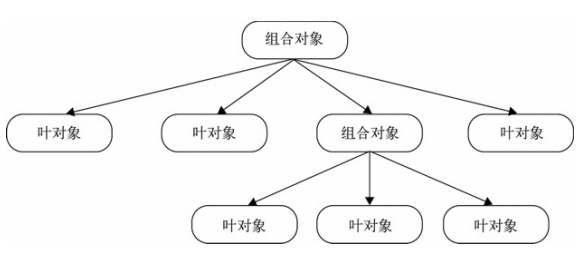

# 七、组合模式

## 1. 定义

是用小的子对象来构建更大的 对象，而这些小的子对象本身也许是由更小 的“孙对象”构成的。

## 2. 核心

可以用树形结构来表示这种“部分- 整体”的层次结构。

调用组合对象 的execute方法，程序会递归调用组合对象 下面的叶对象的execute方法



但要注意的是，组合模式不是父子关系，它是一种HAS-A（聚合）的关系，将请求委托给 它所包含的所有叶对象。基于这种委托，就需要保证组合对象和叶对象拥有相同的 接口

此外，也要保证用一致的方式对待 列表中的每个叶对象，即叶对象属于同一类，不需要过多特殊的额外操作

## 3. 实现

使用组合模式来实现扫描文件夹中的文件

```javascript
// 文件夹 组合对象
function Folder(name) {
    this.name = name;
    this.parent = null;
    this.files = [];
}

Folder.prototype = {
    constructor: Folder,

    add: function(file) {
        file.parent = this;
        this.files.push(file);

        return this;
    },

    scan: function() {
        // 委托给叶对象处理
        for (var i = 0; i < this.files.length; ++i) {
            this.files[i].scan();
        }
    },

    remove: function(file) {
        if (typeof file === 'undefined') {
            this.files = [];
            return;
        }

        for (var i = 0; i < this.files.length; ++i) {
            if (this.files[i] === file) {
                this.files.splice(i, 1);
            }
        }
    }
};

// 文件 叶对象
function File(name) {
    this.name = name;
    this.parent = null;
}

File.prototype = {
    constructor: File,

    add: function() {
        console.log('文件里面不能添加文件');
    },

    scan: function() {
        var name = [this.name];
        var parent = this.parent;

        while (parent) {
            name.unshift(parent.name);
            parent = parent.parent;
        }

        console.log(name.join(' / '));
    }
};
```

构造好组合对象与叶对象的关系后，实例化，在组合对象中插入组合或叶对象

```javascript
var web = new Folder('Web');
var fe = new Folder('前端');
var css = new Folder('CSS');
var js = new Folder('js');
var rd = new Folder('后端');

web.add(fe).add(rd);

var file1 = new File('HTML权威指南.pdf');
var file2 = new File('CSS权威指南.pdf');
var file3 = new File('JavaScript权威指南.pdf');
var file4 = new File('MySQL基础.pdf');
var file5 = new File('Web安全.pdf');
var file6 = new File('Linux菜鸟.pdf');

css.add(file2);
fe.add(file1).add(file3).add(css).add(js);
rd.add(file4).add(file5);
web.add(file6);

rd.remove(file4);

// 扫描
web.scan();
```

扫描结果为


## 4. 优缺点

`优点`

可以方便地构造一棵树来表示对象的部分-整体 结构。在树的构造最终 完成之后，只需要通过请求树的最顶层对 象，便能对整棵树做统一一致的操作。

`缺点`

创建出来的对象长得都差不多，可能会使代码不好理解，创建太多的对象对性能也会有一些影响
