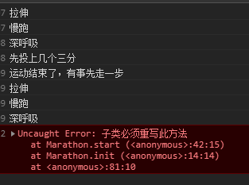

# 八、模板方法模式

## 1. 定义

模板方法模式由两部分结构组成，第一部分是抽象父类，第二部分是具体的实现子类。

## 2. 核心

在抽象父类中封装子类的算法框架，它的 init方法可作为一个算法的模板，指导子类以何种顺序去执行哪些方法。

由父类分离出公共部分，要求子类重写某些父类的（易变化的）抽象方法

## 3. 实现

模板方法模式一般的实现方式为继承

以运动作为例子，运动有比较通用的一些处理，这部分可以抽离开来，在父类中实现。具体某项运动的特殊性则有自类来重写实现。

最终子类直接调用父类的模板函数来执行

```javascript
// 体育运动
function Sport() {

}

Sport.prototype = {
    constructor: Sport,
    
    // 模板，按顺序执行
    init: function() {
        this.stretch();
        this.jog();
        this.deepBreath();
        this.start();

        var free = this.end();
        
        // 运动后还有空的话，就拉伸一下
        if (free !== false) {
            this.stretch();
        }
        
    },
    
    // 拉伸
    stretch: function() {
        console.log('拉伸');
    },
    
    // 慢跑
    jog: function() {
        console.log('慢跑');
    },
    
    // 深呼吸
    deepBreath: function() {
        console.log('深呼吸');
    },

    // 开始运动
    start: function() {
        throw new Error('子类必须重写此方法');
    },

    // 结束运动
    end: function() {
        console.log('运动结束');
    }
};

// 篮球
function Basketball() {

}

Basketball.prototype = new Sport();

// 重写相关的方法
Basketball.prototype.start = function() {
    console.log('先投上几个三分');
};

Basketball.prototype.end = function() {
    console.log('运动结束了，有事先走一步');
    return false;
};


// 马拉松
function Marathon() {

}

Marathon.prototype = new Sport();

var basketball = new Basketball();
var marathon = new Marathon();

// 子类调用，最终会按照父类定义的顺序执行
basketball.init();
marathon.init();
```


