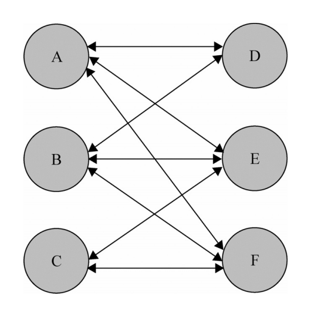
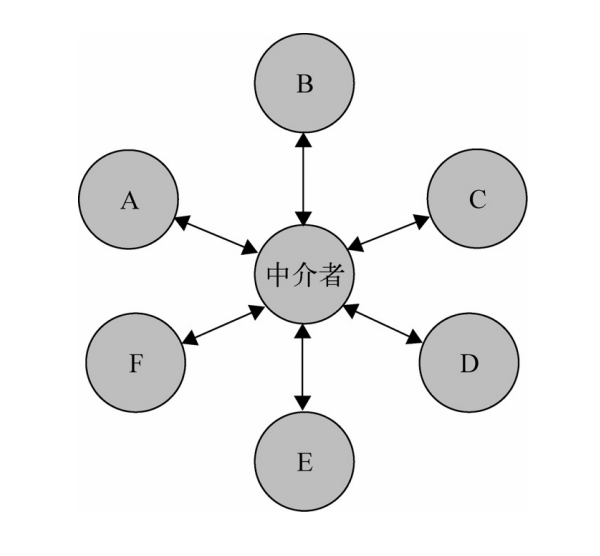

# 十一、中介者模式

## 1. 定义

所有的相关 对象都通过中介者对象来通信，而不是互相引用，所以当一个对象发生改变时，只需要通知中介者对象即可

## 2. 核心

使网状的多对多关系变成了相对简单的一对多关系（复杂的调度处理都交给中介者）



使用中介者后



## 3. 实现

多个对象，指的不一定得是实例化的对象，也可以将其理解成互为独立的多个项。当这些项在处理时，需要知晓并通过其他项的数据来处理。

如果每个项都直接处理，程序会非常复杂，修改某个地方就得在多个项内部修改

我们将这个处理过程抽离出来，封装成中介者来处理，各项需要处理时，通知中介者即可。

```javascript
var A = {
    score: 10,

    changeTo: function(score) {
        this.score = score;

        // 自己获取
        this.getRank();
    },
    
    // 直接获取
    getRank: function() {
        var scores = [this.score, B.score, C.score].sort(function(a, b) {
            return a < b;
        });

        console.log(scores.indexOf(this.score) + 1);
    }
};

var B = {
    score: 20,

    changeTo: function(score) {
        this.score = score;

        // 通过中介者获取
        rankMediator(B);
    }
};

var C = {
    score: 30,

    changeTo: function(score) {
        this.score = score;

        rankMediator(C);
    }
};

// 中介者，计算排名
function rankMediator(person) {
    var scores = [A.score, B.score, C.score].sort(function(a, b) {
        return a < b;
    });

    console.log(scores.indexOf(person.score) + 1);
}

// A通过自身来处理
A.changeTo(100); // 1

// B和C交由中介者处理
B.changeTo(200); // 1
C.changeTo(50); // 3
```

ABC三个人分数改变后想要知道自己的排名，在A中自己处理，而B和C使用了中介者。B和C将更为轻松，整体代码也更简洁

最后，虽然中介者做到了对模块和对象的解耦，但有时对象之间的关系并非一定要解耦，强行使用中介者来整合，可能会使代码更为繁琐，需要注意。
