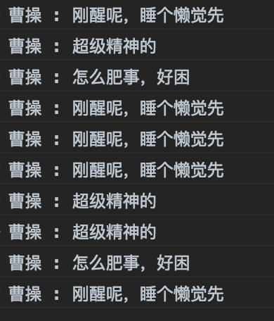

# 十三、状态模式

## 1. 定义

事物内部状态的改变往往会带来事物的行为改变。在处理的时候，将这个处理委托给当前的状态对象即可，该状态对象会负责渲染它自身的行为

## 2. 核心

区分事物内部的状态，把事物的每种状态都封装成单独的类，跟此种状态有关的行为都被封装在这个类的内部

## 3. 实现

以一个人的工作状态作为例子，在刚醒、精神、疲倦几个状态中切换着

```javascript
// 工作状态
function Work(name) {
    this.name = name;
    this.currentState = null;

    // 工作状态，保存为对应状态对象
    this.wakeUpState = new WakeUpState(this);
    // 精神饱满
    this.energeticState = new EnergeticState(this);
    // 疲倦
    this.tiredState = new TiredState(this);

    this.init();
}

Work.prototype.init = function() {
    this.currentState = this.wakeUpState;
    
    // 点击事件，用于触发更新状态
    document.body.onclick = () => {
        this.currentState.behaviour();
    };
};

// 更新工作状态
Work.prototype.setState = function(state) {
    this.currentState = state;
}

// 刚醒
function WakeUpState(work) {
    this.work = work;
}

// 刚醒的行为
WakeUpState.prototype.behaviour = function() {
    console.log(this.work.name, ':', '刚醒呢，睡个懒觉先');
    
    // 只睡了2秒钟懒觉就精神了..
    setTimeout(() => {
        this.work.setState(this.work.energeticState);
    }, 2 * 1000);
}

// 精神饱满
function EnergeticState(work) {
    this.work = work;
}

EnergeticState.prototype.behaviour = function() {
    console.log(this.work.name, ':', '超级精神的');
    
    // 才精神1秒钟就发困了
    setTimeout(() => {
        this.work.setState(this.work.tiredState);
    }, 1000);
};

// 疲倦
function TiredState(work) {
    this.work = work;
}

TiredState.prototype.behaviour = function() {
    console.log(this.work.name, ':', '怎么肥事，好困');
    
    // 不知不觉，又变成了刚醒着的状态... 不断循环呀
    setTimeout(() => {
        this.work.setState(this.work.wakeUpState);
    }, 1000);
};


var work = new Work('曹操');
```

点击一下页面，触发更新状态的操作



## 4. 优缺点

`优点`

状态切换的逻辑分布在状态类中，易于维护

`缺点`

多个状态类，对于性能来说，也是一个缺点，这个缺点可以使用享元模式来做进一步优化

将逻辑分散在状态类中，可能不会很轻易就能看出状态机的变化逻辑
