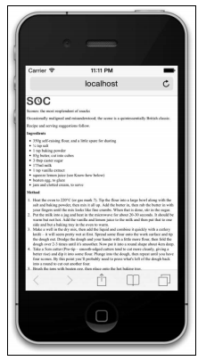
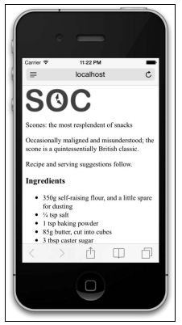
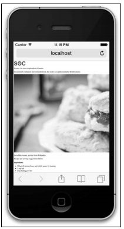
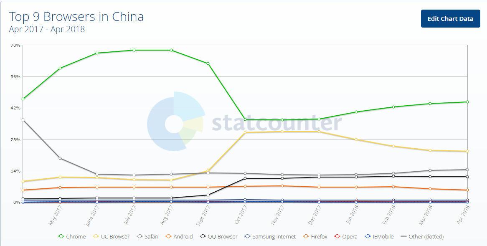
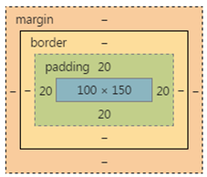
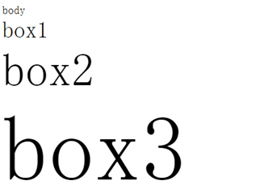

# 关于响应式布局，你必须要知道的

## 一、前言

响应式 Web 设计可以让一个网站同时适配多种设备和多个屏幕，可以让网站的布局和功能随用户的使用环境（屏幕大小、输入方式、设备/浏览器能力）而变化。本文主要介绍一些响应式布局容易忽略但又很重要的知识点。

## 二、视口

`移动前端中常说的 viewport （视口）就是浏览器中用于呈现网页的区域。视口通常并不等于屏幕大小，特别是可以缩放浏览器窗口的情况下。`手机端与 PC 端视口存在差异，电脑端的视口宽度等于分辨率，而移动端的视口宽度跟分辨率没有关系,宽度默认值是设备厂家指定的。iOS, Android 基本都将这个视口分辨率设置为 980px。

### 1.为什么手机端视口要设为 980px?

当年乔布斯设想：苹果手机如果在市场上火爆了，但是各个网站还没有来得及制作手机端网页，那么用户不得不用手机访问电脑版的网页，`如何用小屏幕访问大屏幕的页面也同样可读呢？`乔帮主就想着为手机固定一个视口宽度，让手机的视口宽度等于世界上绝大多数 PC 网页的版心宽度，就是 980px。这样，用手机访问电脑版网页的时候，旁边刚好没有留白。不过页面缩放后文字会变得非常小，用户需要手动放大缩小才能看清楚，体验非常差。



### 2.约束视口

为了解决前面的问题，可以在网页的中添加下面这行代码：

```html
<meta name="viewport" content="width=device-width, initial-scale=1.0, maximum-scale=1.0, user-scalable=no" />
```

>width=device-width   视口为设备宽度（就是人设置的一个宽度）//不设置的话默认为980px
>
>initial-scale=1.0    初始化的视口大小是1.0倍
>
>maximum-scale=1.0    最大的倍数是1.0倍
>
>user-scalable=0      不允许缩放视口

这个视口的标签告诉浏览器怎么渲染网页。在这里，标签想表达的意思是：按照设备的宽度（device-width）来渲染网页内容。事实上，在支持这个标签的设备上给你看一看效果，你就明白了。



不错呀！用户体验大大改善！！！

此时如果用 document.documentElement.clientWidth 来测试浏览器屏幕宽度，你会发现当前视口宽度等于手机屏幕的宽度，约数后的视口宽度都是在 320~480 之间（手机竖直使用的时候）。

这个视口的尺寸，是手机厂商设置的，能够保证我们的文字比如 16px，在自己的这个视口下清晰、大小刚刚合适。所以`大屏幕的手机的约束视口 > 小屏幕手机的约束视口。这就能够保证我们的网页可以用 px 写字号、写行高。`

`需要注意的是：约束之后的视口宽度，不是自己的分辨率！！每个手机的分辨率，都要比自己的视口宽度大得多得多！`

`最最重要的一句话：前端开发工程师，丝毫不关心手机的分辨率，我们只关心视口。`

## 三、图片

人们常说说“一图胜千言”，确实如此。我们网页中关于松饼的文字介绍再多，也没有图片有吸引力。下面我们就在页面上方添加一张松饼的图片（2000 像素宽），效果类似引诱用户往下看的大题图。



哇，真是好大一张图，它让整个网页看起来都失衡了，水平方向上图片溢出了。不行，必须解决这个问题。可以用 CSS 给图片指定固定宽度，`但问题是我们想让它能在不同大小的屏幕中自动缩放`。比如，我们例子中的 iPhone 屏幕宽度为 320 像素，如果我们把图片设置成 320 像素宽，那么 iPhone 屏幕旋转后又怎么办呢？这时候 320 像素变成了 480 像素。

解决方案很简单，只要一行 CSS 代码就可以让图片随容器宽度自动缩放:

```css
img {
  max-width: 100%;
}
```

回到手机上，刷新页面，结果比较符合预期了。

这里声明 max-width 规则，就是要保证所有图片最大显示为其自身的 100%（即最大只可以显示为自身那么大）。`此时，如果包含图片的元素（比如包含图片的 body 或 div）比图片固有宽度小，图片会缩放占满最大可用空间。`

`为什么不用 width:100%?`

要实现图片的自动缩放，也可以使用更通用的 width 属性，比如 width:100%。然而，这条规则在这里并不适用。因为这条规则会导致它显示得跟它的容器一样宽。`在容器比图片宽得多的情况下，图片会被无谓地拉伸。`

## 四、手机浏览器内核

在移动端，仅有四个独立的浏览器内核，分别为微软的 Trident、火狐的 Gecko、开源内核 Webkit、Opera 的 Presto。

目前微软的 Trident 在移动终端上主要为 WP7、8 系统内置浏览器。Opera 的 Presto 内核主要为 Opera Mobile、OperaMini、欧朋浏览器以及欧朋 HD Beta 版。`Webkit 内核的适用范围则较为广泛，Android 原生浏览器、苹果的 Safari、谷歌 Chrome(Android4.0 使用)都是基于 Webkit 开源内核开发的。`

>兼容的前缀：
>
>1	-ms-
>
>2	-moz-
>
>3	-o-
>
>4	-webkit-

中国用户的浏览器市场份额：



UC、Android 内置、Chrome、Safari、QQ Browser 都是 webkit 内核，从图上看占了绝大部分的市场份额。

所以一定要伺候好-webkit-。 有的公司干脆只兼容-webkit-，别的兼容比如-ms-都不写。

## 五、流式布局

`百分比布局也叫作流式布局、弹性盒布局。手机网页没有版心，都左右撑满。`

`百分比能够设置的属性是 width、height、padding、margin。其他属性比如 border、font-size 不能用百分比设置的。`

- 如果用百分比写 width，那么指的是父元素 width 的百分之多少。
- 如果用百分比写 height，那么指的是父元素 height 的百分之多少。
- 如果用百分比写 padding，那么指的是父元素 width 的百分之多少，无论是水平的 padding 还是竖直的 padding。
- 如果用百分比写 margin，那么指的是父元素 width 的百分之多少，无论是水平的 margin 还是竖直的 margin。
- 不能用百分比写 border 的宽度

接下来我们看一个例子：

```css
div{
    width:200px;
    height:300px;
    padding:10px;
}
div p{
    width:50%;
    height:50%;
    padding:10%;
}
此时p的真实宽度是多少？
```



此时 p 的真实宽度是 140px*190px

## 六、媒体查询

### 1.为什么响应式 Web 设计需要媒体查询

`CSS3 媒体查询可以让我们针对特定的设备能力或条件为网页应用特定的 CSS 样式。`如果没有媒体查询，光用 CSS 是无法大大修改网页外观的。这个模块让我们可以提前编写出适应很多不可预测因素的 CSS 规则，比如屏幕方向水平或垂直、视口或大或小等等。弹性布局虽然可以让设计适应较多场景，也包括某些尺寸的屏幕，但有时候确实不够用，因为我们还需要对布局进行更细致的调整。媒体查询让这一切成为可能，它就相当于 CSS 中基本的条件逻辑。

### 2.媒体查询语法

`我们在媒体查询外面写的第一条规则，是“基本的”样式，它适用于任何设备。在此基础上，我们再为不同视口、不同能力的设备，渐进增加不同的视觉效果和功能。`

```css
body {
    background-color: grey;
 }
@media screen and (min-width:1200px){
    body{
        background-color: pink;
	}
}
 @media screen and (min-width:700px) and (max-width:1200px){
    body{
	background-color: blue;
	}
}
@media screen and (max-width:700px){
    body{
	background-color: orange;
    }
}
```

其中`@media`就表示媒体查询，查询现在看这个网页的设备是什么，以及它的宽度是多少。screen 表示看这个网页的设备是显示器，而不是残疾人听力设备、也不是打印机。后面用 and 符号罗列所有的可能性。

值得注意：`媒体查询只能包裹选择器，不能包裹 key:value 键值对儿。`

`IE6、7、8 不支持媒体查询，也为了防止手机端的某些浏览器不支持媒体查询，所以不要把所有的选择器都放在媒体查询里面。`

## 七、rem 响应式布局

>rem 响应式布局思想

1. 一般不要给元素设置具体的宽度,但是对于一些小图标可以设定具体宽度值
2. 高度值可以设置固定值,设计稿有多大,我们就严格写多大
3. 所有设置的固定值都用 REM 做单位(首先在 HTML 中设置一个基准值：PX 和 REM 的对应比例,然后在效果图上获取 PX 值,布局的时候转化为 REM 值)
4. JS 获取真实屏幕的宽度,让其除以设计稿的宽度,算出比例,把之前的基准值按照比例进行重新的设定,这样项目就可以在移动端自适应了

>什么是 rem,它与 em 有何区别

`rem:当前页面中元素的 REM 单位的样式值都是针对于 HTML 元素的 font-size 的值进行动态计算的`

`em:表示父元素的字号的倍数。(特例：在 text-indent 属性中，表示文字宽度)`

```html
body             →font-size:20px;
<div class="box1">   → font-size:2em;
    box1
    <div class="box2">  → font-size:2em;
        box2
    <div class="box3">  → font-size:2em;
        box3
    </div>
    </div>
</div>
```



em 为单位的时候，font-size 属性是计算后继承，box1 计算出来是 40px。那么里面的 box2 是80px。 box3是160px。`em 单位不仅仅可以用来设置字号，还可以设置任何盒模型的属性，比如 width、height、padding、margin、border`

`rem 有一点优势就是可以和媒体查询配合，实现响应式布局：`

```css
@media screen and (min-width: 320px) {
    html {font-size: 14px;}
}
@media screen and (min-width: 360px) {
    html {font-size: 16px;}
}
@media screen and (min-width: 400px) {
    html {font-size: 18px;}
}
```

>运用场景

如果我们做的 H5 页面只在移动端访问，这是因为 REM 不兼容低版本的浏览器。而如果移动端和 PC 端公用一套代码，建议使用流式布局。

>如何做个 REM 响应式布局

`1、从 UI 设计师拿到 PSD 设计稿,然后在样式中给 HTML 设定一个 font-size 的值，我们一般都设置一个方便后面计算的值，例如：100px`

```css
html{
font-size:100px;//1rem=100px
}
```

`2、写页面，写样式`

首先按照设计稿的尺寸来写样式，然后在写样式值的时候，需要把得到的像素值除以 100 计算出对应的 REM 的值。

值得注意的是：真实项目中外层盒子的宽度我们一般还是不写固定值，沿用流式布局法的思想，我们用百分比的方式布局

```css
margin: 0  0.2rem;
height: 3rem;
```

`3、根据当前屏幕的宽度和设计稿的宽度来计算我们 HTML 的 font-size 的值`

例如：设计稿宽度为 640px,其中有一个部分是轮播图，它的尺寸是 600*300，在样式中给 HTML 设定一个 font-size 的值为 100px,则轮播图大小应该为 6rem×3rem，那如果手机屏幕宽度为 375px,其 font-size 应该设置为多少。

> 375/640*100->fontsize=58.59375//此时轮播图能自适应手机屏幕大小

`根据当前屏幕宽度和设计稿宽度的比例，动态计算一下当前宽度下的 fontsize 值应该是多少，如果 fontsize 的值改变了，之前设定的所有 REM 单位的值自动会跟着放大或者缩小`。可以通过以下这段代码实现：

```javascript
<script>
~function(){
var desW = 640,
winW = document.documentElement.clientwidth,
ratio = winW / desW;
document.documentElement.style.fontSize = ratio * 100 + "px";
}();
</script>
```

但如果当前屏幕宽度大于设计稿宽度，图片会被拉长而失真，所以以上代码需要稍微做些修改：

```html
//html部分
<section id="main">
<div class="box"></div>
</section>
//js部分
<script>
~function(){
var desW = 640,
winW = document.documentElement.clientwidth,
ratio = winW / desW;
var oMain = document.getElementById(main")；
if(winW > desW){
oMain.style.width = desW + "px";
oMain.style.margin = "0 auto";
return;
}
document.documentElement.style.fontSize = ratio * 100 + "px";
}();
</script>
```

## 八、参考

响应式 Web 设计：HTML5 和 CSS3 实战/（英）本·弗莱恩（Ben Frain）著；奇舞团译