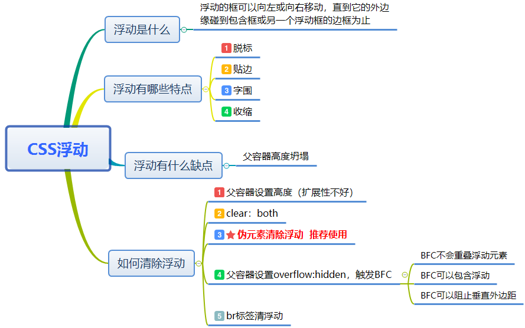
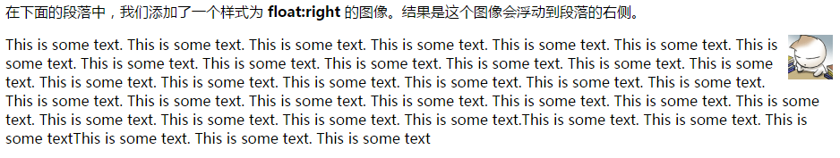
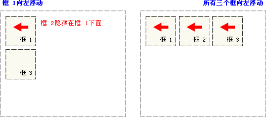
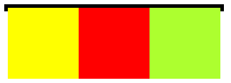

# 如何清除浮动

## 本文概述 

本文的框架图如下：



## 一、浮动到底是什么？

W3school中给出的浮动定义为`浮动的框可以向左或向右移动，直到它的外边缘碰到包含框或另一个浮动框的边框为止`。由于浮动框脱离文档的普通流中，所以文档的普通流中的块框表现得就像浮动框不存在一样。



## 二、浮动有什么特点？

浮动的特点，可以用八个字总结：`脱标、贴边、字围和收缩。`

为了更好说明，请看下图：

当框 1 向左浮动时，它脱离文档流（脱标）并且向左移动（贴边），直到它的左边缘碰到包含框的左边缘。因为它不再处于文档流中，所以它不占据空间，实际上覆盖住了框 2，使框 2 从视图中消失。如果框2中有文字，就会围着框1排开（字围）。

如果把所有三个框都向左浮动，那么框 1 向左浮动直到碰到包含框，另外两个框向左浮动直到碰到前一个浮动框。



下面着重讲解下第四个特点--收缩

一个浮动的内联元素（比如span img标签）不需要设置display：block就可以设置宽度。

```html
<style>
    div{
        float: left;
        background-color: greenyellow;
    }
</style>
</head>
<body>
<div>
    这是一段文字
</div>
</body>
```

得到以下的效果：


我们都知道div标签是块级元素，会独占一行，然而上面的例子中将div设置为左浮后，其宽度不再是占满一行，而是收紧为内部元素的宽度，这就是浮动第四个特征的含义。

## 三、浮动有什么缺点？

先看下面这段代码：

```html
<style>
    .parent{
        border: solid 5px;
        width:300px;
    }
    .child:nth-child(1){
        height: 100px;
        width: 100px;
        background-color: yellow;
        float: left;
    }
    .child:nth-child(2){
        height: 100px;
        width: 100px;
        background-color: red;
        float: left;
    }
    .child:nth-child(3){
        height: 100px;
        width: 100px;
        background-color: greenyellow;
        float: left;
    }
</style>
</head>
<body>
<div class="parent">
    <div class="child"></div>
    <div class="child"></div>
    <div class="child"></div>
</div>
</body>
```

我们想让父容器包裹着三个浮动元素，然而事与愿违，得到却是这样的结果：



这就是浮动带来副作用----父容器高度塌陷，于是清理浮动就显着至关重要。

## 四、如何清理浮动？

`清除浮动不是不用浮动，清除浮动产生的父容器高度塌陷。`

### `套路1：给浮动元素的父元素添加高度（扩展性不好）`

如果一个元素要浮动，那么它的父元素一定要有高度。高度的盒子，才能关住浮动。可以通过直接给父元素设置height，实际应用中我们不大可能给所有的盒子加高度，不仅麻烦，并且不能适应页面的快速变化；另外一种，父容器的高度可以通过内容撑开（比如img图片），实际当中此方法用的比较多。

### `套路2：clear:both;`

在最后一个子元素新添加最后一个冗余元素，然后将其设置clear:both,这样就可以清除浮动。这里强调一点，`即在父级元素末尾添加的元素必须是一个块级元素，否则无法撑起父级元素高度。`

```html
<div id="wrap">
    <div id="inner"></div>
    <div style="clear: both;"></div>
</div>
```

```css
#wrap {
    border: 1px solid;
}
#inner {
    float: left;
    width: 200px;
    height: 200px;
    background: pink;
}
```

### `套路3：伪元素清除浮动`

上面那种办法固然可以清除浮动，但是我们不想在页面中添加这些没有意义的冗余元素，此时如何清除浮动吗？

`结合 :after 伪元素和 IEhack ，可以完美兼容当前主流的各大浏览器，这里的 IEhack 指的是触发 hasLayout。`

```html
<div id="wrap" class="clearfix">
    <div id="inner"></div>
</div>
```

```css
#wrap {
    border: 1px solid;
}
#inner {
    float: left;
    width: 200px;
    height: 200px;
    background: pink;
}
/*开启haslayout*/
.clearfix {
    *zoom: 1;
}
/*ie6 7 不支持伪元素*/
.clearfix::after {
    content: '';
    display: block;
    clear: both;
    height:0;
    line-height:0;
    visibility:hidden;//允许浏览器渲染它，但是不显示出来
}
```

给浮动元素的父容器添加一个clearfix的class，然后给这个class添加一个:after伪元素，实现元素末尾添加一个看不见的块元素来清理浮动。这是通用的清理浮动方案，推荐使用

### `套路4：给父元素使用overflow:hidden;`

这种方案让父容器形成了BFC（块级格式上下文），而BFC可以包含浮动，通常用来解决浮动父元素高度坍塌的问题。

`BFC的触发方式`

我们可以给父元素添加以下属性来触发BFC：

- float 为 left | right

- overflow 为 hidden | auto | scorll

- display 为 table-cell | table-caption | inline-block

- position 为 absolute | fixed

这里可以给父元素设置overflow:auto，但是为了兼容IE最好使用overflow:hidden。

`但这种办法有个缺陷：如果有内容出了盒子，用这种方法就会把多的部分裁切掉，所以这时候不能使用。`

`BFC的主要特征:`

- BFC容器是一个隔离的容器，和其他元素互不干扰；所以我们可以用触发两个元素的BFC来解决垂直边距折叠问题。

- BFC不会重叠浮动元素

- BFC可以包含浮动,这可以清除浮动。

### `套路5：br标签清浮动`

`br标签存在一个属性：clear。这个属性就是能够清除浮动的利器，在br标签中设置属性clear，并赋值all。即能清除掉浮动。`

```html
<div id="wrap">
    <div id="inner"></div>
    <br clear="all" />
</div>
```

```css
#wrap {
    border: 1px solid;
}
#inner {
    float: left;
    width: 200px;
    height: 200px;
    background: pink;
}
```

## 参考文章

- [br清浮动的原理与clear:both的兼容](https://www.h5course.com/a/20150503113.html)

- [清浮动 | 如何清除浮动](https://www.h5course.com/plus/view.php?aid=32)

- [CSS-清除浮动](https://segmentfault.com/a/1190000004865198)