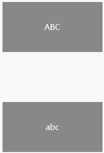
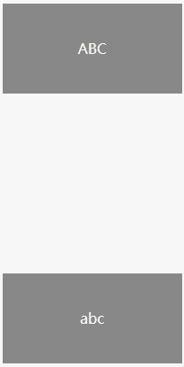
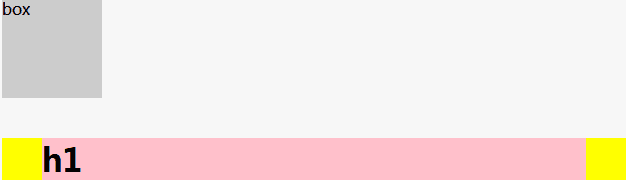
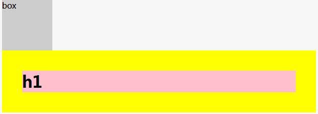
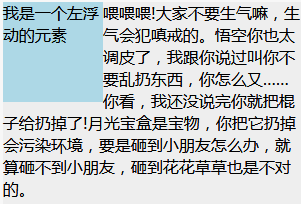
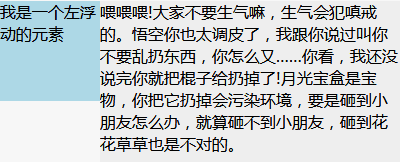
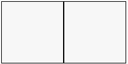
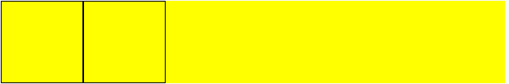

# 深入理解BFC

## 一、什么是BFC

Formatting context 是 W3C CSS2.1 规范中的一个概念。它是页面中的一块渲染区域，并且有一套渲染规则，它决定了其子元素将如何定位，以及和其他元素的关系和相互作用。最常见的 Formatting context 有 Block formatting context (简称BFC)和 Inline formatting context (简称IFC)。`Block formatting context直译为"块级格式化上下文"。它是一个独立的渲染区域，只有Block-level box参与， 它规定了内部的Block-level Box如何布局，并且与这个区域外部毫不相干。通俗地讲，BFC是一个容器，用于管理块级元素。`

## 二、如何创建BFC

- float为 left|right
- overflow为 hidden|auto|scroll
- display为 table-cell|table-caption|inline-block|- - inline-flex|flex
- position为 absolute|fixed
根元素

## 三、BFC布局规则：

- 内部的Box会在垂直方向，一个接一个地放置(即块级元素独占一行)。
- BFC的区域不会与float box重叠(`利用这点可以实现自适应两栏布局`)。
- 内部的Box垂直方向的距离由margin决定。属于同一个BFC的两个相邻Box的margin会发生重叠(`margin重叠三个条件:同属于一个BFC;相邻;块级元素`)。
- 计算BFC的高度时，浮动元素也参与计算。（清除浮动 haslayout）
- BFC就是页面上的一个隔离的独立容器，容器里面的子元素不会影响到外面的元素。反之也如此。

## 四、 BFC有哪些特性

### `特性1：BFC会阻止垂直外边距折叠`

`按照BFC的定义，只有同属于一个BFC时，两个元素才有可能发生垂直margin的重叠`，这个包括相邻元素或者嵌套元素，只要他们之间没有阻挡（`比如边框、非空内容、padding等`）就会发生margin重叠。

#### ①`相邻兄弟元素margin重叠问题`

```html
<style>
p {
    color: #fff;
    background: #888;
    width: 200px;
    line-height: 100px;
    text-align: center;
    margin: 100px;
}
</style>
<body>
    <p>ABC</p>
    <p>abc</p>
</body>
```



上面例中两个P元素之间距离本该为200px,然而实际上只有100px,发生了margin重叠。遇到这种情形，我们如何处理？

`只需要在p外面包裹一层容器，并触发该容器生成一个BFC。那么两个P便不属于同一个BFC，就不会发生margin重叠了。`

```html
<style>
p {
    color: #fff;
    background: #888;
    width: 200px;
    line-height: 100px;
    text-align: center;
    margin: 100px;
}
.wrap {
    overflow: hidden;
}
</style>
<body>
    <p>ABC</p>
    <div class="wrap">
        <p>abc</p>
    </div>
</body>
```



#### ②`父子元素margin重叠问题`

```html
<style>
.box {
    width:100px;
    height:100px;
    background:#ccc;
}
.wrap {
    background:yellow;
}
.wrap h1 {
    background:pink;
    margin:40px;
}
</style>
<body>
<div class="box">box</div>
<div class="wrap">
    <h1>h1</h1>
</div>
</body>
```



上图wrap元素与h1元素之间l理论上本该有个40px的上下margin值,然而实际上父子元素并没有存在margin值，与此同时，两个div元素的间距为40px。遇到这种情形，我们如何处理？

处理方法其实有很多，`**在wrap元素中添加:overflow:hidden;或者overflow：auto；使其父元素形成一个BFC；也可以在wrap元素中添加border：1px solid；或是padding：1px；**`这些都可以有效解决父子元素margin重叠问题。



### `特性2：BFC不会重叠浮动元素`

利用这个特性，我们可以创造`自适应两栏布局`。

```html
<style>
.box1 {
    height: 100px;
    width: 100px;
    float: left;
    background: lightblue;
}
.box2 {
    width: 200px;
    height: 200px;
    background: #eee;
}
</style>
<body>
<div class="box1">我是一个左浮动的元素</div>
<div class="box2">喂喂喂!大家不要生气嘛，生气会犯嗔戒的。悟空你也太调皮了，
我跟你说过叫你不要乱扔东西，你怎么又……你看，我还没说完你就把棍子给扔掉了!
月光宝盒是宝物，你把它扔掉会污染环境，要是砸到小朋友怎么办，就算砸不到小朋友，
砸到花花草草也是不对的。</div>
</body>
```



上图中，文字围绕着浮动元素排列，不过在这里，这显然不是我们想要的。此时我们可以`为.box2元素的样式加上overflow:hidden；使其建立一个BFC,让其内容消除对外界浮动元素的影响`。



这个方法可以用来实现两列自适应布局，效果不错，此时左边的宽度固定，右边的内容自适应宽度。如果我们改变文字的大小或者左边浮动元素的大小，两栏布局的结构依然没有改变！

### `特性3：BFC可以包含浮动----清除浮动`

我们都知道浮动会脱离文档流，接下来我们看看下面的例子：

```html
<style>
.box1 {
    width:100px;
    height:100px;
    float:left;
    border: 1px solid #000;
}
.box2 {
    width:100px;
    height:100px;
    float:left;
    border: 1px solid #000;
}
.box {
    background:yellow
}
</style>
<body>
<div class="box">
    <div class="box1"></div>
    <div class="box2"></div>
</div> 
</body>
```



由于容器内两个div元素浮动，脱离了文档流，父容器内容宽度为零（即发生高度塌陷），未能将子元素包裹住。解决这个问题，只需要把把父元素变成一个BFC就行了。常用的办法是给父元素设置overflow:hidden。



## 参考文章

- [【CSS】深入理解BFC原理及应用](https://www.jianshu.com/p/acf76871d259)

- [10 分钟理解 BFC 原理](https://zhuanlan.zhihu.com/p/25321647)