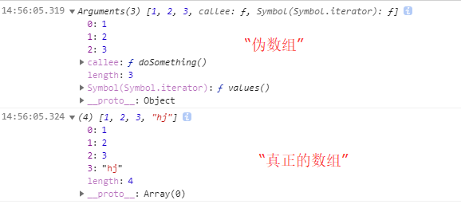
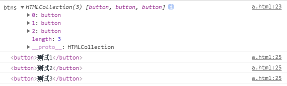

# ES6数组的扩展--Array.from()和Array.of()

## 一、 Array.from() : 将伪数组对象或可遍历对象转换为真数组

### 1.何为伪数组

`如果一个对象的所有键名都是正整数或零，并且有length属性`，那么这个对象就很像数组，语法上称为“类似数组的对象”(array-like object),即为伪数组。

```javascript
let obj = {
    0: 'a',
    1: 'b',
    2: 'c',
    length: 3
};
obj[0] // 'a'
obj[1] // 'b'
obj.length // 3
obj.push('d') // TypeError: obj.push is not a function
```

上面代码中，对象obj就是一个类似数组的对象。但是“类似数组的对象”并不是数组，因为它们不具备数组特有的方法。对象obj没有数组的push方法，使用该方法就会报错。

### 2.有哪些是伪数组

典型的“类似数组的对象”是`函数的arguments对象，以及大多数 DOM 元素集，还有字符串`。

### 3.如何转化为真数组

`①数组的slice方法可以将“类似数组的对象”变成真正的数组`

```javascript
function doSomething(){
    console.log(arguments)
    let args = Array.prototype.slice.call(arguments);
    args.push("hj")
    console.log(args)
    return args
}
doSomething(1,2,3)
```



或者你也可以写成：

```javascript
function doSomething(){
    return [].slice.call(arguments)
}
doSomething(1,2,3)
```

尽管这种方法，也可以实现将类数组转变为数组的目的，但并不直观。ES6新增Array.from()方法来提供一种明确清晰的方式以解决这方面的需求，更推荐后者的办法。

`②Array.from()`

```html
<button>测试1</button>
<br>
<button>测试2</button>
<br>
<button>测试3</button>
<br>
<script type="text/javascript">
let btns = document.getElementsByTagName("button")
console.log("btns",btns);//得到一个伪数组
//btns.forEach(item=>console.log(item)) Uncaught TypeError: btns.forEach is not a function
Array.from(btns).forEach(item => console.log(item))  // 将伪数组转换为数组
</script>
```



`在ES6中，扩展运算符(...)也可以将某些数据结构转为数组。`只不过它需要在背后调用遍历器接口Symbol.iterator。值得注意的是如果一个对象没有部署遍历器接口，使用扩展运算符是无法将类似数组对象转换成数组。

```javascript
function doSomething (){ 
  return [...arguments] 
}
doSomething('a','b','c'); // ["a","b","c"]
```

### 4.Array.from()用法

Array.from接受三个参数，但只有input是必须的：

- input: 你想要转换的类似数组对象和可遍历对象

- map: 类似于数组的map方法，用来对每个元素进行处理，将处理后的值放入返回的数组

- context: 绑定map中用到的this

`只要是部署了iterator接口的数据结构，Array.from都能将其转为数组:`

```javascript
let arr = Array.from('shuaiyang'); 
console.log(arr); //["s", "h", "u", "a", "i", "y", "a", "n", "g"]
```

Array.from还可以接受第二个参数，作用类似于数组的map方法，用来对每个元素进行处理，处理后的值放入返回的数组。

```javascript
Array.from([1, 2, 3], (x) => x * x)// [1, 4, 9]

// 等同于
Array.from([1,2,3].map(x => x * x))
```

如果map函数里面用到了this关键字，还可以传入Array.from的第三个参数，用来绑定this。

`Array.from()可以将各种值转为真正的数组，并且还提供map功能。这实际上意味着，只要有一个原始的数据结构，你就可以先对它的值进行处理，然后转成规范的数组结构，进而就可以使用数量众多的数组方法。`

```javascript
Array.from({ length: 2 }, () => 'jack')// ["jack", "jack"]
```

## 二、Array.of(v1, v2, v3) : 将一系列值转换成数组

当调用 new Array( )构造器时，根据传入参数的类型与数量的不同，实际上会导致一些不同的结果， 例如：

```javascript
let items = new Array(2) ;
console.log(items.length) ; // 2
console.log(items[0]) ; // undefined
console.log(items[1]) ; // undefined
```

```javascript
let items = new Array(1, 2) ;
console.log(items.length) ; // 2
console.log(items[0]) ; // 1
console.log(items[1]) ; // 2
```

当使用单个数值参数来调用 Array 构造器时，数组的长度属性会被设置为该参数。 如果使用多个参数(无论是否为数值类型)来调用，这些参数也会成为目标数组的项。数组的这种行为既混乱又有风险，因为有时可能不会留意所传参数的类型。

ES6 引入了Array.of( )方法来解决这个问题。该方法的作用非常类似Array构造器，但在使用单个数值参数的时候并不会导致特殊结果。`Array.of( )方法总会创建一个包含所有传入参数的数组，而不管参数的数量与类型`：

```javascript
let items = Array.of(1, 2);
console.log(items.length); // 2
console.log(items[0]); // 1
console.log(items[1]); // 2
items = Array.of(2);
console.log(items.length); // 1
console.log(items[0]); // 2
```

`Array.of基本上可以用来替代Array()或new Array()，并且不存在由于参数不同而导致的重载，而且他们的行为非常统一。`

## 参考文章

[深入理解ES6](https://book.douban.com/subject/27072230/)

[Javascript教程](https://wangdoc.com/javascript/)

[JavaScript学习笔记：ES6数组方法](https://www.w3cplus.com/javascript/es6-array-methods.html)
