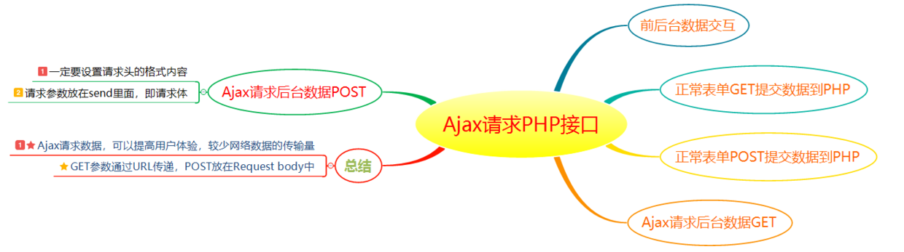

# Ajax请求后台数据



## 一、前期准备

安装好XAMPP软件，并运行起来。本文代码是基于XAMPP开发环境，XAMPP是完全免费且易于安装的Apache发行版，其中包含MariaDB、PHP和Perl。XAMPP开放源码包的设置让安装和使用出奇容易。

## 二、前后台数据交互

前台部分

其中“process.php?name=Herry”，向后台传递name数据

```javascript
document.getElementById("button").addEventListener("click",function () {
    var xhr = new XMLHttpRequest();
    xhr.open("GET","process.php?name=Herry",true);
    xhr.onreadystatechange=function () {
        if(xhr.readyState==4&&xhr.status==200) {
            var data = xhr.responseText;
            console.log(data)
        }
    };
    xhr.send();
})
```

后台PHP部分

后台接收了name数值，并向前台返回了"GET: 你的名字是". $_GET['name']

```javascript
<?php 
   	if (isset($_GET['name'])) {
   		echo "GET: 你的名字是". $_GET['name'];
   	}
?>
```

于是最后前台console里面得到：GET: 你的名字是Herry

## 三、正常表单提交到PHP与Ajax方式提交

`正常表单GET提交数据到PHP`

前台部分

```html
<form action="process.php" method="GET">
    <input type="text" name="name">
    <input type="submit" value="提交">
</form>
```

后台PHP部分

```javascript
<?php
   	if (isset($_GET['name'])) {
   		echo "GET: 你的名字是". $_GET['name'];
   	}
?>
```

表单输入名字Bucky，然后点击提交后，浏览器将数据打包后，传递给后台,最后后台返回我们想要的数据----GET: 你的名字是Bucky。整个过程中页面有刷新，数据点击提交后，页面跳转到这个网址http://localhost/ajax/process.php?name=Bucky

`Ajax请求后台数据GET`

`Ajax异步请求数据，无需刷新页面。可以提高用户体验，较少网络数据的传输量。`click事件改成submit事件（表单应该用submit事件），然后取消默认事件。

前台部分

```html
//Html部分
<form id="getForm">
    <input type="text"name="name" id="name1">
    <input type="submit"value="提交">
</form>
//Javascript部分
 document.getElementById("getForm").addEventListener("submit",function(e){
    e.preventDefault();//阻止默认跳转事件
    var name=document.getElementById("name1").value;//获取输入的值
    var xhr = new XMLHttpRequest();
    xhr.open("GET","process.php?name="+name,true);
    xhr.onreadystatechange=function () {
        if (  xhr.status == 200&&xhr.readyState == 4) {
            var data = xhr.responseText;
            console.log(data);
        }
    }
        xhr.send();
})
```

后台PHP部分

```javascript
<?php
   	if (isset($_GET['name'])) {
   		echo "GET: 你的名字是". $_GET['name'];
   	}
?>
```

在表单输入Bucky，点击提交，最后在console显示：GET: 你的名字是Bucky。整个过程页面无刷新，有效提高页面性能。

`正常表单POST提交数据到PHP`

与GET提交数据差不多

前台部分

```html
<form action="process.php" method="POST">
    <input type="text" name="name">
    <input type="submit" value="提交">
</form>
```

后台PHP部分

```javascript
<?php
   	if (isset($_POST['name'])) {
       	echo "POST: 你的名字是". $_POST['name'];
       	}
?>
```

表单输入名字Bucky，然后点击提交后，浏览器将数据打包后，传递给后台,最后后台返回我们想要的数据----POST: 你的名字是Bucky。整个过程中页面有刷新，数据点击提交后，页面跳转到这个网址http://localhost/ajax/process.php。与GET方式提交不同的是，POST方法数据并没有内嵌在url中，这样安全性比较高。

`Ajax请求后台数据POST`

POST请求与GET主要有两点不同：

`①post请求一定要设置请求头的格式内容：`

```javascript
xhr.setRequestHeader("Content-type","application/x-www-form-urlencoded"); 
```

`②post请求参数放在send里面，即请求体`

```javascript
xhr.send("name="+name" );  
```

前台部分

```html
//HTML部分
<form id="postForm">
    <input type="text"name="name" id="name2">
    <input type="submit"value="提交">
</form>
//Javascript部分
document.getElementById("postForm").addEventListener("submit", function (e) {
    e.preventDefault();
    var name=document.getElementById("name2").value;
    var params = "name="+name;
    var xhr = new XMLHttpRequest();
    xhr.open("POST","process.php",true);
    xhr.setRequestHeader("Content-type","application/x-www-form-urlencoded");
    xhr.onreadystatechange=function () {
        if(xhr.readyState==4&&xhr.status==200) {
            var data = xhr.responseText;
            console.log(data);
        }
    };
    xhr.send(params);
})
```

后台PHP部分

```javascript
<?php
     if (isset($_POST['name'])) {
        echo "POST: 你的名字是". $_POST['name'];
        }
?>
```

表单输入名字Bucky，然后点击提交后，最后在console显示：POST: 你的名字是Bucky。整个过程页面无刷新。

## 四、总结
`1.在不需要重新刷新页面的情况下，Ajax 通过异步请求加载后台数据，提高用户体验和页面性能。`

`2.GET参数通过URL传递，POST放在Request body中，后者安全性比较高。`
