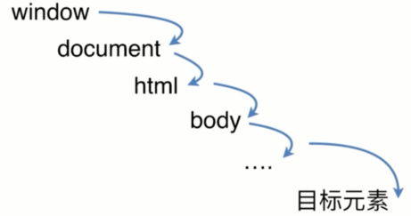
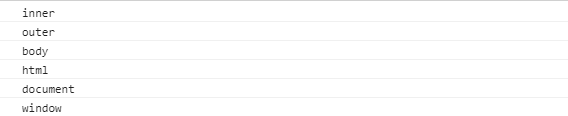
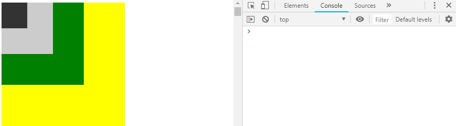

# DOM事件机制

## 前言

本文主要介绍DOM事件级别、DOM事件模型、事件流、事件代理和Event对象常见的应用，希望对你们有些帮助和启发！

## 一、DOM事件级别

DOM级别一共可以分为四个级别：DOM0级、DOM1级、DOM2级和DOM3级。而`DOM事件分为3个级别：DOM 0级事件处理，DOM 2级事件处理和DOM 3级事件处理`。由于DOM 1级中没有事件的相关内容，所以没有DOM 1级事件。

### 1.DOM 0级事件

`el.onclick=function(){}`

```javascript
// 例1
let btn = document.getElementById('btn');
btn.onclick = function(){
 alert(this.innerHTML);
}
```

`当希望为同一个元素/标签绑定多个同类型事件的时候（如给上面的这个btn元素绑定3个点击事件），是不被允许的`。DOM0事件绑定，给元素的事件行为绑定方法，`这些方法都是在当前元素事件行为的冒泡阶段(或者目标阶段)执行的`。

### 2.DOM 2级事件

`el.addEventListener(event-name, callback, useCapture)`

- event-name: 事件名称，可以是标准的DOM事件

- callback: 回调函数，当事件触发时，函数会被注入一个参数为当前的事件对象 event

- useCapture: `默认是false，代表事件句柄在冒泡阶段执行`

```javascript
// 例2
let btn = document.getElementById('btn');
btn.addEventListener("click", test, false);
function test(e){
	e = e || window.event;
    alert((e.target || e.srcElement).innerHTML);
    btn.removeEventListener("click", test)
}
//IE9-:attachEvent()与detachEvent()。
//IE9+/chrom/FF:addEventListener()和removeEventListener()
```

IE9以下的IE浏览器不支持 addEventListener()和removeEventListener()，使用 attachEvent()与detachEvent() 代替，因为IE9以下是不支持事件捕获的，所以也没有第三个参数，第一个事件名称前要加on。

### 3.DOM 3级事件

在DOM 2级事件的基础上添加了更多的事件类型。

- UI事件，当用户与页面上的元素交互时触发，如：load、scroll

- 焦点事件，当元素获得或失去焦点时触发，如：blur、focus

- 鼠标事件，当用户通过鼠标在页面执行操作时触发如：dblclick、mouseup

- 滚轮事件，当使用鼠标滚轮或类似设备时触发，如：mousewheel

- 文本事件，当在文档中输入文本时触发，如：textInput

- 键盘事件，当用户通过键盘在页面上执行操作时触发，如：keydown、keypress

- 合成事件，当为IME（输入法编辑器）输入字符时触发，如：compositionstart

- 变动事件，当底层DOM结构发生变化时触发，如：DOMsubtreeModified

- 同时DOM3级事件也允许使用者自定义一些事件。

## 二、DOM事件模型和事件流

`DOM事件模型分为捕获和冒泡`。一个事件发生后，会在子元素和父元素之间传播（propagation）。这种传播分成三个阶段。

（1）捕获阶段：事件从window对象自上而下向目标节点传播的阶段；

（2）目标阶段：真正的目标节点正在处理事件的阶段；

（3）冒泡阶段：事件从目标节点自下而上向window对象传播的阶段。

`DOM事件捕获的具体流程`



捕获是从上到下，事件先从window对象，然后再到document（对象），然后是html标签（通过document.documentElement获取html标签），然后是body标签（通过document.body获取body标签），然后按照普通的html结构一层一层往下传，最后到达目标元素。

而事件冒泡的流程刚好是事件捕获的逆过程。

接下来我们看个事件冒泡的例子：

```html
// 例3
<div id="outer">
    <div id="inner"></div>
</div>
.......
<script>
window.onclick = function() {
    console.log('window');
};
document.onclick = function() {
    console.log('document');
};
document.documentElement.onclick = function() {
    console.log('html');
};
document.body.onclick = function() {
    console.log('body');
}
outer.onclick = function(ev) {
    console.log('outer');
};
inner.onclick = function(ev) {
    console.log('inner');
};
</script>
```



正如我们上面提到的onclick给元素的事件行为绑定方法都是在当前元素事件行为的冒泡阶段(或者目标阶段)执行的。

## 三、事件代理(事件委托)

由于事件会在冒泡阶段向上传播到父节点，因此可以把子节点的监听函数定义在父节点上，由父节点的监听函数统一处理多个子元素的事件。这种方法叫做事件的代理（delegation）。

### 1.优点

- 减少内存消耗，提高性能

```html
// 例4
<ul id="list">
  <li>item 1</li>
  <li>item 2</li>
  <li>item 3</li>
  ......
  <li>item n</li>
</ul>
```

如果给每个列表项一一都绑定一个函数，那对于内存消耗是非常大的，效率上需要消耗很多性能。借助事件代理，我们只需要给父容器ul绑定方法即可，这样不管点击的是哪一个后代元素，都会根据冒泡传播的传递机制，把容器的click行为触发，然后把对应的方法执行，根据事件源，我们可以知道点击的是谁，从而完成不同的事。

- 动态绑定事件

在很多时候，我们需要通过用户操作动态的增删列表项元素，如果一开始给每个子元素绑定事件，那么在列表发生变化时，就需要重新给新增的元素绑定事件，给即将删去的元素解绑事件，如果用事件代理就会省去很多这样麻烦。

### 2.如何实现

接下来我们来实现上例中父层元素 #list 下的 li 元素的事件委托到它的父层元素上：

```javascript
// 给父层元素绑定事件
document.getElementById('list').addEventListener('click', function (e) {
  // 兼容性处理
  let event = e || window.event;
  let target = event.target || event.srcElement;
  // 判断是否匹配目标元素
  if (target.nodeName.toLocaleLowerCase === 'li') {
    console.log('the content is: ', target.innerHTML);
  }
});
```

## 四、Event对象常见的应用

- event. preventDefault()

`如果调用这个方法，默认事件行为将不再触发。`什么是默认事件呢？例如表单一点击提交按钮(submit)跳转页面、a标签默认页面跳转或是锚点定位等。

很多时候我们使用a标签仅仅是想当做一个普通的按钮，点击实现一个功能，不想页面跳转，也不想锚点定位。

```html
//方法一：
<a href="javascript:;">链接</a>
```

也可以通过JS方法来阻止，给其click事件绑定方法，当我们点击A标签的时候，先触发click事件，其次才会执行自己的默认行为

```html
//方法二:
<a id="test" href="http://www.cnblogs.com">链接</a>
<script>
test.onclick = function(e){
    e = e || window.event;
    return false;
}
</script>
```

```html
//方法三：
<a id="test" href="http://www.cnblogs.com">链接</a>
<script>
test.onclick = function(e){
    e = e || window.event;
    e.preventDefault();
}
</script>
```

接下来我们看个例子：输入框最多只能输入六个字符，如何实现？

```html
// 例5
<input type="text" id='tempInp'>
<script>
tempInp.onkeydown = function(ev) {
    ev = ev || window.event;
    let val = this.value.trim() //trim去除字符串首位空格（不兼容）
    // this.value=this.value.replace(/^ +| +$/g,'') 兼容写法
    let len = val.length
    if (len >= 6) {
        this.value = val.substr(0, 6);
        //阻止默认行为去除特殊按键（DELETE\BACK-SPACE\方向键...）
        let code = ev.which || ev.keyCode;
        if (!/^(46|8|37|38|39|40)$/.test(code)) {
            ev.preventDefault()
        }
    }
}
</script>
```

- event.stopPropagation() & event.stopImmediatePropagation()

`event.stopPropagation() 方法阻止事件冒泡到父元素，阻止任何父事件处理程序被执行。`上面提到事件冒泡阶段是指事件从目标节点自下而上向window对象传播的阶段。

我们在例3的inner元素click事件上，添加`event.stopPropagation()`这句话后，就阻止了父事件的执行，最后只打印了'inner'。

```javascript
inner.onclick = function(ev) {
    console.log('inner');
    ev.stopPropagation();
};
```

`stopImmediatePropagation 既能阻止事件向父元素冒泡，也能阻止元素同事件类型的其它监听器被触发。而 stopPropagation 只能实现前者的效果。`我们来看个例子：

```html
<body>
  <button id="btn">click me to stop propagation</button>
</body>
......
<script >
const btn = document.querySelector('#btn');
btn.addEventListener('click', event => {
  console.log('btn click 1');
  event.stopImmediatePropagation();
});
btn.addEventListener('click', event => {
  console.log('btn click 2');
});
document.body.addEventListener('click', () => {
  console.log('body click');
});
</script>
```

如上所示，使用 stopImmediatePropagation后，点击按钮时，不仅body绑定事件不会触发，与此同时按钮的另一个点击事件也不触发。

- event.target & event.currentTarget

老实说这两者的区别，并不好用文字描述，我们先来看个例子：

```html
<div id="a">
  <div id="b">
    <div id="c"><div id="d"></div></div>
  </div>
</div>
<script>
  document.getElementById('a').addEventListener('click', function(e) {
    console.log(
      'target:' + e.target.id + '&currentTarget:' + e.currentTarget.id
    )
  })
  document.getElementById('b').addEventListener('click', function(e) {
    console.log(
      'target:' + e.target.id + '&currentTarget:' + e.currentTarget.id
    )
  })
  document.getElementById('c').addEventListener('click', function(e) {
    console.log(
      'target:' + e.target.id + '&currentTarget:' + e.currentTarget.id
    )
  })
  document.getElementById('d').addEventListener('click', function(e) {
    console.log(
      'target:' + e.target.id + '&currentTarget:' + e.currentTarget.id
    )
  })
</script>
```



当我们点击最里层的元素d的时候，会依次输出:

```text
target:d&currentTarget:d
target:d&currentTarget:c
target:d&currentTarget:b
target:d&currentTarget:a
```

从输出中我们可以看到，event.target指向引起触发事件的元素，而event.currentTarget则是事件绑定的元素，只有被点击的那个目标元素的event.target才会等于event.currentTarget。`也就是说，event.currentTarget始终是监听事件者，而event.target是事件的真正发出者。`

## 五、参考文章

[DOM级别与DOM事件](https://www.jianshu.com/p/622d994906f7)

