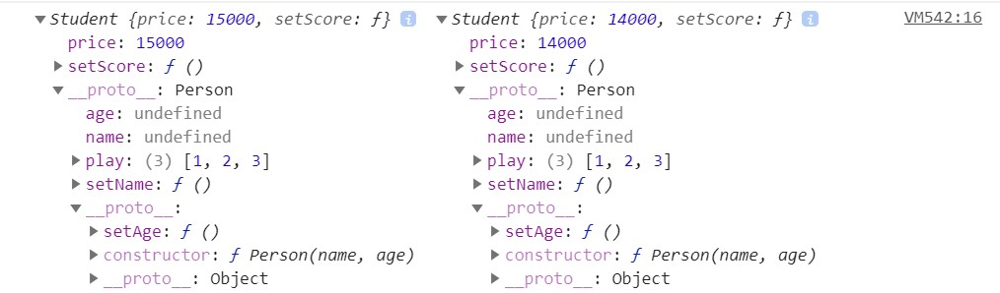
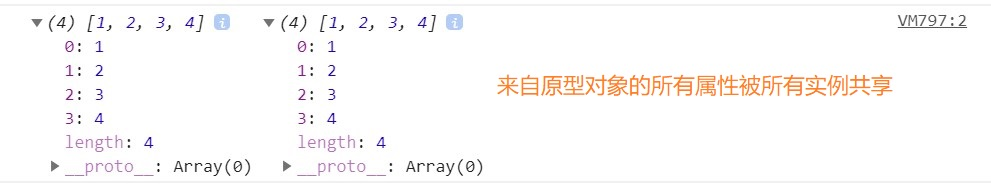
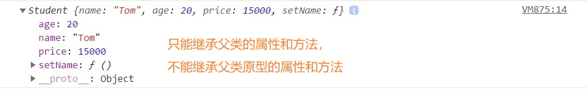
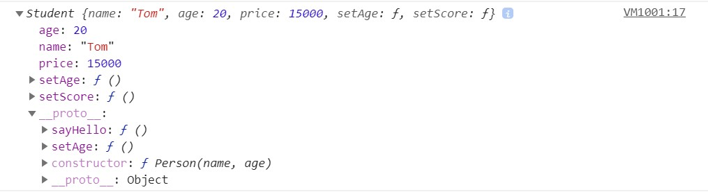
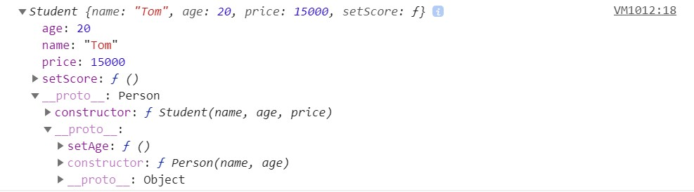
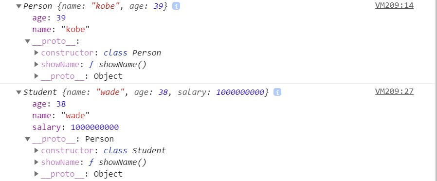

# JavaScript常见的六种继承方式

## 前言

面向对象编程很重要的一个方面，就是对象的继承。`A 对象通过继承 B 对象，就能直接拥有 B 对象的所有属性和方法。`这对于代码的复用是非常有用的。

大部分面向对象的编程语言，都是通过“类”（class）实现对象的继承。传统上，JavaScript 语言的继承不通过 class(ES6 引入了class 语法)，而是通过“原型对象”（prototype）实现。那么在JS中常见的继承方式有几种呢？

如需本文源码，请猛戳 [常见的六种继承方式](./index.html)

## 方式一、原型链继承

这种方式关键在于: `子类型的原型为父类型的一个实例对象`。

```javascript
//父类型
function Person(name, age) {
    this.name = name
    this.age = age
    this.play = [1, 2, 3]
    this.setName = function () {}
}
Person.prototype.setAge = function () {}
//子类型
function Student(price) {
    this.price = price
    this.setScore = function () {}
}
Student.prototype = new Person() // 子类型的原型为父类型的一个实例对象
let s1 = new Student(15000)
let s2 = new Student(14000)
console.log(s1,s2)     
```



但这种方式实现的本质是通过将子类的原型指向了父类的实例，所以`子类的实例就可以通过__proto__访问到 Student.prototype 也就是Person的实例，这样就可以访问到父类的私有方法，然后再通过__proto__指向父类的prototype就可以获得到父类原型上的方法`。于是做到了将父类的私有、公有方法和属性都当做子类的公有属性

`子类继承父类的属性和方法是将父类的私有属性和公有方法都作为自己的公有属性和方法`，我们都知道在操作基本数据类型的时候操作的是值，在操作引用数据类型的时候操作的是地址，如果说父类的私有属性中有引用类型的属性，那它被子类继承的时候会作为公有属性，这样子类1操作这个属性的时候，就会影响到子类2。

```javascript
s1.play.push(4)
console.log(s1.play, s2.play)
console.log(s1.__proto__ === s2.__proto__)//true
console.log(s1.__proto__.__proto__ === s2.__proto__.__proto__)//true     
```



s1中play属性发生变化，与此同时，s2中play属性也会跟着变化。

另外注意一点的是，`我们需要在子类中添加新的方法或者是重写父类的方法时候，切记一定要放到替换原型的语句之后`

```javascript
function Person (name, age) {
    this.name = name
    this.age = age
}
Person.prototype.setAge = function () {
 console.log("111")
}
function Student (price) {
    this.price = price
    this.setScore = function () { }
}
// Student.prototype.sayHello = function () { }//在这里写子类的原型方法和属性是无效的，
//因为会改变原型的指向，所以应该放到重新指定之后
Student.prototype = new Person()
Student.prototype.sayHello = function () { }
let s1 = new Student(15000)
console.log(s1)   
```

`特点：`

- 父类新增原型方法/原型属性，子类都能访问到

- 简单，易于实现

`缺点：`

- 无法实现多继承

- 来自原型对象的所有属性被所有实例共享

- 创建子类实例时，无法向父类构造函数传参

- 要想为子类新增属性和方法，必须要在`Student.prototype = new Person()`之后执行，不能放到构造器中

## 方式二: 借用构造函数继承

这种方式关键在于: `在子类型构造函数中通用call()调用父类型构造函数`

```javascript
function Person(name, age) {
    this.name = name
    this.age = age
    this.setName = function () {}
}
Person.prototype.setAge = function () {}
function Student(name, age, price) {
Person.call(this, name, age)  // 相当于: this.Person(name, age)
    /*this.name = name
    this.age = age*/
    this.price = price
}
let s1 = new Student('Tom', 20, 15000)
console.log(s1)
```



这种方式只是实现部分的继承，如果父类的原型还有方法和属性，子类是拿不到这些方法和属性的。

```javascript
console.log(s1.setAge())//Uncaught TypeError: s1.setAge is not a function
```

`特点：`

- 解决了原型链继承中子类实例共享父类引用属性的问题

- 创建子类实例时，可以向父类传递参数

- 可以实现多继承(call多个父类对象)

`缺点：`

- 实例并不是父类的实例，只是子类的实例

- 只能继承父类的实例属性和方法，不能继承原型属性和方法

- 无法实现函数复用，每个子类都有父类实例函数的副本，影响性能

## 方式三: 原型链+借用构造函数的组合继承

这种方式关键在于: `通过调用父类构造，继承父类的属性并保留传参的优点，然后通过将父类实例作为子类原型，实现函数复用。`

```javascript
function Person (name, age) {
    this.name = name
    this.age = age
    this.setAge = function () { }
}
Person.prototype.setAge = function () {
    console.log("111")
}
function Student (name, age, price) {
    Person.call(this, name, age)
    this.price = price
    this.setScore = function () { }
}
Student.prototype = new Person()
Student.prototype.constructor = Student//组合继承也是需要修复构造函数指向的
Student.prototype.sayHello = function () { }
let s1 = new Student('Tom', 20, 15000)
let p1 = new Person('ShuaiYang', 22)
console.log(s1)
console.log(s1.constructor) //Student
console.log(p1.constructor) //Person
```


这种方式融合原型链继承和构造函数的优点，是 JavaScript 中最常用的继承模式。不过也存在缺点就是无论在什么情况下，都会调用两次构造函数：一次是在创建子类型原型的时候，另一次是在子类型构造函数的内部，子类型最终会包含父类型对象的全部实例属性，但我们不得不在调用子类构造函数时重写这些属性。

`优点：`

- 可以继承实例属性/方法，也可以继承原型属性/方法

- 不存在引用属性共享问题

- 可传参

- 函数可复用

`缺点：`

- 调用了两次父类构造函数，生成了两份实例

## 方式四: 组合继承优化1

`这种方式通过父类原型和子类原型指向同一对象，子类可以继承到父类的公有方法当做自己的公有方法，而且不会初始化两次实例方法/属性，避免的组合继承的缺点。`

```javascript
function Person (name, age) {
    this.name = name
    this.age = age
    this.setAge = function () { }
}
Person.prototype.setAge = function () {
    console.log("111")
}
function Student (name, age, price) {
    Person.call(this, name, age)
    this.price = price
    this.setScore = function () { }
}
Student.prototype = Person.prototype
Student.prototype.sayHello = function () { }
let s1 = new Student('Tom', 20, 15000)
console.log(s1)       
```



但这种方式没办法辨别是对象是子类还是父类实例化

```javascript
console.log(s1 instanceof Student, s1 instanceof Person)//true true
console.log(s1.constructor)//Person
```

`优点：`

- 不会初始化两次实例方法/属性，避免的组合继承的缺点

`缺点：`

- 没办法辨别是实例是子类还是父类创造的，子类和父类的构造函数指向是同一个。

## 方式五: 组合继承优化2

`借助原型可以基于已有的对象来创建对象，var B = Object.create(A)以A对象为原型，生成了B对象。B继承了A的所有属性和方法。`

```javascript
function Person (name, age) {
    this.name = name
    this.age = age
}
Person.prototype.setAge = function () {
    console.log("111")
}
function Student (name, age, price) {
    Person.call(this, name, age)
    this.price = price
    this.setScore = function () { }
}
Student.prototype = Object.create(Person.prototype)//核心代码
Student.prototype.constructor = Student//核心代码
let s1 = new Student('Tom', 20, 15000)
console.log(s1 instanceof Student, s1 instanceof Person) // true true
console.log(s1.constructor) //Student
console.log(s1)     
```

同样的，Student继承了所有的Person原型对象的属性和方法。目前来说，最完美的继承方法！



## 方式六：ES6中class 的继承

ES6中引入了class关键字，class可以通过extends关键字实现继承，还可以通过static关键字定义类的静态方法,这比 ES5 的通过修改原型链实现继承，要清晰和方便很多。

ES5 的继承，实质是先创造子类的实例对象this，然后再将父类的方法添加到this上面（Parent.apply(this)）。ES6 的继承机制完全不同，实质是先将父类实例对象的属性和方法，加到this上面（所以必须先调用super方法），然后再用子类的构造函数修改this。

`需要注意的是，class关键字只是原型的语法糖，JavaScript继承仍然是基于原型实现的。`

```javascript
class Person {
  //调用类的构造方法
  constructor(name, age) {
    this.name = name
    this.age = age
  }
  //定义一般的方法
  showName () {
    console.log("调用父类的方法")
    console.log(this.name, this.age);
  }
}
let p1 = new Person('kobe', 39)
console.log(p1)
//定义一个子类
class Student extends Person {
  constructor(name, age, salary) {
    super(name, age)//通过super调用父类的构造方法
    this.salary = salary
  }
  showName () {//在子类自身定义方法
    console.log("调用子类的方法")
    console.log(this.name, this.age, this.salary);
  }
}
let s1 = new Student('wade', 38, 1000000000)
console.log(s1)
s1.showName()     
```



`优点：`

- 语法简单易懂,操作更方便

`缺点：`

- 并不是所有的浏览器都支持class关键字

## 参考文章

- [JS实现继承的几种方式](https://www.cnblogs.com/humin/p/4556820.html)

- [JavaScript深入之继承的多种方式和优缺点](https://github.com/mqyqingfeng/Blog/issues/16)

- [阮一峰ES6入门之class的继承](https://es6.ruanyifeng.com/#docs/class-extends)

