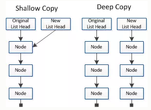
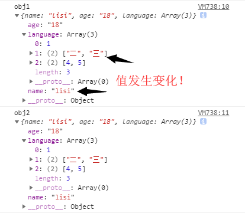
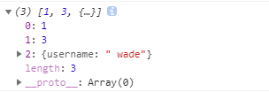
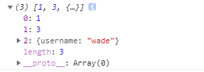
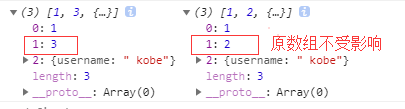
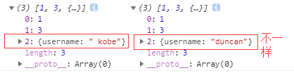

# 浅拷贝与深拷贝

## 一、数据类型

数据分为基本数据类型(String, Number, Boolean, Null, Undefined，Symbol)和对象数据类型。

- 基本数据类型的特点：直接存储在栈(stack)中的数据

- 引用数据类型的特点：`存储的是该对象在栈中引用，真实的数据存放在堆内存里`

引用数据类型在栈中存储了指针，该指针指向堆中该实体的起始地址。当解释器寻找引用值时，会首先检索其在栈中的地址，取得地址后从堆中获得实体。


## 二、浅拷贝与深拷贝

`深拷贝和浅拷贝是只针对Object和Array这样的引用数据类型的。`

深拷贝和浅拷贝的示意图大致如下：



`浅拷贝只复制指向某个对象的指针，而不复制对象本身，新旧对象还是共享同一块内存。但深拷贝会另外创造一个一模一样的对象，新对象跟原对象不共享内存，修改新对象不会改到原对象。`

## 三、赋值和浅拷贝的区别

- 当我们把一个对象赋值给一个新的变量时，`赋的其实是该对象的在栈中的地址，而不是堆中的数据`。也就是两个对象指向的是同一个存储空间，无论哪个对象发生改变，其实都是改变的存储空间的内容，因此，两个对象是联动的。

- 浅拷贝是按位拷贝对象，`它会创建一个新对象`，这个对象有着原始对象属性值的一份精确拷贝。如果属性是基本类型，拷贝的就是基本类型的值；如果属性是内存地址（引用类型），拷贝的就是内存地址 ，因此如果其中一个对象改变了这个地址，就会影响到另一个对象。即默认拷贝构造函数只是对对象进行浅拷贝复制(逐个成员依次拷贝)，即只复制对象空间而不复制资源。

我们先来看两个例子，对比赋值与浅拷贝会对原对象带来哪些改变？

```javascript
// 对象赋值
let obj1 = {
    'name' : 'zhangsan',
    'age' :  '18',
    'language' : [1,[2,3],[4,5]],
};
let obj2 = obj1;
obj2.name = "lisi";
obj2.language[1] = ["二","三"];
console.log('obj1',obj1)
console.log('obj2',obj2)
```



```javascript
// 浅拷贝
let obj1 = {
    'name' : 'zhangsan',
    'age' :  '18',
    'language' : [1,[2,3],[4,5]],
};
let obj3 = shallowCopy(obj1);
obj3.name = "lisi";
obj3.language[1] = ["二","三"];
function shallowCopy (src) {
    let dst = {};
    for (let prop in src) {
        if (src.hasOwnProperty(prop)) {
            dst[prop] = src[prop];
        }
    }
    return dst;
}
console.log('obj1',obj1)
console.log('obj3',obj3)
```


上面例子中，obj1是原始数据，obj2是赋值操作得到，而obj3浅拷贝得到。我们可以很清晰看到对原始数据的影响，具体请看下表：


## 四、浅拷贝的实现方式

### 1.Object.assign()

Object.assign() 方法可以把任意多个的源对象自身的可枚举属性拷贝给目标对象，然后返回目标对象。但是 Object.assign()进行的是浅拷贝，拷贝的是对象的属性的引用，而不是对象本身。

```javascript
let obj = { a: {a: "kobe", b: 39} };
let initalObj = Object.assign({}, obj);
initalObj.a.a = "wade";
console.log(obj.a.a); //wade
```

注意：`当object只有一层的时候，是深拷贝`

```javascript
let obj = {
    username: 'kobe'
};
let obj2 = Object.assign({},obj);
obj2.username = 'wade';
console.log(obj);//{username: "kobe"}
```

### 2.Array.prototype.concat()

```javascript
let arr = [1, 3, {
    username: 'kobe'
}];
let arr2=arr.concat();    
arr2[2].username = 'wade';
console.log(arr);
```

修改新对象会改到原对象:



### 3.Array.prototype.slice()

```javascript
let arr = [1, 3, {
    username: ' kobe'
}];
let arr3 = arr.slice();
arr3[2].username = 'wade'
console.log(arr);
```

同样修改新对象会改到原对象:



`关于Array的slice和concat方法的补充说明`：Array的slice和concat方法不修改原数组，只会返回一个浅复制了原数组中的元素的一个新数组。

原数组的元素会按照下述规则拷贝：

- 如果该元素是个对象引用(不是实际的对象)，slice 会拷贝这个对象引用到新的数组里。两个对象引用都引用了同一个对象。如果被引用的对象发生改变，则新的和原来的数组中的这个元素也会发生改变。

- 对于字符串、数字及布尔值来说（不是 String、Number 或者 Boolean 对象），slice 会拷贝这些值到新的数组里。在别的数组里修改这些字符串或数字或是布尔值，将不会影响另一个数组。

可能这段话晦涩难懂，我们举个例子，将上面的例子小作修改：

```javascript
let arr = [1, 3, {
    username: ' kobe'
}];
let arr3 = arr.slice();
arr3[1] = 2
console.log(arr,arr3);
```



## 五、深拷贝的实现方式

### 1.JSON.parse(JSON.stringify())

```javascript
let arr = [1, 3, {
    username: ' kobe'
}];
let arr4 = JSON.parse(JSON.stringify(arr));
arr4[2].username = 'duncan'; 
console.log(arr, arr4)
```



原理： 用JSON.stringify将对象转成JSON字符串，再用JSON.parse()把字符串解析成对象，一去一来，新的对象产生了，而且对象会开辟新的栈，实现深拷贝。

`这种方法虽然可以实现数组或对象深拷贝,但不能处理函数`

```javascript
let arr = [1, 3, {
    username: ' kobe'
}, function(){}];
let arr4 = JSON.parse(JSON.stringify(arr));
arr4[2].username = 'duncan'; 
console.log(arr, arr4)
```


这是因为JSON.stringify() 方法是将一个JavaScript值(对象或者数组)转换为一个 JSON字符串，不能接受函数

### 2.手写递归方法

递归方法实现深度克隆原理：`遍历对象、数组直到里边都是基本数据类型，然后再去复制，就是深度拷贝`

```javascript
//定义检测数据类型的功能函数
function checkedType(target) {
  return Object.prototype.toString.call(target).slice(8, -1)
}
//实现深度克隆---对象/数组
function clone(target) {
  //判断拷贝的数据类型
  //初始化变量result 成为最终克隆的数据
  let result,
    targetType = checkedType(target)
  if (targetType === 'Object') {
    result = {}
  } else if (targetType === 'Array') {
    result = []
  } else {
    return target
  }
  //遍历目标数据
  for (let i in target) {
    //获取遍历数据结构的每一项值。
    let value = target[i]
    //判断目标结构里的每一值是否存在对象/数组
    if (checkedType(value) === 'Object' || checkedType(value) === 'Array') {
      //对象/数组里嵌套了对象/数组
      //继续遍历获取到value值
      result[i] = clone(value)
    } else {
      //获取到value值是基本的数据类型或者是函数。
      result[i] = value
    }
  }
  return result
}
```

### 3.函数库lodash

该函数库也有提供_.cloneDeep用来做 Deep Copy

```javascript
var _ = require('lodash');
var obj1 = {
    a: 1,
    b: { f: { g: 1 } },
    c: [1, 2, 3]
};
var obj2 = _.cloneDeep(obj1);
console.log(obj1.b.f === obj2.b.f);
// false
```

## 参考文章

- [什么是js深拷贝和浅拷贝及其实现方式](https://www.haorooms.com/post/js_copy_sq)

- [JavaScript浅拷贝和深拷贝](https://www.kancloud.cn/ljw789478944/interview/397319)

- [js 深拷贝 vs 浅拷贝](https://juejin.im/post/59ac1c4ef265da248e75892b)

- [深拷贝的终极探索（99%的人都不知道)](https://segmentfault.com/a/1190000016672263)
