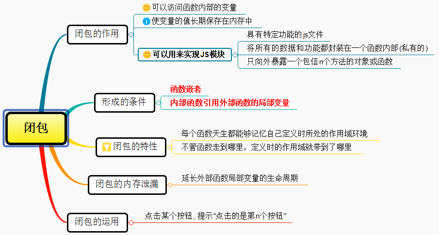
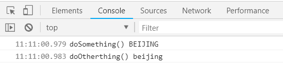

# 深入浅出Javascript闭包

## 一、引子

闭包（closure）是 Javascript 语言的一个难点，面试时常被问及，也是它的特色，很多高级应用都要依靠闭包实现。本文尽可能用简单易懂的话，讲清楚闭包的概念、形成条件及其常见的面试题。



我们先来看一个例子：

```javascript
let n = 999
function f1() {
    console.log(n)
}
f1() // 999
```

上面代码中，函数f1可以读取全局变量n。但是，函数外部无法读取函数内部声明的变量。

```javascript
function f1() {
    let n = 999
}
console.log(n)
// Uncaught ReferenceError: n is not defined
```

上面代码中，函数f1内部声明的变量n，函数外是无法读取的。

如果有时需要得到函数内的局部变量。正常情况下，这是办不到的，只有通过变通方法才能实现。那就是在函数的内部，再定义一个函数。

```javascript
function f1() {
    let n = 999
    function f2() {
        console.log(n) // 999
    }
}
```

上面代码中，函数f2就在函数f1内部，这时f1内部的所有局部变量，对f2都是可见的。既然f2可以读取f1的局部变量，那么只要把f2作为返回值，我们不就可以在f1外部读取它的内部变量了吗！

## 二、闭包是什么

我们可以对上面代码进行如下修改：

```javascript
function f1(){
    let a = 999
    function f2(){
        console.log(a)
    }
    return f2 // f1返回了f2的引用
}
let result = f1() // result就是f2函数了
result() 
// 执行result，全局作用域下没有a的定义，
//但是函数闭包，能够把定义函数的时候的作用域一起记住，输出999	
```

上面代码中，函数f1的返回值就是函数f2，由于f2可以读取f1的内部变量，所以就可以在外部获得f1的内部变量了。

闭包就是函数f2，即能够读取其他函数内部变量的函数。由于在JavaScript语言中，只有函数内部的子函数才能读取内部变量，因此可以把闭包简单理解成“`定义在一个函数内部的函数`”。`闭包最大的特点，就是它可以“记住”诞生的环境，比如f2记住了它诞生的环境f1，所以从f2可以得到f1的内部变量。`在本质上，闭包就是将函数内部和函数外部连接起来的一座桥梁。

`那到底什么是闭包呢？`

`当函数可以记住并访问所在的词法作用域，即使函数是在当前词法作用域之外执行，这就产生了闭包。` ----《你不知道的Javascript上卷》

我个人理解，`闭包就是函数中的函数(其他语言不能函数再套函数)`,里面的函数可以访问外面函数的变量，外面的变量的是这个内部函数的一部分。

`闭包形成的条件`

- 函数嵌套

- 内部函数引用外部函数的局部变量

## 三、闭包的特性

`每个函数都是闭包，每个函数天生都能够记忆自己定义时所处的作用域环境。`把一个函数从它定义的那个作用域，挪走，运行。这个函数居然能够记忆住定义时的那个作用域。`不管函数走到哪里，定义时的作用域就带到了哪里。`接下来我们用两个例子来说明这个问题：

```javascript
//例题1
let inner
function outer(){
    let a = 250
    inner = function(){
        alert(a)//这个函数虽然在外面执行，但能够记忆住定义时的那个作用域，a是250
    }
}
outer()
let a = 300
inner()//一个函数在执行的时候，找闭包里面的变量，不会理会当前作用域。
```

```javascript
//例题2
function outer(x){
    function inner(y){
        console.log(x + y)
    }
    return inner
}
let inn = outer(3)//数字3传入outer函数后，inner函数中x便会记住这个值
inn(5)//当inner函数再传入5的时候，只会对y赋值，所以最后弹出8
```

## 四、闭包的内存泄漏

栈内存提供一个执行环境，即作用域，包括全局作用域和私有作用域,那他们什么时候释放内存的？

- `全局作用域----只有当页面关闭的时候全局作用域才会销毁`

- `私有的作用域----只有函数执行才会产生`

`一般情况下，函数执行会形成一个新的私有的作用域，当私有作用域中的代码执行完成后，我们当前作用域都会主动的进行释放和销毁。但当遇到函数执行返回了一个引用数据类型的值，并且在函数的外面被一个其他的东西给接收了，这种情况下一般形成的私有作用域都不会销毁。`

如下面这种情况：

```javascript
function fn(){
    let num = 100
    return function(){

    }
}
let f = fn()//fn执行形成的这个私有的作用域就不能再销毁了
```

也就是像上面这段代码，fn函数内部的私有作用域会被一直占用的，发生了内存泄漏。`所谓内存泄漏指任何对象在您不再拥有或需要它之后仍然存在。闭包不能滥用，否则会导致内存泄露，影响网页的性能。闭包使用完了后，要立即释放资源，将引用变量指向null。`

接下来我们看下有关于内存泄漏的一道经典面试题：

```javascript
function outer(){
    let num = 0//内部变量
    return function add(){//通过return返回add函数，就可以在outer函数外访问了
        num++//内部函数有引用，作为add函数的一部分了
        console.log(num)
    }
 }
let func1 = outer()
func1()//实际上是调用add函数， 输出1
func1()//输出2 因为outer函数内部的私有作用域会一直被占用
let func2 = outer()
func2()// 输出1  每次重新引用函数的时候，闭包是全新的。
func2()// 输出2 
```

## 五、闭包的作用

1. `可以读取函数内部的变量。`

2. `可以使变量的值长期保存在内存中，生命周期比较长。`因此不能滥用闭包，否则会造成网页的性能问题

3. `可以用来实现JS模块。`

`JS模块:具有特定功能的js文件,将所有的数据和功能都封装在一个函数内部(私有的),只向外暴露一个包信n个方法的对象或函数,模块的使用者,只需要通过模块暴露的对象调用方法来实现对应的功能。`

具体请看下面的例子:

```html
//index.html文件
<script type="text/javascript" src="myModule.js"></script>
<script type="text/javascript">
    myModule2.doSomething()
    myModule2.doOtherthing()
</script>
```

```javascript
//myModule.js文件
(function () {
    let msg = 'Beijing'//私有数据
    //操作数据的函数
    function doSomething() {
        console.log('doSomething() ' + msg.toUpperCase())
    }
    function doOtherthing () {
        console.log('doOtherthing() ' + msg.toLowerCase())
    }
    //向外暴露对象(给外部使用的两个方法)
    window.myModule2 = {
        doSomething: doSomething,
        doOtherthing: doOtherthing
    }
})()
```



## 六、闭包的运用

我们要实现这样的一个需求: 点击某个按钮, 提示"点击的是第n个按钮",此处我们先不用事件代理:

```html
.....
<button>测试1</button>
<button>测试2</button>
<button>测试3</button>
<script type="text/javascript">
    let btns = document.getElementsByTagName('button')
        for (var i = 0; i < btns.length; i++) {
        btns[i].onclick = function () {
            console.log('第' + (i + 1) + '个')
        }
    }
</script>  
```

万万没想到，点击任意一个按钮，后台都是弹出“第4个”,这是因为i是全局变量,执行到点击事件时，此时i的值为3。那该如何修改，最简单的是用let声明i

```javascript
let btns = document.getElementsByTagName('button')
    for (let i = 0; i < btns.length; i++) {
    btns[i].onclick = function () {
        console.log('第' + (i + 1) + '个')
    }
}
```

另外我们可以通过闭包的方式来修改:

```javascript
for (var i = 0; i < btns.length; i++) {
    (function (j) {
        btns[j].onclick = function () {
            console.log('第' + (j + 1) + '个')
        }
    })(i)
}
```

## 参考文章

[Javascript教程](https://wangdoc.com/javascript/types/function.html#%E9%97%AD%E5%8C%85)
