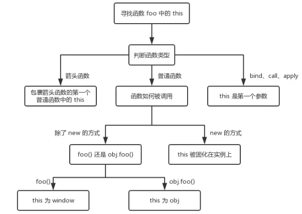

# 深入理解JavaScript执行上下文和执行栈

## 前言

如果你是一名 JavaScript 开发者，或者想要成为一名 JavaScript 开发者，那么你必须知道 JavaScript 程序内部的执行机制。执行上下文和执行栈是JavaScript中关键概念之一，是JavaScript难点之一。 理解执行上下文和执行栈同样有助于理解其他的 JavaScript 概念如提升机制、作用域和闭包等。本文尽可能用通俗易懂的方式来介绍这些概念。

## 一、执行上下文（Execution Context）

### 1.什么是执行上下文

简而言之，执行上下文就是当前 JavaScript 代码被解析和执行时所在环境的抽象概念， JavaScript 中运行任何的代码都是在执行上下文中运行

### 2.执行上下文的类型

执行上下文总共有三种类型：

- 全局执行上下文： 这是默认的、最基础的执行上下文。不在任何函数中的代码都位于全局执行上下文中。它做了两件事：1. 创建一个全局对象，在浏览器中这个全局对象就是 window 对象。2. 将 this 指针指向这个全局对象。一个程序中只能存在一个全局执行上下文。
- 函数执行上下文： 每次调用函数时，都会为该函数创建一个新的执行上下文。每个函数都拥有自己的执行上下文，但是只有在函数被调用的时候才会被创建。一个程序中可以存在任意数量的函数执行上下文。每当一个新的执行上下文被创建，它都会按照特定的顺序执行一系列步骤，具体过程将在本文后面讨论。
- Eval 函数执行上下文： 运行在 eval 函数中的代码也获得了自己的执行上下文，但由于 Javascript 开发人员不常用 eval 函数，所以在这里不再讨论。

## 二、执行上下文的生命周期

执行上下文的生命周期包括三个阶段：`创建阶段→执行阶段→回收阶段`，本文重点介绍创建阶段。

### 1.创建阶段

当函数被调用，但未执行任何其内部代码之前，会做以下三件事：

- 创建变量对象：首先初始化函数的参数arguments，提升函数声明和变量声明。下文会详细说明。
- 创建作用域链（Scope Chain）：在执行期上下文的创建阶段，作用域链是在变量对象之后创建的。作用域链本身包含变量对象。作用域链用于解析变量。当被要求解析变量时，JavaScript 始终从代码嵌套的最内层开始，如果最内层没有找到变量，就会跳转到上一层父作用域中查找，直到找到该变量。
- 确定this指向：包括多种情况，下文会详细说明

在一段 JS 脚本执行之前，要先解析代码（所以说 JS 是解释执行的脚本语言），解析的时候会先创建一个全局执行上下文环境，先把代码中即将执行的变量、函数声明都拿出来。变量先暂时赋值为undefined，函数则先声明好可使用。这一步做完了，然后再开始正式执行程序。

另外，一个函数在执行之前，也会创建一个函数执行上下文环境，跟全局上下文差不多，不过 函数执行上下文中会多出this arguments和函数的参数。

### 2.执行阶段

执行变量赋值、代码执行

### 3.回收阶段

执行上下文出栈等待虚拟机回收执行上下文

## 三、变量提升和this指向的细节

### 1.变量声明提升

大部分编程语言都是先声明变量再使用，但在JS中，事情有些不一样：

```javascript
console.log(a)// undefined
var a = 10
```

上述代码正常输出 undefined 而不是报错 Uncaught ReferenceError: a is not defined ,这是因为声明提升（hoisting），相当于如下代码：

```javascript
var a  //声明 默认值是undefined “准备工作”
console.log(a);
a=10  //赋值
```

### 2.函数声明提升

我们都知道，创建一个函数的方法有两种，一种是通过函数声明 `function foo(){}` 另一种是通过函数表达式 `var foo = function(){}` ,那这两种在函数提升有什么区别呢？

```javascript
console.log(f1) // function f1(){}
function f1() {} // 函数声明
console.log(f2) // undefined
var f2 = function() {} // 函数表达式
```

接下来我们通过一个例子来说明这个问题：

```javascript
function test() {
    foo(); // Uncaught TypeError "foo is not a function"
    bar(); // "this will run!"
    var foo = function () { // function expression assigned to local variable 'foo'
        alert("this won't run!");
    }
    function bar() { // function declaration, given the name 'bar'
        alert("this will run!");
    }
}
test();
```

在上面的例子中，foo()调用的时候报错了，而bar能够正常调用。

我们前面说过变量和函数都会上升，遇到函数表达式 `var foo = function(){}` 时，首先会将 `var foo` 上升到函数体顶部，然而此时的foo的值为undefined,所以执行 `foo()` 报错。

而对于函数 `bar()` , 则是提升了整个函数，所以 `bar()` 才能够顺利执行。

有个细节必须注意：`当遇到函数和变量同名且都会被提升的情况，函数声明优先级比较高，因此变量声明会被函数声明所覆盖，但是可以重新赋值。`

```javascript
alert(a);//输出：function a(){ alert('我是函数') }
function a(){ alert('我是函数') }//
var a = '我是变量';
alert(a);   //输出：'我是变量'
```

function声明的优先级比var声明高，也就意味着当两个同名变量同时被function和var声明时，function声明会覆盖var声明

这代码等效于：

```javascript
function a(){alert('我是函数')} 
var a;    //hoisting
alert(a);    //输出：function a(){ alert('我是函数') }
a = '我是变量';//赋值
alert(a);   //输出：'我是变量'
```

最后我们看个复杂点的例子：

```javascript
function test(arg){
    // 1. 形参 arg 是 "hi"
    // 2. 因为函数声明比变量声明优先级高，所以此时 arg 是 function
    console.log(arg);  
    var arg = 'hello'; // 3.var arg 变量声明被忽略， arg = 'hello'被执行
    function arg(){
	console.log('hello world') 
    }
    console.log(arg);  
}
test('hi');
/* 输出：
function arg(){
    console.log('hello world') 
    }
hello 
*/
```

这是因为当函数执行的时候,首先会形成一个新的私有的作用域，然后依次按照如下的步骤执行：

- 如果有形参，先给形参赋值
- 进行私有作用域中的预解释，函数声明优先级比变量声明高，最后后者会被前者所覆盖，但是可以重新赋值
- 私有作用域中的代码从上到下执行

### 3.确定this的指向

先搞明白一个很重要的概念 —— `this的值是在执行的时候才能确认，定义的时候不能确认！` 

为什么呢 —— 因为this是执行上下文环境的一部分，而执行上下文需要在代码执行之前确定，而不是定义的时候。看如下例子：

```javascript
// 情况1
function foo() {
  console.log(this.a) //1
}
var a = 1
foo()

// 情况2
function fn(){
  console.log(this);
}
var obj={fn:fn};
obj.fn(); //this->obj

// 情况3
function CreateJsPerson(name,age){
//this是当前类的一个实例p1
this.name=name; //=>p1.name=name
this.age=age; //=>p1.age=age
}
var p1=new CreateJsPerson("尹华芝",48);

// 情况4
function add(c, d){
  return this.a + this.b + c + d;
}
var o = {a:1, b:3};
add.call(o, 5, 7); // 1 + 3 + 5 + 7 = 16
add.apply(o, [10, 20]); // 1 + 3 + 10 + 20 = 34

// 情况5
<button id="btn1">箭头函数this</button>
<script type="text/javascript">   
    let btn1 = document.getElementById('btn1')
    let obj = {
        name: 'kobe',
        age: 39,
        getName: function () {
            btn1.onclick = () => {
                console.log(this) //obj
            };
        }
    };
    obj.getName()
</script>
```

接下来我们逐一解释上面几种情况

- 对于直接调用 foo 来说，不管 foo 函数被放在了什么地方，this 一定是 window
- 对于 obj.foo() 来说，我们只需要记住，谁调用了函数，谁就是 this，所以在这个场景下 foo 函数中的 this 就是 obj 对象
- 在构造函数模式中，类中(函数体中)出现的this.xxx=xxx中的this是当前类的一个实例
- call、apply和bind：this 是第一个参数
- 箭头函数this指向:箭头函数没有自己的this，看其外层的是否有函数，如果有，外层函数的this就是内部箭头函数的this，如果没有，则this是window。



## 四、执行上下文栈（Execution Context Stack）

函数多了，就有多个函数执行上下文，每次调用函数创建一个新的执行上下文，那如何管理创建的那么多执行上下文呢？

JavaScript 引擎创建了执行上下文栈来管理执行上下文。`可以把执行上下文栈认为是一个存储函数调用的栈结构，遵循先进后出的原则。`


从上面的流程图，我们需要记住几个关键点：

- JavaScript执行在单线程上，所有的代码都是排队执行。
- 一开始浏览器执行全局的代码时，首先创建全局的执行上下文，压入执行栈的顶部。
- 每当进入一个函数的执行就会创建函数的执行上下文，并且把它压入执行栈的顶部。当前函数执行完成后，当前函数的执行上下文出栈，并等待垃圾回收。
- 浏览器的JS执行引擎总是访问栈顶的执行上下文。
- 全局上下文只有唯一的一个，它在浏览器关闭时出栈。

我们再来看个例子：

```javascript
var color = 'blue'
function changeColor() {
    var anotherColor = 'red'
    function swapColors() {
        var tempColor = anotherColor
        anotherColor = color
        color = tempColor
    }
    swapColors();
}
changeColor();
```

上述代码运行按照如下步骤：

- 当上述代码在浏览器中加载时，JavaScript 引擎会创建一个全局执行上下文并且将它推入当前的执行栈
- 调用 changeColor函数时，此时changeColor函数内部代码还未执行，js执行引擎立即创建一个changeColor的执行上下文（简称EC），然后把这执行上下文压入到执行栈（简称ECStack）中。
- 执行changeColor函数过程中，调用swapColors函数，同样地，swapColors函数执行之前也创建了一个swapColors的执行上下文，并压入到执行栈中。
- swapColors函数执行完成，swapColors函数的执行上下文出栈，并且被销毁。
- changeColor函数执行完成，changeColor函数的执行上下文出栈，并且被销毁。


## 参考文章

- [了解JavaScript的执行上下文](https://yanhaijing.com/javascript/2014/04/29/what-is-the-execution-context-in-javascript/)
- [前端面试之道](https://juejin.im/book/5bdc715fe51d454e755f75ef/section/5be04a8e6fb9a04a072fd2cd)
- [深入理解javascript原型和闭包系列](https://juejin.im/book/5bdc715fe51d454e755f75ef/section/5be04a8e6fb9a04a072fd2cd)
- [【译】理解 Javascript 执行上下文和执行栈](https://juejin.im/post/5bdfd3e151882516c6432c32)
- [深入理解JavaScript中的作用域和上下文](https://www.html.cn/archives/7255)
- [前端基础进阶（二）：执行上下文详细图解](https://segmentfault.com/a/1190000012646203)
- [深入理解JS中声明提升、作用域（链）和this关键字](https://github.com/creeperyang/blog/issues/16)