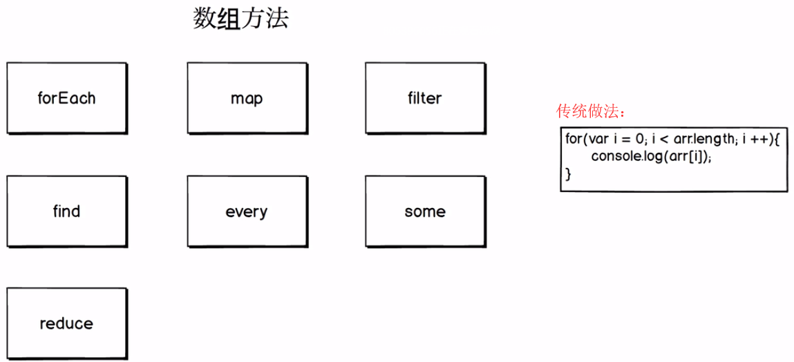

# 细说数组常用遍历的方法



## 前言

本文主要介绍数组常见遍历方法：`forEach`、`map`、`filter`、`find`、`every`、`some`、`reduce`，它们有个共同点：不会改变原始数组。

## 一、forEach：遍历数组

```javascript
let colors = ["red","blue","green"];
// ES5遍历数组方法
for(var i = 0; i < colors.length; i++){ 
    console.log(colors[i]);//red blue green
}
```

```javascript
let colors = ["red","blue","green"];
// ES6 forEach
colors.forEach(function(color){
    console.log(color);//red blue green
});
```

我们再来看个例子：遍历数组中的值,并计算总和

```javascript
let numbers = [1,2,3,4,5];
let sum = 0;
numbers.forEach(number=>sum+=number)
console.log(sum)//15
```

## 二、map：将数组映射成另一个数组

`map通过指定函数处理数组的每个元素，并返回处理后新的数组，map 不会改变原始数组。`

`forEach和map的区别在于，forEach没有返回值。`

`map需要返回值，如果不给return，默认返回undefined`

### 使用场景1

```javascript
var numbers = [1,2,3];
var doubledNumbers = [];
// es5写法
for(var i = 0; i < numbers.length; i++){
    doubledNumbers.push(numbers[i] * 2);
}
console.log(doubledNumbers);//[2,4,6]
```

```javascript
// es6 map方法
let doubled = numbers.map(function(number){
    return number * 2;
})
console.log(doubled);//[2,4,6]
```

### 使用场景2 

假定有一个对象数组(A),将A数中对象某个属性的值存储到B数组中

```javascript
let cars = [
    {model:"Buick",price:"CHEAP"},
    {model:"BMW",price:"expensive"}
];
let prices = cars.map(car => {
    return car.price;
})
console.log(prices);//["CHEAP", "expensive"]
```

## 三、filter：从数组中找出所有符合指定条件的元素

`filter() 检测数值元素，并返回符合条件所有元素的数组。 filter() 不会改变原始数组。`

### 使用场景1

假定有一个对象数组(A),获取数组中指定类型的对象放到B数组中

```javascript
var porducts = [
    {name:"cucumber",type:"vegetable"},
    {name:"banana",type:"fruit"},
    {name:"celery",type:"vegetable"},
    {name:"orange",type:"fruit"}
];
// es5写法
var filteredProducts = [];
for(var i = 0; i < porducts.length; i++){
    if(porducts[i].type === "vegetable"){
      filteredProducts.push(porducts[i]);
    }
}
console.log(filteredProducts);//[{name: "cucumber", type: "vegetable"},{name: "celery", type: "vegetable"}]
```

```javascript
// es6 filter
let filtered2 = porducts.filter(product => {
    return product.type === "vegetable";
})
console.log(filtered2);
```

### 使用场景2

假定有一个对象数组(A),过滤掉不满足以下条件的对象

条件: 蔬菜 数量大于0,价格小于10

```javascript
let products = [
    {name:"cucumber",type:"vegetable",quantity:0,price:1},
    {name:"banana",type:"fruit",quantity:10,price:16},
    {name:"celery",type:"vegetable",quantity:30,price:8},
    {name:"orange",type:"fruit",quantity:3,price:6}
];
products = products.filter(product => {
    return product.type === "vegetable" 
    && product.quantity > 0 
    && product.price < 10
})
console.log(products);//[{name:"celery",type:"vegetable",quantity:30,price:8}]
```

### 使用场景3

假定有两个数组(A,B),根据A中id值,过滤掉B数组不符合的数据

```javascript
let post = {id:4,title:"Javascript"};
let comments = [
    {postId:4,content:"Angular4"},
    {postId:2,content:"Vue.js"},
    {postId:3,content:"Node.js"},
    {postId:4,content:"React.js"},
];
const commentsForPost = (post,comments) => {
    return comments.filter(comment => {
        return comment.postId === post.id;
    })
}
console.log(commentsForPost(post,comments));//[{postId:4,content:"Angular4"},{postId:4,content:"React.js"}]
```

## 四、find：返回通过测试（函数内判断）的数组的第一个元素的值

`它的参数是一个回调函数，所有数组成员依次执行该回调函数，直到找出第一个返回值为true的成员，然后返回该成员。如果没有符合条件的成员，则返回undefined。`

### 使用场景1

假定有一个对象数组(A),找到符合条件的对象

```javascript
var users = [
    {name:"Jill"},
    {name:"Alex",id:2},
    {name:"Bill"},
    {name:"Alex"}
];
// es5方法
var user;
for(var i = 0; i < users.length; i++){
    if(users[i].name === "Alex"){
        user = users[i];
        break;//找到后就终止循环
    }
}
console.log(user);// {name:"Alex",id:2}
```

```javascript
// es6 find
let user = users.find(user => {
  return user.name === "Alex";
})
console.log(user);// {name:"Alex",id:2}找到后就终止循环
```

### 使用场景2

假定有一个对象数组(A),根据指定对象的条件找到数组中符合条件的对象

```javascript
let posts = [
    {id:3,title:"Node.js"},
    {id:1,title:"React.js"}
];
let comment = {postId:1,content:"Hello World!"};
const postForComment = (posts,comment) => {
    return posts.find(post => {
        return post.id === comment.postId;
    })
}
console.log(postForComment(posts,comment));//{id: 1, title: "React.js"}
```

## 五、every&some

`every：数组中是否每个元素都满足指定的条件`

`some:数组中是否有元素满足指定的条件`

### 使用场景1

计算对象数组中每个电脑操作系统是否可用，大于16位操作系统表示可用,否则不可用

```javascript
//ES5方法
var computers = [
    {name:"Apple",ram:16},
    {name:"IBM",ram:4},
    {name:"Acer",ram:32}
];
var everyComputersCanRunProgram = true;
var someComputersCanRunProgram = false;
for(var i = 0; i < computers.length; i++){
    var computer = computers[i];
        if(computer.ram < 16){
        everyComputersCanRunProgram = false;
    } else {
        someComputersCanRunProgram = true;
    }
}
console.log(everyComputersCanRunProgram);//false
console.log(someComputersCanRunProgram);//true
```

```javascript
//ES6 some every 
let every = computers.every(function(computer){
    return computer.ram > 16;
})
console.log(every);//false
let some = computers.some(function(computer){
    return computer.ram > 16;
})
console.log(some);//true
```

`一言以蔽之：Some: 一真即真；Every: 一假即假`

### 使用场景2

假定有一个注册页面,判断所有input内容的长度是否大于0

```javascript
function Field(value){
    this.value = value;
}
Field.prototype.validate = function(){
    return this.value.length > 0;
}

//ES5方法
var username = new Field("henrywu");
var telephone = new Field("18888888888");
var password = new Field("my_password");
console.log(username.validate());//true
console.log(telephone.validate());//true
console.log(password.validate());//true

//ES6 some every
let fields = [username,telephone,password];
let formIsValid = fields.every(field => {
    return field.validate();
})
console.log(formIsValid);//true
if(formIsValid){
 // 注册成功
} else {
  // 给用户一个友善的错误提醒
}
```

### 六、reduce：将数组合成一个值

`reduce() 方法接收一个方法作为累加器，数组中的每个值(从左至右) 开始合并，最终为一个值。`

### 使用场景1

计算数组中所有值的总和

```javascript
var numbers = [10,20,30];
var sum = 0;
//es5 方法
for(var i = 0; i < numbers.length; i++){
  sum += numbers[i];
}
console.log(sum);
```

```javascript
// es6 reduce
let sumValue = numbers.reduce((sum2,number2) => {
    console.log(sum2);//0 10 30 60
    return sum2 + number2;
}, 0);//sum2初始值为0
console.log(sumValue);
```

### 使用场景2

将数组中对象的某个属性抽离到另外一个数组中

```javascript
let primaryColors = [
    {color:"red"},
    {color:"yellow"},
    {color:"blue"}
];
let colors = primaryColors.reduce((previous,primaryColor) => {
    previous.push(primaryColor.color);
    return previous;
}, []);
console.log(colors);//["red", "yellow", "blue"]
```

### 使用场景3

判断字符串中括号是否对称

```javascript
const balancedParens = string => {
    return !string.split("").reduce((previous,char) => {
        if (previous < 0) { return previous;}
        if (char == "(") { return ++previous;}
        if (char == ")") { return --previous;}
        return previous;
    }, 0);
}
console.log(balancedParens("((())))"));
```
