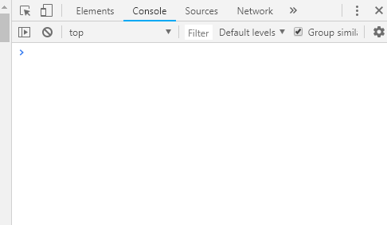
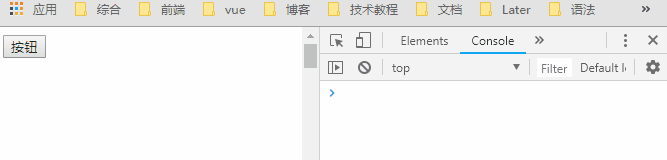

# 函数节流和防抖

## 前言

事件的触发权很多时候都属于用户，有些情况下会产生问题：

- 向后台发送数据，用户频繁触发，对服务器造成压力

- 一些浏览器事件:window.onresize、window.mousemove等，触发的频率非常高，会造成浏览器性能问题

如果你碰到这些问题，那就需要用到函数节流和防抖了。

## 一、函数节流(throttle)

`函数节流：一个函数执行一次后，只有大于设定的执行周期后才会执行第二次。`

有个需要频繁触发函数，出于优化性能角度，在规定时间内，只让函数触发的第一次生效，后面不生效。

### 1.如何实现

其原理是用时间戳来判断是否已到回调该执行时间，记录上次执行的时间戳，然后每次触发 scroll 事件执行回调，回调中判断当前时间戳距离上次执行时间戳的间隔是否已经到达 规定时间段，如果是，则执行，并更新上次执行的时间戳，如此循环；

```css
html,
body {
  height: 500%; // 让其出现滚动条
}
```

```javascript
function throttle(fn, delay) {
    // 记录上一次函数触发的时间
    let lastTime = 0;
    return function() {
        // 记录当前函数触发的时间
        let nowTime = Date.now();
        if (nowTime - lastTime > delay) {
            // 修正this指向问题
            fn.call(this);
            // 同步时间
            lastTime = nowTime;
        }
    }
}
document.onscroll = throttle(function() { console.log('scroll事件被触发了' + Date.now()) }, 200)
```



上例中用到了闭包的特性--`可以使变量lastTime的值长期保存在内存中`。

### 2.函数节流的应用场景

需要间隔一定时间触发回调来控制函数调用频率：

- DOM 元素的拖拽功能实现（mousemove）

- 搜索联想（keyup）

- 计算鼠标移动的距离（mousemove）

- Canvas 模拟画板功能（mousemove）

- 射击游戏的 mousedown/keydown 事件（单位时间只能发射一颗子弹）

- 监听滚动事件判断是否到页面底部自动加载更多：给 scroll 加了 debounce 后，只有用户停止滚动后，才会判断是否到了页面底部；如果是 throttle 的话，只要页面滚动就会间隔一段时间判断一次

## 二、函数防抖(debounce)

`防抖函数：一个需要频繁触发的函数，在规定时间内，只让最后一次生效，前面的不生效。`

### 1.如何实现

其原理就第一次调用函数，创建一个定时器，在指定的时间间隔之后运行代码。当第二次调用该函数时，它会清除前一次的定时器并设置另一个。如果前一个定时器已经执行过了，这个操作就没有任何意义。然而，如果前一个定时器尚未执行，其实就是将其替换为一个新的定时器，然后延迟一定时间再执行。

```html
<button id='btn'>按钮</button>
<script type="text/javascript">
function debounce(fn, delay) {
    // 记录上一次的延时器
   let timer = null;
    return function() {
    // 清除上一次延时器
    clearTimeout(timer)
    timer = setTimeout(function() {
            fn.apply(this)
        }, delay)
    }
}
document.getElementById('btn').onclick = debounce(function() {
    console.log('点击事件被触发' + Date.now())
}, 1000)
</script>
```



上例中也用到了闭包的特性--可以使变量timer的值长期保存在内存中。

### 2.函数防抖的应用场景

对于连续的事件响应我们只需要执行一次回调：

- 每次 resize/scroll 触发统计事件

- 文本输入的验证（连续输入文字后发送 AJAX 请求进行验证，验证一次就好）

## 三、总结

函数节流和函数去抖的核心其实就是限制某一个方法被频繁触发，而一个方法之所以会被频繁触发，大多数情况下是因为 DOM 事件的监听回调，而这也是函数节流以及防抖多数情况下的应用场景。

## 参考文章

- [函数节流与函数防抖](https://juejin.im/entry/6844903466427482120)

- [JavaScript 函数节流和函数去抖应用场景辨析](https://github.com/lessfish/underscore-analysis/issues/20)

- [函数节流、函数防抖实现原理分析](https://rockjins.js.org/2017/02/21/2017-02-21-debounce-function/)
